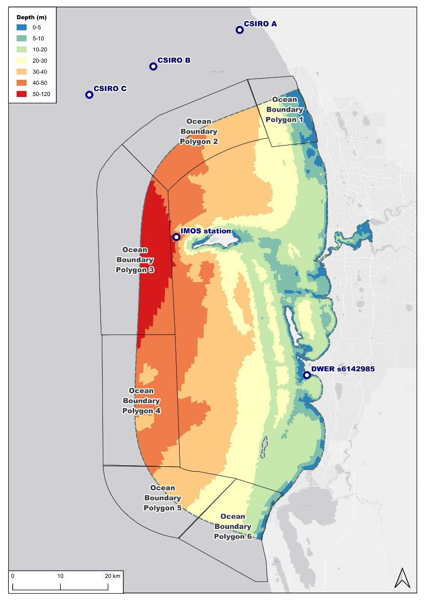
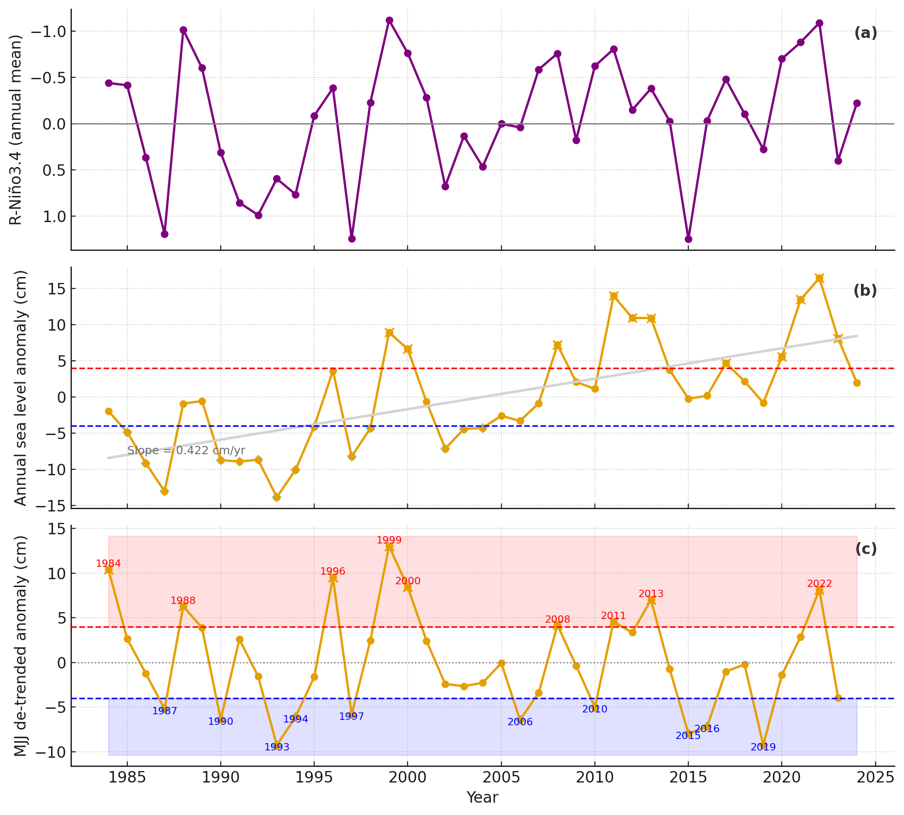
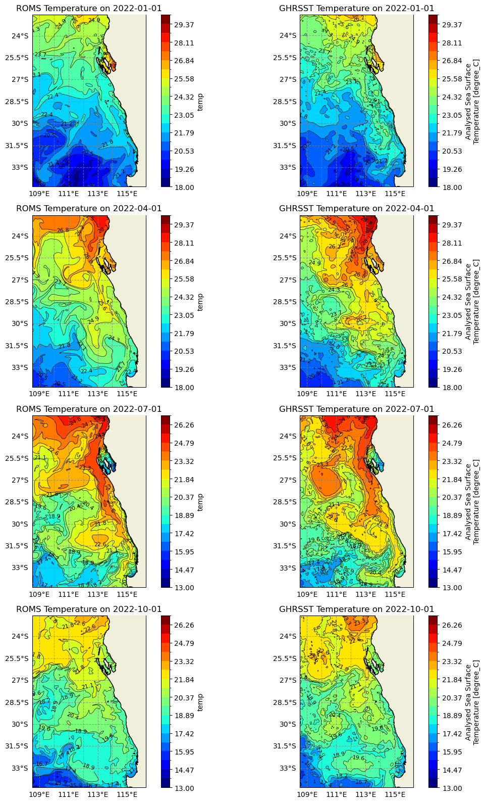
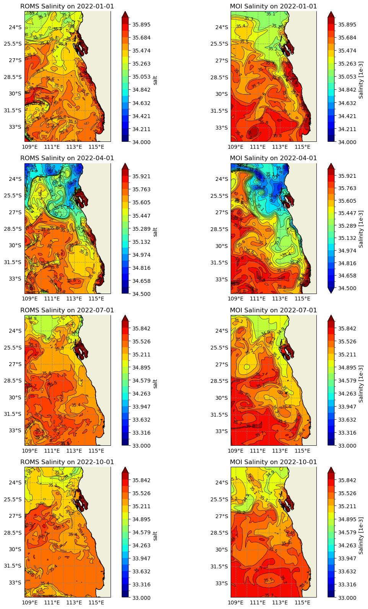
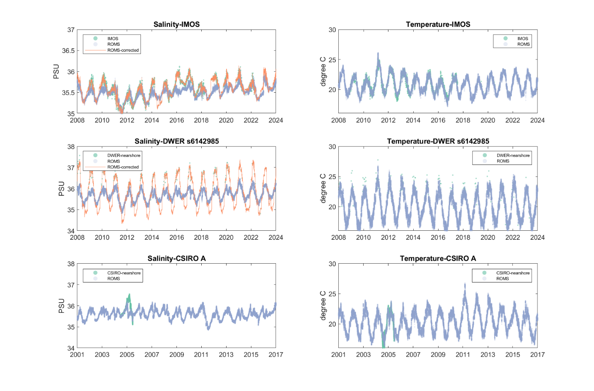
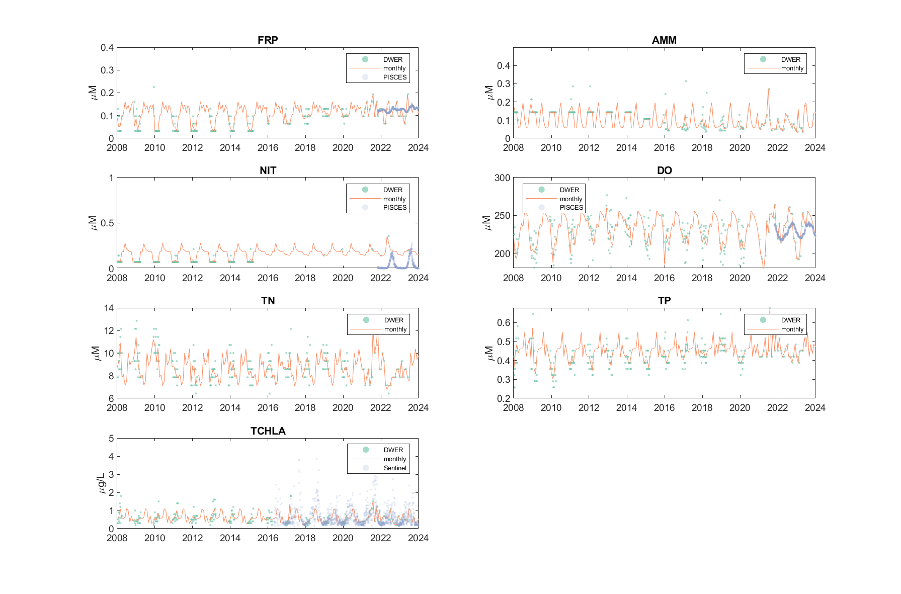
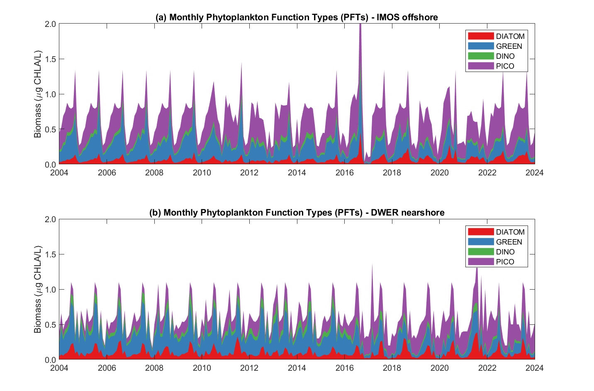
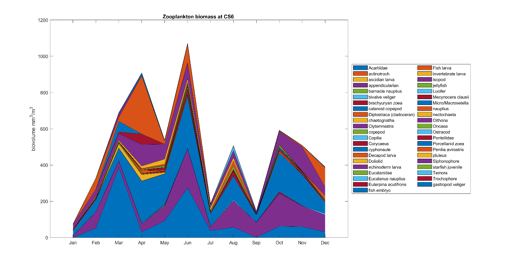

# Resolving Perth Waters Ocean Climatology {#ocean-climatology}

## Overview

Given the inherently multi-scale nature of coastal environments, numerical models such as CSIEM rely on readily available large-scale ocean climatological data for initialization, data assimilation, or boundary forcing (Levitus, 1982; Kim et al., 2007). This approach is crucial for identifying and accounting for external anomalies, such as sea level variations, marine heatwaves, and nutrient anomalies, which can influence or even dominate local conditions. Researchers, therefore, create climatology to improve the parameterization and specification of hydrographic and biogeochemical boundary conditions.

Developing a climatology for Perth waters involves building the temporal averages and/or statistical properties of environmental variables that characterize the physical and biochemical states of the ocean (Fukumori et al., 2018; Shahzadi et al., 2021). Oceanographers commonly generate monthly climatologies, at the scale of the global ocean (Levitus, 1982; Fukumori et al., 2018; Shahzadi et al., 2021) or for regional systems like the Northwest Atlantic Ocean (Seidov et al., 2018), Central California (Kim et al., 2007), and East Asian Seas (Johnson et al., 2015). These climatologies are typically developed through the objective analysis of irregularly distributed data, producing smooth yet realistic representations of ocean variables in key areas of interest. This method is especially effective in regions with sufficient data coverage and can resolve mesoscale processes critical for local downscaled models.

In the specific case of hydrodynamics, coastal models designed to resolve local hydrological conditions rely on being nested within larger regional models in order to capture the broader oceanographic influences that drive local dynamics. However, whilst nesting hydrodynamic models is a common practice, specifying regional *biogeochemical* conditions for coastal biogeochemical models presents a greater challenge (Fukumori et al., 2018). This difficulty arises primarily from the lack of readily available regional biogeochemical models able to capture coastally relevant features, and the scarcity of observational data at ocean model boundaries. Another significant issue in many climatology studies is the high degree of inhomogeneity in ocean observations over time. The process of filling spatial and temporal gaps in these records often depends on statistical assumptions that, while sometimes plausible, are generally untestable (Boyer et al., 2016; Wunsch, 2018). AT the time of developing CSIEM, to the best of our knowledge, no extended-time ocean climatology has been specifically developed for the Western Australian coastal region, yet this is required to enable the development of a comprehensive water quality model.

Here we describe the creation of a continuous, monthly-resolution ocean climatology for the Perth coastal waters region, focusing on temperature, salinity, and biogeochemical properties which are needed to inform boundary conditions for the CSIEM platform and associated analyses. We expand the concept of regional ocean climatologies by incorporating biogeochemical data along side predictions from the available regional hydrodynamic model. To achieve this, we undertake a synthesis by combining the regional resolution ROMS model, satellite imagery, and available *in-situ* data. The resulting data product covers the period from 1980 to 2024, and provides continuous key ocean water properties that can be used for boundary condition specification for our localized models of Perth's coastal waters.

## Oceanographic context of Perth Waters and Cockburn Sound

Cockburn Sound is an open bay situated in the southwestern Australian (SWA) coastal region of the Indian Ocean. The Sound spans an area of approximately 80 km^2^ and a maximum depth of 22m (Figure 3.1). It is bordered by a coastal line to the east and south, the Garden Island to the west, and a relatively shallow entrance to the north (transect from Garden Island to Woodman Point), where depths are generally less than 5 meters, except for a narrow shipping channel of about 15m. These geographical features give the Sound a 'Mediterranean Sea' effect, with restricted flow at its southern entrance and the ocean exchange primarily occurring through the northern entrance. Anomalies in sea level, temperature, salinity, and biological activity originating from the broader Indian ocean can strongly influence the properties of the SWA shelf (e.g. Gaughan and Fletcher, 1997; Koslow et al., 2008; Rose et al., 2012).

The oceanography of the SWA coastal region is characterized by a combination of warm currents and climate-driven changes that shape its marine ecosystems, affecting both marine biodiversity and coastal processes. The region is dominated by the Leeuwin Current, which is a poleward-flowing, warm, nutrient-poor current. The current promotes downwelling and local upwelling along the continental shelf, which creates a unique marine environment that supports both warm- and cool-water species (Smith et al., 1991; James et al., 1999).

Climatic variations, including shifts in winter rainfall patterns, are closely tied to broader atmospheric and oceanic circulation systems. Research indicates that fluctuations in long-term mean sea-level pressure at Perth are negatively correlated with austral winter rainfall, which has been trending downward in recent decades, affecting freshwater input and coastal dynamics (Allan & Haylock, 1993; Silberstein et al., 2012; Smith & Power, 2014). The SWA coastal region is also influenced by the strong northward winds particularly during the austral summer. The sea breezes are featured with a diurnal pattern, rotating in an anticlockwise direction and translating into coastal currents, particularly along the shoreline and within the coastal embayment (Pattiaratchi et al., 1999; Gallop et al., 2012). Marine heatwaves, such as the significant event in 2011, further highlight the vulnerability of the region\'s ecosystems and lead to widespread coral bleaching, fish die-offs, and harmful algal blooms (Rose et al., 2012).

## Analysis approach

The conventional method for constructing ocean climatology generally involves two stages. The first stage is a latitude-longitude-depth averaging at selected scales, followed by the interpolation of the sparse-grid datasets into a high-resolution climatology (Lozano et al., 1996; Kim et al., 2007). The first stage entails the collection of all available datasets within the area of interest and rigorous data screening. The second stage involves remapping the data onto the space using a multivariate statistical exercise known as the multi-scale objective analysis. While this approach is widely used, it is typically applied to large domains with spatial scales of degrees in longitude and latitude, often yielding spatial resolution of 10-100km. Moreover, most climatology products are limited to temperature with only a few including salinity (e.g. Kim et al., 2007; Fukumori et al., 2018).

The aim of this project component was to construct a climatology for hydrologic and ecologic properties at the CSIEM boundary. The spatial scale in this study is much smaller compared to conventional ocean climatology, and resolving the nutrient and plankton climatology presents additional challenges. Unlike hydrographic variables such as temperature and salinity, nutrients and plankton exhibit sharper gradients from shallow nearshore region to deep offshore areas, and data availability is often sparse.

To address these challenges, the CSIEM ocean boundary is divided into six polygons (Figure 3.1), where the polygons 1 and 6 represent the 'nearshore' boundary, polygons 3 and 4 represent the 'offshore' boundary, and polygons 2 and 5 are the 'transitional' zones between the nearshore and offshore areas. The following procedures were applied to develop the biogeochemical properties within these polygons.

***[Stage 1: data collection and screening]{.underline}***

Standardising historical observations poses a significant challenge in climatological studies, particularly regarding metadata consistency and quality control. The process of data collection and integration into a standardized database is detailed in the WWMSP Theme 1.1 report -- Integrated Ecosystem Modelling Platform. For this study, ocean climatology analysis utilizes observations from various sources, including:

- Integrated Marine Observing System (IMOS) Australian National Mooring Network (AMNM) program

- Integrated Marine Observing System (IMOS) BGC-Argo program

- DWER/Westport water quality sampling program

- CSIRO Two Rocks survey program

The site locations of these data sources are shown in Figure 3.1.

In addition to field observations, we also incorporated data from remote sensing products and regional and global ocean models to benchmark the ROMS performance at the boundaries, and to characterise the spatial biogeochemical properties. These additional data sources include:

- **Regional Model:** ROMS Hydrodynamics Model (CWA-ROMS), 2 km version

- **Global Ocean Model:** Mercator Ocean International (MOI) Ocean Model

- **Remote Sensing Products:**

  - ESA GlobColour and Sentinel products

  - NASA GHRSSTR and MODIS products

{width="3.937007874015748in" height="5.56882217847769in"}

**Figure 5.1.** Map of boundary polygons, and stations where observed data was sourced. *Note the ROMS water levels, currents, temperatures and salinities within CSIEM are applied continuously along the ocean-edge of the hydrodynamic model, and the six polygons referred to here specifically relate to: i) bias-correction fatcors, and ii) regions for assignment of biogeochemical properties*.

Data collection was completed under WWMSP Project 1.1 and imported as a ready-for-use data product.  After collection,  data screening and averaging were conducted as follows:

1.  **Hydrographic Condition:** water elevations, temperature and salinity data from ROMS were compared against raw field data-sets on a daily and monthly basis to assess accuracy and interannual variability in ROMS performance.

2.  **Water Quality Data:** Water quality measurements recorded at the IMOS station near Rottnest Island (Figure 3.1, representing offshore boundary conditions) and at the DWER site near the Warnbro (Site ID: s6142985, Figure 3.1, representing nearshore boundary conditions) were examined and averaged into monthly datasets. These water quality datasets were recorded at an irregular interval, typically every 1-3 months from 2009 to 2021. To address the irregularity, a 'monthly climatology' for the boundary condition was created. This involved using monthly-average data for months where measurements were available, and for months with no available data, we used the average value from the same month across the entire historical dataset.

3.  **Remote Sensing and Model Data:** Water quality variables from remote sensing products and regional/global ocean model were extracted at the same IMOS and DWER sites. These datasets were screened against the IMOS and DWER measurements. It is important to note that these remote sensing and model datasets have not been calibrated or validated for the study area and can only provide indictive information on (1) phytoplankton functional group composition and (2) typical nutrient and phytoplankton biomass concentrations around Cockburn Sound.

***[Stage 2: data interpolation into ocean boundary polygons and infilling missing periods]{.underline}***

An interpolation procedure was employed to generate the final estimate of a monthly climatology for the six CSIEM ocean boundary polygons. This procedure yields an optimal estimate for each polygon, using prior knowledge gathered in stage 1. The generic approach for data standardisation involved the following steps:

1.  **Water Temperature and Salinity:** monthly resolution bias-correction factors were computed and applied to the ROMS boundary condition when significant monthly discrepancies were identified between the ROMS output and field observations from stage 1.

2.  **Nutrient Concentrations:** for nutrient variables that are available from the field observations (such as dissolved nitrogen and phosphorus), the 'monthly climatology' of the offshore and transitional areas (polygons 2-5) were constructed based on the IMOS record, while the nearshore areas (polygon 1 and 6) were constructed based on the DWER record. For other nutrient concentration (such as particulate and dissolved organic matters), the data were interpolated from the existing knowledge of CHL:POC ratio, DOC:POC ratio, nutrient stoichiometric ratio, and review of relevant publications in the study area.

3.  **Phytoplankton Composition:** the biomass of each phytoplankton functional group was estimated based on the field measurements of total chlorophyll-a concentration and the group composition information from the ESA GlobColour datasets.

Details regarding data screening, averaging, and final results of data interpolation across the six ocean boundary polygons are described in the following section.

## Results and discussion

### Boundary climatology -- water surface elevation

Water surface elevation within Perth coastal region is influenced by tidal changes and regional drivers in sea-level changes, most notably including the seasonal influence of the Leeuwin Current. Sea level anomalies also occur due to continental shelf waves, and inter-annual changes associated the strength of the Southern Oscillation Index. 

Comparison of ROMS output of surface elevation with the Fremantle Fishing Boat Harbour tidal gauge station indicates that the field observations compare well with ROMS prediction, including ability to capture the temporal variations in tidal elevations ($R=0.9391$). The minimum bias between the model and observation was with a datum offset of -0.34 meters, which is thus applied to the tidal elevations from the ROMS outputs.

{width="6.301388888888889in" height="2.5479166666666666in"}

Figure **5.2.** (left) Time series and (right) regression analysis of ROMS surface elevation against the observations at Fremantle gauge station.

{width="6.301388888888889in"}

Figure **5.3.** Long-term drivers of the sea-level anomaly as recorded at the Fremantle Fishing Boat Harbour.

### Boundary climatology -- water temperature and salinity

The ROMS model outputs from Theme 5.1 for the WA region were used to provide hydrographic boundary conditions for CSIEM. The outputs include tidal elevations, water temperature, salinity, and ocean currents at three-hourly intervals. Example snapshots of ROMS surface water temperature in comparison to the GHRSST products (Figure 5.3) showed that the ROMS and GHRSST datasets present similar spatial temperature patterns with higher temperatures concentrated in the northern region that decreased towards the south. The ROMS model exhibits slightly more uniform temperature gradients compared to GHRSST that displays more localized high-temperature zones, especially around coastal areas. Similar plots comparing the ROMS salinity and MOI data (Figure 5.5) suggest that the ROMS and MOI salinity distributions agree on broader spatial salinity trends, with a slight increase of salinity from north to south. However, the ROMS model provides a more smoothed representation, whereas MOI data reveals finer coastal salinity variations, indicating possible differences in resolution or the ability to capture localized coastal salinity features.

{width="6.301388888888889in" height="5.2131944444444445in"}

**Figure 5.4.** Snapshots of surface water temperature from ROMS (left column) and GHRSST satellite data (right column).

{width="6.301388888888889in" height="5.204861111111111in"}

**Figure 5.5.** Snapshots of surface salinity from ROMS (left column) and MOI (right column).

A further benchmarking analysis of ROMS outputs against observational data from IMOS (Rottnest Island station), DWER (at site s6142985), and CSIRO (near Two Rocks) indicated that the ROMS effectively captured the water temperature, with correlation coefficients (*r*) greater than 0.86 and bias less than 2% at all sites (Figure 5.6). However, ROMS exhibited a tendency to underpredict salinity during the summers and overpredict it during the winters, particularly at nearshore site where salinity can exceed 37 PSU in summers and drop below 35 PSU in winters.

Given this, water temperature was retained as it appeared in the ROMS outputs, while a monthly bias correction factor $\gamma_{i}$ was applied to the ROMS salinity to better align with field observations. The correction factor was calculated as:

$\gamma_{i} = \overline{\Sigma_{obs}^{i}}/\overline{\Sigma_{ROMS}^{i}}$

Where $\overline{\Sigma_{obs}^{i}}$ is the average observed salinity for month $i$, and $\overline{\Sigma_{ROMS}^{i}}$ is the average ROMS salinity for the same month at selected polygons.

The bias factors derived from the IMOS station were applied to offshore polygons 3 and 4, while the factors from the DWER nearshore station were applied to nearshore polygons 1 and 6. For the transitional polygons 2 and 5, the average bias factors from both the IMOS station and DWER stations were applied. Figure 3.5 presents the time series plots of the ROMS data, field observational data, and the bias-corrected ROMS data. The regressions of the bias-corrected salinity against the field observations are presented in Figure 3.4, demonstrating that the bias correction method has significantly improved the accuracy of salinity predictions in the ROMS model.

{width="6.294344925634296in" height="4.49369750656168in"}

**Figure 5.6.** Regression analysis of ROMS salinity (SAL) and water temperature (TEMP) against the observations at IMOS, DWER s6142985, and the CSIRO A stations. Regression coefficients (r) and bias between the ROMS outputs and observations are included in the plots. For SAL, the light blue colour represents results from the raw ROMS output vs. data and the orange colour represents results from the bias-correction method.

{width="6.301388888888889in" height="4.447553587051619in"}

**Figure 5.7.** Time series of ROMS salinity and temperature (blue dots) against the observations from IMOS, DWER s6142985, and the CSIRO datasets (dark dots). The orange lines indicate the bias-corrected salinity predictions in the ROMS model.

### Boundary climatology -- nutrients

The time series comparison (Figure 3.7 and 3.8) indicates that while the global ocean model for FRP, NIT, and DO generally align in magnitudes with field observations at the IMOS and DWER sites, they lack the strong seasonal variation observed in field data, and the regression results show generally poor agreement. Consequently, we relied solely on the field observations to construct the monthly climatology for the nutrient conditions at the boundaries. The monthly average values of dissolved nitrogen, phosphorus and DO, $C_{i}$, is calculated as follows:

$C_{i} = \left\{ \begin{array}{r}
\overline{\Sigma_{obs}^{i}\ }\ \ if\ N_{obs}^{i} > 0 \\
\overline{\Sigma_{obs}^{month}\ }\ \ if\ N_{obs}^{i} = 0
\end{array} \right.\ $

where $N_{obs}^{i}$ represents the number of observations in month $i$, $\overline{\Sigma_{obs}^{i}\ }$ is the average of observations in the same month and year if data available ($N_{obs}^{i} > 0$), and $\overline{\Sigma_{obs}^{month}\ }$ is the average of observations in the same month of all historical data when no data are available ($N_{obs}^{i} = 0$).

{width="6.40799978127734in" height="4.408297244094488in"}

**Figure 5.8.** Time series plot of filterable reactive phosphorus (FRP), ammonium (AMM), nitrate (NIT), dissolved oxygen (DO), inorganic suspended solids (TSS inorganic), organic suspended solids (TSS organic), and total chlorophyll-a (TCHLA) concentrations at the IMOS station (dark dots) compared to the PISCES, GlobColor and Sentinel products (cyan dots) at the same site when they are available. The magenta lines represent the final monthly climatology results.

{width="6.289728783902012in" height="4.316313429571304in"}

**Figure 5.9.** Time series plot of filterable reactive phosphorus (FRP), ammonium (AMM), nitrate (NIT), dissolved oxygen (DO), total nitrogen (TN), total phosphorus (TP), and total chlorophyll-a (TCHLA) concentrations at the DWER s6142985 station against the PISCES, GlobColor and Sentinel products at the same site. The magenta lines represent the final monthly climatology results.

Constructing the monthly climatology for organic matter at the ocean boundaries was challenging due to the lack of direct organic matter data from either IMOS or DWER nearshore area. To address this, we relied on the existing water quality data, stoichiometric balance assumptions, and guidance from local literature to define the boundary conditions for organic matters.

We began by estimating the particulate organic carbon (POC) concentrations at the IMOS site using the following equation:

$POC = \left( {TSS}_{organic} \times 0.5 - TCHLA \times \alpha \right) \times (\frac{1000}{12})$

where the ${TSS}_{organic}$ is the total organic suspended solid concentration (assuming half of this weight is POC), TCHLA is the total chlorophyll-a concentration, $\alpha = 50/1000$ is a factor converting the TCHLA from µg CHLA/L to mg POC/L, and finally a factor of 1000/12 converting the POC concentration from mg/L to mmol C/m^3^.

This analysis yielded a CHL:POC ratio of 0.0044, which is aligned with the typical CHL:POC ratio of 0.004-0.010 in Southeast Indian Ocean (Strutton et al., 2022). The POC concentrations at the nearshore area were then estimated from the TCHLA concentration using the CHL:POC ratio of 0.0044.

The dissolved organic carbon concentration (DOC) is estimated by assuming a DOC:POC ratio of 80:14, based on the DON:PON ratio reported in Cary et al. (1995) which covers water quality surveys in the Cockburn Sound region.

We subsequently estimated the concentrations of particulate and dissolved organic nitrogen and phosphorus (PON, POP, DON, DOP) from the POC and DOC concentrations using C:N:P stoichiometric ratios. The Redfield ratio (106:16:1) was applied as a baseline, assuming phyto-detritus dominates the organic matters.

The IMOS results were applied to offshore polygons 3 and 4, while the DWER nearshore results were applied to polygon 1 and 6 (nearshore areas). For the transitional polygons 2 and 5, the average from both the IMOS station and DWER stations were applied.

### Boundary climatology -- phytoplankton

The setting of the phytoplankton properties at the boundaries includes the total phytoplankton biomass and its composition of selected phytoplankton functional groups (PFGs). Comparison of the field observations of total chlorophyll-a (TCHLA) concentrations at IMOS and DWER s6142985 against the Sentinel TCHLA data (Figures 3.7 -- 3.8) showed the Sentinel TCHLA data fits better at the nearshore location, but generally under-predict the CHLA concentration at the IMOS location. We therefore rely solely on the observational data and use the same monthly climatology approach as for nutrients, and applied the IMOS results to polygons 2-5, and DWER results to polygon 1 and 6 (Figures 3.7 -- 3.8).

After the identification of TCHLA concentrations, we then analysed the PFGs composition using the ESA GlobColour products, which includes the biomass of six groups (Diatom, Green algae, Dinoflagellates, Haptophytes, Prochlorococcus, and Prokaryotes) and three sizes (macro, nano, pico) of phytoplankton. An overview of the datasets (Figure 3.9) showed that the main phytoplankton groups are the Prokaryotes, Prochlorococcus, and Haptophytes, followed by the Diatom, Green algae and Dinoflagellates. Picoplankton is the major component in terms of size composition.

{width="5.47200021872266in" height="3.8269663167104113in"}

**Figure 5.10.** Phytoplankton composition analysis results from the ESA GlobColour products.

Based on this information, we further categorized the phytoplankton into four functional types, which are:

- Diatom;

- Picoplankton (summation of Prochlorococcus and Prokaryotes of the ESA GlobColour products).

- Dinoflagellates;

- Mixed group (summation of Green Algae and haptophytes of the ESA GlobColour products); and

The monthly climatology of the biomass of each phytoplankton functional type (PFT) $C_{PFT}^{i}$ was then created as:

$C_{PFT}^{i} = {TCHLA}^{i} \times \gamma_{PFT}^{i}$

where ${TCHLA}^{i}$ is the monthly total chlorophyll-a concentration created based on the IMOS and DWER s6142985 TCHLA datasets with the same approach as the nutrients, and $\gamma_{PFT}^{i}$ is the monthly percentage composition of each PFT calculated from the ESA GlobColour datasets. The final results are presented in Figure 3.10

{width="6.301388888888889in" height="4.1618055555555555in"}

**Figure 5.11.** Final products of monthly phytoplankton functional types at (a) offshore region and (b) nearshore region.

### Boundary climatology -- zooplankton

Similar to phytoplankton, the setting of zooplankton biomass at the ocean boundary condition includes the total zooplankton biomass and their functional groups, though the available data on zooplankton is even more patchy. An initial review of the local-scale SEAPODYM zooplankton biomass suggests that the variation of zooplankton biomass showed a seasonal pattern with higher biomass in wintertime and lower biomass in summertime (Figure 3.11). Data analysis from the WWMSP field survey data of zooplankton biomass on monthly basis in 2022 does not show such clear seasonal variation as that in SEAPODYM (Figure 3.12), probably because the WWMSP survey data is in unit of biovolume mm^3^/m^3^ which is usually associated with large error in biomass estimation, and more local drivers dominating relative to oceanographic scale drivers.

Zooplankton biomass tends to follow the patterns observed with phytoplankton abundance (Yuan and Pollard, 2019), and this is the case in Cockburn Sound (Figure 3.13). It is therefore reasonable to set up a zooplankton biomass associated with the phytoplankton biomass when specifying boundary zooplankton biomass amounts.

{width="6.301388888888889in" height="3.102777777777778in"}

**Figure 5.12.** Boundary zooplankton biomass estimated in each boundary polygon of the CSIEM domain.

{width="6.301388888888889in" height="3.3159722222222223in"}

**Figure 5.13.** Field data of zooplankton biovolume collected within the CSIEM domain during project WWMSP 4.2.2.

{width="6.301388888888889in" height="3.102777777777778in"}

**Figure 5.14.** Final zooplankton biomass estimated in each boundary polygon of the CSIEM domain.

## Summary

The main aim of this analysis was to create a monthly resolution reference climatology of salinity, temperature, nutrient species and other biogeochemical variables that could be used for local scale models. We have designed this to span from early time-periods in CS history until present in order to enable long-term simulations within the CSIEM platform. The systematic screening and analysis of the available datasets, as shown in section 3.3.1 -- 3.3.4, has help to optimize the ocean boundary conditions (OBCs) for CSIEM, that are summarized in Table 3.1. With the monthly climatology approach, CSIEM v1.5 is able to utilize continuous ocean conditions in space and time when and where data is not available. The final OBC products showed a clear seasonal pattern in most of the properties. For example, during the summertime, the salinity and temperature are generally higher, whilst the nutrient and phytoplankton biomass are generally lower. In contrast, salinity and temperature are lower in wintertime with elevated nutrient concentrations and phytoplankton biomass.

**Table 5.1:** Summary of climatology approach for the physical and biogeochemical properties at the ocean boundary conditions (OBCs).

+----------------------+-----------------------------------------------------------------------------------------------------------------------------------------------------------------------------------------------------------------------------------------------------------------------------------------+
| Attribute            | Spatial gradient                                                                                                                                                                                                                                                                        |
|                      +------------------------------------------------------------------------------------------------------------------------------+------------------------------------------------------------------------------------------------+---------------------------------------------------------+
|                      | *Offshore (polygon 3 & 4)*                                                                                                   | *Nearshore (polygon 1 & 6)*                                                                    | *Middle zones (polygon 2 & 5)*                          |
+======================+==============================================================================================================================+================================================================================================+=========================================================+
| Water level          | WA-ROMS outputs interpolated onto model boundary \@2km horizontal                                                                                                                                                                                                                       |
+----------------------+-----------------------------------------------------------------------------------------------------------------------------------------------------------------------------------------------------------------------------------------------------------------------------------------+
| Velocity             | WA-ROMS outputs interpolated onto model boundary \@2km horizontal and for each vertical layer                                                                                                                                                                                           |
+----------------------+-----------------------------------------------------------------------------------------------------------------------------------------------------------------------------------------------------------------------------------------------------------------------------------------+
| Temperature          | WA-ROMS outputs interpolated onto model boundary \@2km horizontal and for each vertical layer                                                                                                                                                                                           |
+----------------------+-----------------------------------------------------------------------------------------------------------------------------------------------------------------------------------------------------------------------------------------------------------------------------------------+
| Salinity             | WA-ROMS outputs interpolated onto model boundary \@2km horizontal and for each vertical layer, plus monthly model bias correction ^a^                                                                                                                                                   |
+----------------------+------------------------------------------------------------------------------------------------------------------------------+------------------------------------------------------------------------------------------------+---------------------------------------------------------+
| DO, NO, NH3, PO4, Si | Interpolated from data at IMOS Rottnest station                                                                              | Interpolated from data at DWER s6142985                                                        | Average from offshore and nearshore boundary conditions |
+----------------------+------------------------------------------------------------------------------------------------------------------------------+------------------------------------------------------------------------------------------------+                                                         |
| SS                   | Interpolated from IMOS Rottnest station "TSS inorganic" data                                                                 | Interpolated data from POC data with SS/POC ratio of 100:116                                   |                                                         |
+----------------------+------------------------------------------------------------------------------------------------------------------------------+------------------------------------------------------------------------------------------------+                                                         |
| POC                  | Interpolated data from IMOS Rottnest station "TSS organic" data minus phytoplankton carbon estimate from TCHLA concentration | Interpolated data from DWER s6142985 TCHLA data with CHL:POC ratio (mg/mg) of 0.0044 ^b^       |                                                         |
+----------------------+------------------------------------------------------------------------------------------------------------------------------+------------------------------------------------------------------------------------------------+                                                         |
| DOC                  | Interpolated data from POC with DOC:POC stoichiometric ratio of 80:14 ^c^                                                    | Interpolated data from POC with DOC:POC stoichiometric ratio of 80:14 ^3^                      |                                                         |
+----------------------+------------------------------------------------------------------------------------------------------------------------------+------------------------------------------------------------------------------------------------+                                                         |
| PON                  | Interpolated from POC with a C:N stoichiometric ratio of 106:16                                                              | Interpolated from POC with a C:N stoichiometric ratio of 106:16                                |                                                         |
+----------------------+------------------------------------------------------------------------------------------------------------------------------+------------------------------------------------------------------------------------------------+                                                         |
| DON                  | Interpolated from DOC with a C:N stoichiometric ratio of 106:16                                                              | Interpolated from DOC with a C:N stoichiometric ratio of 106:16                                |                                                         |
+----------------------+------------------------------------------------------------------------------------------------------------------------------+------------------------------------------------------------------------------------------------+                                                         |
| POP                  | Interpolated from POC with a C:P stoichiometric ratio of 106:1                                                               | Interpolated from POC with a C:P stoichiometric ratio of 106:1                                 |                                                         |
+----------------------+------------------------------------------------------------------------------------------------------------------------------+------------------------------------------------------------------------------------------------+                                                         |
| DOP                  | Interpolated from DOC with a C:P stoichiometric ratio of 106:1                                                               | Interpolated from DOC with a C:P stoichiometric ratio of 106:1                                 |                                                         |
+----------------------+------------------------------------------------------------------------------------------------------------------------------+------------------------------------------------------------------------------------------------+                                                         |
| Chl-a                | Interpolated from data at IMOS Rottnest station                                                                              | Interpolated from data at DWER s6142985                                                        |                                                         |
+----------------------+------------------------------------------------------------------------------------------------------------------------------+------------------------------------------------------------------------------------------------+                                                         |
| PFT groups           | Monthly PFT fraction from broad satellite climatology analysis related to Chl-a concentrations                               | Monthly PFT fraction from broad satellite climatology analysis related to Chl-a concentrations |                                                         |
+----------------------+------------------------------------------------------------------------------------------------------------------------------+------------------------------------------------------------------------------------------------+                                                         |
| Zoo groups           | TBC                                                                                                                          |                                                                                                |                                                         |
+----------------------+------------------------------------------------------------------------------------------------------------------------------+------------------------------------------------------------------------------------------------+---------------------------------------------------------+

Notes:

a.  Salinity bias correction based on assessment of WA-ROMS against offshore (IMOS Rottnest station) and nearshore (DWER s6142985, Warnbro Sound) data (see Section 3.3)

b.  Typical Chl/POC ratio is 0.004-0.010 in Southeast Indian Ocean (Strutton et al., 2022); Chl:POC ratio =0.0044 in the IMOS station

c.  The DOC:POC ratio of 80:14 was estimated from the DON:PON ratio in Cary et al., 1995 who reported the water quality survey results around the Cockburn Sound region

<!-- -->

