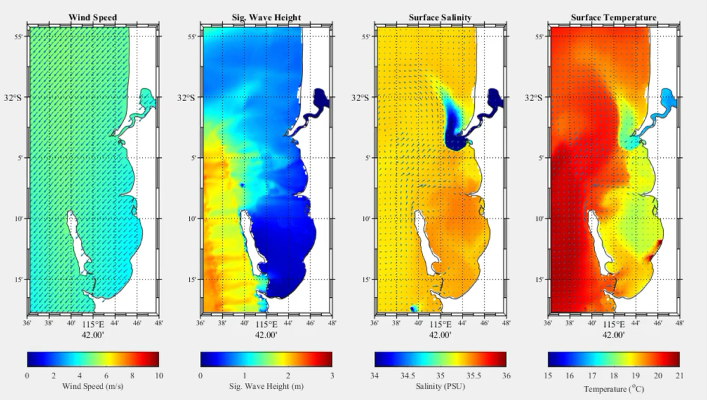
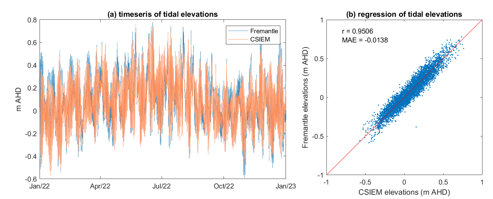
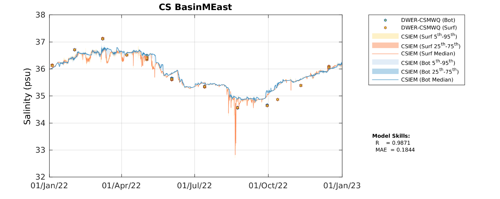
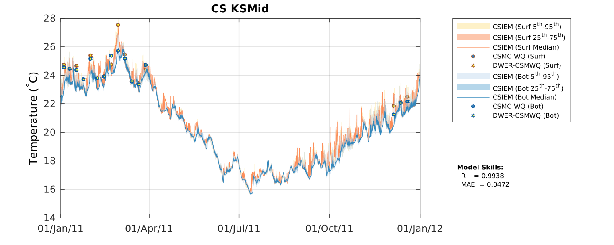
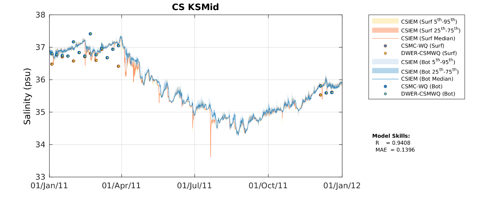

# Hydrodynamics {#hydrodynamics}

## Overview

The hydrodynamics of Cockburn Sound are governed by the interplay of seasonal wind regimes, relatively weak tidal forcing, episodic periods of stratification, and the regional drivers of currents along Perth's coast. The system is also influenced by human-induced changes to the physical environment which have occured over time, including both changes to the Sound's bathymetry, and discharges to the system that impact local water temperature and salinity patterns. This chapter describes the approach to simulation of hydrodynamics within the CSIEM platform, and outlines efforts to validate the model. The changes in weather, wave, and hydrodynamic conditions are highly dynamic and variabe in space snd time (Figure 5.1), and serve as the foundation for ecosystem predictions presented in subsequent chapters.

<video width="80%" height="80%" controls>
<source src="./media/hydro/1_4panel_animation.avi" type="video/avi">
</video>

{width="5.459722222222222in" height="3.09749343832021in"}

**Figure 5.1.** Snapshot output (July 2013) from CSIEM showing wind, wave, salinity and temperature variation across the Perth coast.

## Hydrodynamic setting

In brief, and for the purposes of contextualising the model approach, the primary driver of circulation in Cockburn Sound is wind, particularly the prevailing south-westerly sea breeze during the summer months. This consistent wind pattern induces a two-layer circulation with surface waters are driven northward by the wind, while a compensatory return flow develops at depth, moving southward. This mechanism is critical in transporting heat, nutrients, and other properties throughout the water column and across the basin. The horizontal shear established during these flows is generally effective at promoting vertical mixing, however, during periods of sustained solar heating and calm weather, thermal stratification intensifies, and vertical mixing becomes inhibited.

This pattern of stratification typically develops in late spring and can persist into summer and early autumn. Solar heating at the surface, combined with weak tidal mixing and reduced wind-driven turbulence, results in the formation of a pycnocline separating the bottom waters, and this is most notable in the southern region of the Sound, where the residence time of bottom water is longest and flushing is most restricted. In contrast, during the winter months, increased storm activity and a shift to more variable northerly winds enhance vertical mixing, eroding stratification and replenishing oxygen levels throughout the water column. Freshwater inputs from surface runoff and groundwater are limited in Cockburn Sound, and thus salinity-driven stratification is generally weak. However, under certain conditions, especially following large rainfall events or in proximity to anthropogenic discharges, salinity gradients can form and contribute to stratification, albeit to a lesser extent than thermal effects. In addition to the natural dynamics, hypersaline discharges from the Perth Seawater Desalination Plant have the potential to intensify near-bottom density stratification (BMT 2019). These discharges tend to move along the seabed due to their higher salinity, which can exacerbate hypoxic conditions when overlaid by a stable, warmer water column. Warm waters discharged after cooling industrial facilities can also contributed to vertical buoyancy gradients along the Kwinana Shelf.

Tidal forcing plays a relatively minor role in the overall circulation of Cockburn Sound. The microtidal regime, with tidal ranges averaging around 0.5 metres, results in weak tidal currents that are generally insufficient to drive substantial mixing or water exchange on their own. Nonetheless, tides do contribute to localized nearshore and residual circulation features and can influence sediment resuspension and mixing near coastal infrastructure, particularly in combination with wind forcing.

The embayment's capacity for flushing and water renewal varies both spatially and seasonally. In the northern part of Cockburn Sound, where connections to offshore waters are more direct and wind-induced circulation is stronger, flushing times are relatively short---on the order of several days under favourable wind conditions. In contrast, the southern basin experiences significantly longer residence times, often exceeding 30 to 50 days during summer. The most notable modification to the natural hydrodynamic regime was the construction of the Garden Island Causeway in the 1970s, which connects the mainland to Garden Island. This solid structure substantially impedes the natural exchange of water between the central basin and offshore waters, particularly in the vicinity of the causeway. As a result, regions to the south of Cockburn Sound exhibit extended residence times and greater susceptibility to water quality deterioration.

Ability to resolve these flushing times, the key circulation features and the effect stratification, are important to resolve due to their role in shaping the accumulation patterns of nutrients, reduced oxygen concentrations, and other water quality processes like algal bloom development. Early three-dimensional models (e.g. Mills and D'Adamo, 1995) provided key insights into seasonal circulation patterns and the effects of infrastructure like the Garden Island Causeway. More recently, a range of high-resolution models (e.g., FVCOM, TUFLOW-FV, SCHISM, ROMS, ELCOM) have been applied for various applications and demonstrate good performance in simulate the hydrodynamics of the Sound, including the two-layer wind-driven circulation, residual currents and temperature structure (e.g., Xiao et al., 2022).

An additional requirement for integrated prediction and EIA in the sound is flexibility in capturing the role of coastal infrastructure and associated. Desalination operations, port development, and dredging activities all impact hydrodynamic and sediment movement. In particular, dredging and port operations also modify local bathymetry over time, modifying currents and remobilising sediments.

In this section, the model setup as described in the previous chapters is tested against available data on waves, currents, water level, temperature and salinity.

## Model description 

CSIEM consists of a set of linked one-way coupled models to capture the hydrodynamics of Cockburn Sound and the surrounding waters. The core engine capturing local hydrodynamics is the 3-D unstructured model TUFLOW-FV, which simulates local water levels and currents, turbulent mixing, and water density, temperature and salinity. This model is forced by weather, wave and regional ocean model outputs, each of which has several options within the CSIEM software ecosystem, and which are described in Chapter X.

The model adopts a flexible mesh (users can select one of 4 options are available; see Figure 2.3) and is based on a finite-volume numerical scheme, which solves the conservative integral form of the non-linear shallow water equations. The model resolves the advection and transport of scalar constituents including both salinity and temperature. The equations are solved in 3D with baroclinic coupling from both salinity and temperature and adopts the UNESCO equation of state for density (Fofonoff and Millard, 1983). The vertical scheme in the model adopts a hybrid z-σ approach, with variable z-spacing (by default ranging from 0.2 - 1m thickness) to the tidal minimum elevation, and then 6 σ layers spannign the tidal range. 

Surface momentum exchange and heat dynamics are solved in each water column, and in the current application, turbulent mixing of momentum and scalars has been calculated using the Smagorinsky scheme in the horizontal plane and through application of the coupled General Ocean Turbulence Model (GOTM) for vertical mixing. The calculation of horizontal turbulent mixing adopts a 1st or 2nd order approximation of the spatial gradients. In the vertical, the XX option within GOTM is adopted by default, however other GOTM options are selectable as desired for more specific applications.

The bottom shear stress configuration within CSIEM adopts the roughness--length relationship approach, assuming a rough-turbulent logarithmic velocity profile in the lowest model layer. The roughness length, *z~0~*, settings were based on the area type (e.g., soft substrate, hard substrate, reef, seagrass coverage, etc.) and when coupled with the ecosystem model, the bottom drag is influenced by the biomass of aquatic vegetation within the cell. For this purpose, the bottom was categorized into 20 zones (Figure [2.2]{.mark}) where the benthic characteristics and associated *z~0~* in each zone were specified (Table 6.2).

The hydrodynamics are driven by boundary conditions as summarised in Section 2.4, with spatially variable inputs at the ocean boundary, surface meteorological forcing and river inputs on the landward side creating the necessary forcing to resolve the key circulation features. 

 - Weather conditions: CSIEM relies on one of two gridded weather data products - either the Bureau of Meterology's 1.5km BARRA-PH re-analysis product, or output from a locally developed WRF model. The main WRF simulation is the 1.75km horizontal-resolution application, that adopts 2 levels of regional down-scaling from the global GFS product, and resolves X atmospheric levels. The model is configured based on a one-way coupling, and thus uses estimates for local water and land temperature as the lower boundary condition. BARRA is a interpolated reanalysis product described in XX. 
 
 - Wave conditions: CSIEM relies on one of two gridded wave model outputs -  either the SWAN or WWM models. The wave model output is read in to TUFLOW-FV as a boundary condition.  

 - Ocean conditions: The 2km ROMS model output is processed into a netcdf file and water levels and depth-resolved profiles of currents, temperature and salinity are specified at each model edge cell, and updated at an hourly resolution. Where needed, the coarser scale HYCOM model can instead be used in place of ROMS. An assessment of the performance of ROMS in caputring the seasonal and inter-annual variability in regional ocean dynamics, refer to Chapter X.

 - Estuarine inputs:
 
 - Stormwater inputs:

 - Local discharges:
 

## Field validation data

A range of data has been compiled and is used in the below assessment of model performance. These data are from varied sources and available via the CSIEM data catalogue (Figure 5.12) as described in Hipsey et al. (2025). Further data sets are being added and are able to be used in ongoing model assessment and refinement.

### {.panelset .unnumbered}

#### Hydrodynamics Dataset Summary {.unnumbered}

{width="6.301388888888889in" height="4.457638888888889in"}

**Figure 5.12a.** Hydrodynamics data-set: Summary of CSIEM data catalogue showing identified hydrodynamics data. Visit the csiem-data catalogue for further information. Click to enlarge.

#### Temp/Sal Dataset Summary {.unnumbered}

{width="6.301388888888889in" height="4.458333333333333in"}

**Figure 5.12b.** Hydrodynamics data-set: Summary of CSIEM data catalogue showing identified temperature and salinity data (bottom). Visit the csiem-data catalogue for further information. Click to enlarge.

## Weather dynamics

## Wave climate

The CSIEM model platform includes two main wave modelling products, and a range of wave related data-sets from DOT, FPA, JPPL, and UWA. The main continuous (13 year) wave modelling product is from the WWM model developed as part of the WWMSP program and reported in Pattiaratchi and Janekovic (2024). The platform additionally includes an option for using SWAN model outputs, which have been developed by BMT during the different phases of CSIEM platform development (Gunaratne et al., 2022); this has been used in related  applications in Cockburn Sound.

Readers are referred to these reports for the specifics of these model applications and their setup justifications. Given the various domains and approaches (Figure 5.2) an assessment of the models in the context of the CSIEM platform is provided here for reference.

{width="5.5in" height="3.8911996937882765in"}

**Figure 5.2.** Outline of different wave model domain extents available in CSIEM. In TUFLOW-FV, the application of these is hierarchical so the highest resolution option is used where available.

[2013 model inter-comparison :]{.underline}

As the model system developed spans multiple years and has several options for wave data able to be used as boundary conditions to the main CSIEM hydrodynamic model, an initial screening and comparison of models indicates the differences between the various model setup options, model resolutions and the (JPPL) field data (Figure 5.1). When comparing data for a focus period in September 2013 at the JPPL site S02, the initial assessment showed the BMT SWAN model (both the B and C resolution domains) were relatively accurate in capturing the magnitude of the significant wave height and changes over time, and the direction and wave period. The WWM model in our analyses displayed an over-prediction bias in the wave height, but was comparable in capturing wave direction and magnitude. The validation presented of the WWM calibration reported in Pattiaratchi and Janekovic (2024),  showed accurate and non-biased results against the nearby Stirling Channel data collected by FPA in the year 2022, and other data collected by WWMSP Project 5.2. In that analysis seasonal and event changes in significant wave height are notably lower than in presented in these plots suggesting potential differences in methodology or versions.

{width="5.672017716535433in" height="4.2555555555555555in"}

**Figure 5.2.** Comparison of (a) significant wave height, (b) wave direction, and (c) wave period comparing models and data in the CSIEM platform (SWAN-B, SWAN-C, WWM, TUFLOW-FV) and AWAC data at site S01 in for a period in 2013.

As the raw wave model data is internally interpolated into the selected hydrodynamic model mesh used by TUFLOW-FV, tests were also undertaken to ensure the raw model boundary conditions values were being applied correctly. This is also shown Figure 5.2, showing the TUFLOW-FV (TFV) wave model predictions at the same location for the "B" grid.

[2013 and 2023 wave climate validation :]{.underline}

Further comparison of the WWM wave model outputs was undertaken against the available JPPL AWAC data at S01 and S02, and against data from Parmelia Bank (A and B) ADV collected as part of WWMSP Project 9.1 measuring coastal processes.

Performance against the JPPL S01 & S02 AWAC data suggested the WWM wave model generally over-predicted the significant wave height by a factor of upto 2 (Figure 8.6 and 8.7). Within the TUFLOW-FV modelling, a bias-correction options was therefore applied to the significant wave height from WWM, and when doing using a factor of 0.5, the CSIEM output generally agreed well with the field data, with a regression coefficient \> 0.47 and MAE \< 0.052 m at both sites.

Similar comparisons were made between the model outputs to the ADV data collected at sites of Parmelia Bank A (115.7128°E, 32.1200°S) and Parmelia Bank B (115.7201°E, 32.1333°S) (Figure 8.8 & 8.9). The results suggested that with bias correction to the significant wave height from WWM, the CSIEM output generally agreed well with the field data, with a regression coefficient \> 0.76 and MAE \< 0.22 m for these two sites.

The observed wave direction showed more variability with periods where the model diverges from the observations, particularly during some high-variability phases. The model\'s performance for wave period is mixed. While the general trend is captured, there is significant scatter in the observed data, particularly in shorter wave periods.

{width="6.1262478127734035in" height="4.369907042869642in"}

**Figure 5.2a.** Comparison of (a) significant wave height, (b) wave direction, and (c) wave period of WWM, CSIEM, and AWAC data at site S01 in year 2013.

{width="6.126388888888889in" height="4.4079122922134735in"}

**Figure 5.2b.** Comparison of (a) significant wave height, (b) wave direction, and (c) wave period of WWM, CSIEM, and AWAC data at site S02 in year 2013.

{width="6.287557961504812in" height="4.395062335958006in"}

**Figure 5.3a.** Comparison of (a) significant wave height, (b) wave direction, and (c) wave period of WWM, CSIEM, and ADV measurements at Parmelia Bank A in year 2023/24.

{width="6.288194444444445in" height="4.46465113735783in"}

**Figure 5.3b.** Comparison of (a) significant wave height, (b) wave direction, and (c) wave period of WWM, CSIEM, and ADV measurements at Parmelia Bank B in year 2023/24.

## Water surface elevation

Simulated surface water elevations at site of Fremantle tidal gauge station were compared against data collected during 2023 (Figure 5.4). The model confidently captures the temporal variation in the tidal elevations over the simulation period with a correlation coefficient of 0.9310 and MAE of 0.0034 m.

{width="6.301388888888889in" height="2.5479166666666666in"}**Figure 5.4.** Comparison of surface water elevations against Fremantle gauge data in year 2022.

## Currents

Modelled eastern and northern currents were compared to the ADV data collected at sites of Parmelia Bank A (115.7128°E, 32.1200°S) and Parmelia Bank B (115.7201°E, 32.1333°S) from WWMSP Project 9.1 (Figure 8.2 & 8.3). The model reasonably captures the temporal variation in the currents over the simulation period with a correlation coefficient \>0.45 and MAE\< 0.0187 m/s.

{width="6.131402012248469in" height="4.425925196850394in"}

**Figure 5.5a.** Comparison of (a) eastern and (b) northern currents between CSIEM outputs and ADV measurements at Parmelia Bank A in year 2023/24.

{width="6.13125in" height="4.405433070866142in"}

**Figure 5.5b.** Comparison of (a) eastern and (b) northern currents between CSIEM outputs and ADV measurements at Parmelia Bank B in year 2023/24.

Further comparison of current profiles was made between the CSIEM outputs and historical AWAC data collected at site S01 (115.7627°E, 32.2009°S, on east shelf of Cockburn Sound) from JPPL (Figure 5.6). The model was able to well capture the phase (switch of current directions) and the magnitudes of currents in comparison to the data.

{width="6.301388888888889in" height="3.9635323709536308in"}

**Figure 5.6a.** Comparison of (a) eastern and (b) northern currents between CSIEM outputs and JPPL AWAC measurements at site S01 in year 2013.

{width="6.411763998250219in" height="4.087307524059493in"}

**Figure 5.6b.** Comparison of (a) eastern and (b) northern currents between CSIEM outputs and JPPL AWAC measurements at site S02 in year 2013.

## Temperature and salinity

Water temperature and salinity patterns were subject to an iterative calibration process, comparing the grab data and continuous data available for these variables against the model at several assessment zones. Initial experience with earlier versions of CSIEM had highlighted issues associated with incorrect seasonal trends in salinity and biases in temperature to be considered when refining the performance of CSIEM1.5. In addition, for CSIEM 1.5 a wider range of years were considered in the model assessment process. Adjustments in this version included refining the ocean boundary inputs (see Chapter 3) and parameters in the heat balance model.

Both the water temperature and salinity seasonal variations within the Sound, with the higher temperature and salinity in summertime and lower in wintertime explored for the year 2022 (Figure 5.7). The modelled data closely aligns with the field observations, capturing both the seasonal trends and variations throughout the year. The high correlation coefficient (r=0.9975 for temperature and r=0.9871 for salinity) and low mean absolute error (MAE=0.1944°C for temperature and MAE=0.1844 psu for salinity) indicates an excellent agreement between the model and observations. Episodes of short-term stratification are resolved, as indicated between the difference between surface and bottom.

The model\'s robustness in capturing temporal and spatial variations in temperature and salinity was further tested in the year 2011, when the SWA coastal region experienced a significant marine heat wave event (e.g., see Figure 3.5). The comparison between the model output and observations (Figure 5.8) indicated that the model captured the heat wave event during the summer, with temperature reaching 27.8 degrees and salinity reached 37.4 psu in February of that year.

{width="6.301388888888889in" height="2.5208333333333335in"}

{width="6.301388888888889in" height="2.460784120734908in"}

**Figure 5.7.** Comparison of water temperature and salinity between CSIEM and field observations at the region of middle east basin of Cockburn Sound (BasinMEast) in year 2022.

{width="6.301388888888889in" height="2.517361111111111in"}

{width="6.301388888888889in" height="2.517361111111111in"}

**Figure 5.8.** Comparison of water temperature and salinity between CSIEM and field observations at the region of middle Kwinana Shelf of Cockburn Sound (KSMid) in year 2011 experiencing a heat wave event in summer.

Additional comparisons of the model against data from the Cockburn Sound moorings, and from satellite images has also been undertaken. For example, a multi-data set comparison is presented in Figure 5.9 comparing a rage of data for Henderson and Mangles Bay. This includes in situ sensors, profile, and data from the GHRSST satellite product. The demonstrate the strong model performance in resolving the seasonal changes and shorter-term changes associated with weather events. At the shallow sites the GHRSST product shows accuracy issues, but more accurate is at the deeper water site.

Images of the system, take a various times are able to show the effect of surface cooling waters released to the Sound (Figure 5.10), and the brine discharge (Figure 5.11).

These examples are just a limited set selected to demonstrate general aspects of the model performance, and a detailed catalogue of the model validation of these parameters for all the CSIEM assessment polygons and all the available datasets is included in the csiem_model_1.5 repository. Furter validation plots exploring dynamics of these system and the response during specific events are able to be made using the MARVL scripts included in the csiem-marvl repository.

{width="5.514583333333333in" height="2.9906616360454943in"}{width="5.514583333333333in" height="2.9742530621172354in"}

{width="5.514844706911636in" height="2.9901957567804023in"}

**Figure 5.9.** Comparison of water temperature in three regions of the model between Jan 2022 and Apr 2024, comparing the model simulations against various data-sets in the csiem-data catalogue.

{width="2.9080358705161853in" height="3.8627449693788276in"}{width="3.0098042432195977in" height="3.9365583989501314in"}

**Figure 5.10.** Comparison of water temperature in three regions of the model between Jan 2022 and Apr 2024, comparing the model simulations against various data-sets in the csiem-data catalogue.

{width="6.301388888888889in" height="3.067361111111111in"}

**Figure 5.11.** Output of the CSIEM model demonstrating the plume from the PSDP brine discharge, as both a salinity anomaly and tracer.

## Limitations and further work

Development of the CSIEM model during the WWMSP project 1.2, and reported herein, was undertaken in parallel to other applications of the model focusing on hydrodynamics, flushing and sediment transport as part of Westport's assessment of port options. As a result, this is therefore not an exhaustive assessment of the model's performance in resolving waves, currents and circulation features in Cockburn Sound. This assessment has been made in the context of development of an integrated approach to ecosystem prediction, linking met-ocean conditions, biogeochemistry and ecology in a coordinated way over the scales relevant to prediction challenges for cumulative EIA. Beyond this scope, there are a range of areas for further investigation and refinement to be considered during applications with this version and for consideration during further developments of the platform.

- The Project 5.2 analysis of the wave model show seasonal and event changes in significant wave height are notably lower than in presented in this assessment suggesting potential differences in methodology, or model versions. The wave prediction methodology described in Pattiaratchi and Janekovic (2024) describes two-way hydrodynamic-wave coupling with the model SCHISM-WWM, whereas the 13-year data-set archived to the CSIEM platform was run without two-way coupling. Further analysis is required to resolve the difference.

- Sensitivity to different mesh configurations in resolving the currents and stratification under different forcing conditions will enable more informed selection of the appropriate mesh for different applications.

- Further assessment of the model in resolving plume dynamics, both associated with the low-discharge desalination and industrial discharge plumes, and also the occasional high-discharge flow pulses from the Swan and Peel systems is suggested.

- A further dedicated comparison of the model in resolving stratification phenology over a wider range of met-ocean conditions by comparing against the DWER mooring data would allow further refinement of model surface heating and vertical mixing dynamics.

