# Hydrodynamics {#hydrodynamics}

## Overview

The hydrodynamics of Cockburn Sound are governed by the interplay of seasonal wind regimes, relatively weak tidal forcing, episodic periods of stratification, and the regional drivers of currents along Perth's coast. The system is also influenced by human-induced changes to the physical environment which have occurred over time, including both changes to the Sound's bathymetry, and discharges to the system that impact local water temperature and salinity patterns. This chapter describes the approach to simulation of hydrodynamics within the CSIEM platform, and outlines efforts to validate the model. The changes in weather, wave, and hydrodynamic conditions are highly dynamic and variabe in space and time (Figure 7.1), and serve as the foundation for ecosystem predictions presented in subsequent chapters.

<br>

<center>
<video width="97%" height="97%" controls>
<source src="./media/hydro/1_4panel_animation.mp4" type="video/mp4">
</video>
</center>

**Figure 7.1.** Example hydrodynamic output from CSIEM showing wind, wave, salinity and temperature variation across the Perth coast in July 2013.

<br>


```{block2, hintM2-1, type='rmdnote2'}
*This chapter provides a general summary of the model and its performance; please note some results are specific to a particular version of the model at the time of preparation, and the model performance is subject to iterative refinements over time. For performance of a specific model version follow the below links to the MARVL Viewer.*
```


## Hydrodynamic setting

In brief, and for the purposes of contextualising the model approach, the primary driver of circulation in Cockburn Sound is wind, particularly the prevailing south-westerly sea breeze during the summer months. This consistent wind pattern induces a two-layer circulation with surface waters are driven northward by the wind, while a compensatory return flow develops at depth, moving southward. This mechanism is critical in transporting heat, nutrients, and other properties throughout the water column and across the basin. The horizontal shear established during these flows is generally effective at promoting vertical mixing, however, during periods of sustained solar heating and calm weather, thermal stratification intensifies, and vertical mixing becomes inhibited.

This pattern of stratification typically develops in late spring and can persist into summer and early autumn. Solar heating at the surface, combined with weak tidal mixing and reduced wind-driven turbulence, results in the formation of a pycnocline separating the bottom waters, and this is most notable in the southern region of the Sound, where the residence time of bottom water is longest and flushing is most restricted. In contrast, during the winter months, increased storm activity and a shift to more variable northerly winds enhance vertical mixing, eroding stratification and replenishing oxygen levels throughout the water column. Freshwater inputs from surface runoff and groundwater are limited in Cockburn Sound, and thus salinity-driven stratification is generally weak. However, under certain conditions, especially following large rainfall events or in proximity to anthropogenic discharges, salinity gradients can form and contribute to stratification, albeit to a lesser extent than thermal effects. In addition to the natural dynamics, hypersaline discharges from the Perth Seawater Desalination Plant have the potential to intensify near-bottom density stratification (BMT 2019). These discharges tend to move along the seabed due to their higher salinity, which can exacerbate hypoxic conditions when overlaid by a stable, warmer water column. Warm waters discharged after cooling industrial facilities can also contributed to vertical buoyancy gradients along the Kwinana Shelf.

Tidal forcing plays a relatively minor role in the overall circulation of Cockburn Sound. The microtidal regime, with tidal ranges averaging around 0.5 metres, results in weak tidal currents that are generally insufficient to drive substantial mixing or water exchange on their own. Nonetheless, tides do contribute to localized nearshore and residual circulation features and can influence sediment resuspension and mixing near coastal infrastructure, particularly in combination with wind forcing.

The embayment's capacity for flushing and water renewal varies both spatially and seasonally. In the northern part of Cockburn Sound, where connections to offshore waters are more direct and wind-induced circulation is stronger, flushing times are relatively short---on the order of several days under favourable wind conditions. In contrast, the southern basin experiences significantly longer residence times, often exceeding 30 to 50 days during summer. The most notable modification to the natural hydrodynamic regime was the construction of the Garden Island Causeway in the 1970s, which connects the mainland to Garden Island. This solid structure substantially impedes the natural exchange of water between the central basin and offshore waters, particularly in the vicinity of the causeway. As a result, regions to the south of Cockburn Sound exhibit extended residence times and greater susceptibility to water quality deterioration.

Ability to resolve these flushing times, the key circulation features and the effect stratification, are important to resolve due to their role in shaping the accumulation patterns of nutrients, reduced oxygen concentrations, and other water quality processes like algal bloom development. Early three-dimensional models (e.g. Mills and D'Adamo, 1995) provided key insights into seasonal circulation patterns and the effects of infrastructure like the Garden Island Causeway. More recently, a range of high-resolution models (e.g., FVCOM, TUFLOW-FV, SCHISM, ROMS, ELCOM) have been applied for various applications and demonstrate good performance in simulate the hydrodynamics of the Sound, including the two-layer wind-driven circulation, residual currents and temperature structure (e.g., Xiao et al., 2022).

An additional requirement for integrated prediction and EIA in the sound is flexibility in capturing the role of coastal infrastructure and associated. Desalination operations, port development, and dredging activities all impact hydrodynamic and sediment movement. In particular, dredging and port operations also modify local bathymetry over time, modifying currents and remobilising sediments.

In this section, the model setup as described in the previous chapters is tested against available data on waves, currents, water level, temperature and salinity.

## Model description 

### Overview 

CSIEM consists of a set of linked (one-way coupled) models to capture the hydrodynamics of Cockburn Sound and the surrounding waters. The core engine capturing local hydrodynamics is the 3-D unstructured model TUFLOW-FV, which simulates local water levels and currents, turbulent mixing, and water density, temperature and salinity. This model is forced by weather, wave and regional ocean model outputs, each of which has several options within the CSIEM software ecosystem, and which are described in Chapter 4.

The model adopts a flexible mesh (users can select one of 4 options are available; three as depicted in Figure 4.3 and a fourth "Westport EIA Mesh") and is based on a finite-volume numerical scheme, which solves the conservative integral form of the non-linear shallow water equations. The model resolves the advection and transport of scalar constituents including both salinity and temperature. The equations are solved in 3D with baroclinic coupling from both salinity and temperature and adopts the UNESCO equation of state for density (Fofonoff and Millard, 1983). The vertical scheme in the model adopts a hybrid z-σ approach, with variable z-spacing (by default ranging from 0.2 - 1m thickness) to the tidal minimum elevation, and then 6 σ layers spanning the tidal range. 

### Model parameterisation 

**Surface thermodynamics**: Surface momentum exchange and heat dynamics are solved in each water column cell of the domain, using standard bulk-transfer approach, with assumed momentum input linked to wind stress, and heat exchange based on humidity and temperature gradients between the water surface and 10m height above the surface. Light penetration is split into 4 representative band-widths, NIR, PAR, UVA and UVB, which are enter the upper cell and are subject to light attenuation using a band-width specific light attenuation coefficient; this is set to default values in TUFLOW-FV, but can be manipulated by the coupled sediment or water quality model libraries as appropriate. Non-penetrative (longwave) radiative fluxes are also included, with the downward longwave set based on outputs from the linked atmospheric model, and the upward component computed dynamically based on the temperature of the uppermost water cell.

**Turbulence**: In the current application, turbulent mixing of momentum and scalars has been calculated using the Smagorinsky scheme in the horizontal plane and through application of the coupled General Ocean Turbulence Model (GOTM) for vertical mixing. The calculation of horizontal turbulent mixing adopts a 1st or 2nd order approximation of the spatial gradients. In the vertical, the turbulence option 3 is adopted within GOTM by default (second order with k-epsilon style closure), however other GOTM options are selectable as desired for more specific applications.

**Bottom boundary layer**: The bottom shear stress configuration within CSIEM adopts the roughness--length relationship approach, assuming a rough-turbulent logarithmic velocity profile in the lowest model layer. The roughness length, *z~0~*, settings were based on the area type (e.g., soft substrate, hard substrate, reef, seagrass coverage, etc.) and when coupled with the ecosystem model, the bottom drag is influenced by the biomass of aquatic vegetation within the cell. For this purpose, the bottom was categorized into 20 zones (Figure [4.2]{.mark}) where the benthic characteristics and associated *z~0~* in each zone were specified.

### Boundary specification 

The hydrodynamics within the CSIEM domain are driven by a carefully co-ordinated set of boundary conditions, which are generally summarised in Section 2.4. These include spatially variable inputs along the ocean boundary as well as for the surface meteorological forcing, and on the landward side, river and discharges are also included. Together, these create the necessary external forcing to resolve the key circulation features within region of focus, and the associated variability in temperature and salinity.

A summary of the 7 main types of boundary conditions configured within CSIEM include:

- **Weather conditions**: CSIEM relies on one of two gridded weather data products - either the Bureau of Meterology's 1.5km BARRA-PH re-analysis product, or output from a locally developed WRF model. The main WRF simulation is the 1.75km horizontal-resolution application over the Perth region (WRF-PERTH), that adopts 2 levels of regional down-scaling from the global GFS product, and resolves X atmospheric levels. The model is configured based on a one-way coupling, and thus uses estimates for local water and land temperature as the lower boundary condition. BARRA is a interpolated reanalysis product described in Su et al. (2019). Comparisons between BARRA-PH and WRF-PERTH were undertaken for the year of 2018, and the results were consistent and comparable.  

- **Wave conditions**: CSIEM relies on one of two gridded wave model outputs -  either the SWAN or WWM models. The wave model output is read in to TUFLOW-FV as a boundary condition, and includes significant wave height, wave direction and wave period as input to each water column cell. In the default CSIEM setup, there is no two-way interaction between the models, though this is possible if required for focused investigations. The main continuous (13 year) wave modelling product is from the WWM model developed as part of the WWMSP program and reported in detail in Pattiaratchi and Janekovic (2024), and the platform additionally includes an option for using SWAN model outputs for select years, which have been developed by BMT during the different phases of CSIEM platform development (Gunaratne et al., 2022). The SWAN model is configured to have three sub-domains of sequentially increasing resolution and reducing domain size, and they can be stacked within TUFLOW-FV, such that the highest resolution product available in any hydrodynamic cell will be applied. The WWM model on the other hand is a continuous un-structured model with variable mesh resolution. As this format does not read natively into TUFLOW-FV, a conversion step is undertaken to interpolate WWM raw wave results onto a high-resolution grid comparable to SWAN.

- **Ocean conditions**: The 2km ROMS raw model output is processed into a intermediate NetCDF file with water levels and depth-resolved profiles of currents, temperature and salinity  specified at each model edge cell, and at an hourly resolution. An assessment of the performance of ROMS in capturing the seasonal and inter-annual variability in regional ocean dynamics, refer to Chapter 4. In the case of salinity, some seasonal bias was assessed, and thus and additional bias-correction step was applied to the raw ROMS model output.  Where needed, the coarser scale HYCOM model can instead be used in place of ROMS, but the performance of this approach is not discussed further here.

- **Estuarine inputs**: Inputs of flow are includes at four locations into the CSIEM domain: at the Narrows Bridge, at the Canning Bridge, at Mandurah, and at Dawesville Channel.  Flows, and their associated temperature and salinity, were computed based measured upstream flow rates, and interpolated temperature and salinity data.
 
- **Groundwater inputs**: Inputs of flow from groundwater along the eastern edge of Cockburn Sound were computed by an associated model setup using the MODFLOW system (Donn et al. 2025). See Chapter 8 for detail on how this is configured. The inputs have a relatively negligble effect on CS hydrodynamics but are included to ensure inclusion of the associated nutrient loads.  

- **Stormwater inputs**: A set of 13 point source inputs associated with urban and industrial stormwater inputs are also included in the model. These are based on the report of Donn et al. (2025) and flow amounts quantified based on a model assessment of the Lake Richmond system for the Mangles Bay Drain, and a simple rainfall-runoff approximation for the other smaller urban pipe netowrks. See Chapter 9 for further detail.

- **Local discharges**: Cockburn Sound and the surrounding Perth waters that are captured within the CSIEM domain have been impacted by numerous discharges (and intakes) over time. The specific flow volumes and their salinity and temperature specification depends on the year of simulation configured. In general, the  hydrodynamics are influenced by warm water discharges, the high-salinity Perth desalination plant (PSDP) discharge, and other low-salinity waste-water discharges. These are configured to enter at the pipe outlet location, either into the water column as a surface-1m or bottom-1m inflow.  See Chapter 9 for further detail.
 
## Field data and approach to validation

A range of data has been compiled and is used in the below assessment of model performance. These data are from varied sources and available via the CSIEM data catalogue (Figure 7.2) as described in Hipsey et al. (2025). Further data sets are being added and are able to be used in ongoing model assessment and refinement.

The approach to CSIEM hydrodynamic validation includes three elements:

- **Synoptic scale assessment** of temperature and salinity dynamics, across multiple sites and multiple years, comparing both surface and bottom conditions ([<span style="color: blue">images viewable via the **MARVL-VIEWER** web-app</span>](https://csiem-mv.seaf.org.au).
- **Focused validation** of the model coinciding with periods of interesting events, and/or periods of high quality data-sets. For example, key data-sets recording high-resolution currents within Cockburn Sound and Owen Anchorage include:
  - UWA-OI : 2011, *Summer*
  - JPPL-AWAC : 2013, *Summer*
  - WWMPS5-AWAC : 2021-2022, *All Seasons*  
  - WWMSP9-AWAC : 2023-2024, *Winter and Summer*
- **Benchmarking** against prior publications reporting specific behaviors and patterns in the system (e.g., residual circulation features, two-layer flow dynamics, and seasonal regimes). Specifically, these include assessment based on:
  - D’Adamo (1992) – seasonal regimes 
  - Ruiz-Montoya & Lowe (2014) – controls on exchange
  - Xiao et al. (2024) – summer stratification, exchange dynamics and flushing

A summary of the locations of "hydrodynamic" and water "physico-chemical" data within the CSIEM data platform are summarised in Figure 7.2, below. 

### {.panelset .unnumbered}

#### Hydrodynamics Dataset Summary {.unnumbered}

{width="6.301388888888889in" height="4.457638888888889in"}

**Figure 7.2-i.** Hydrodynamics data-set: Summary of CSIEM data catalogue showing identified hydrodynamics data. Visit the csiem-data catalogue for further information. Click to enlarge.

#### Temp/Sal Dataset Summary {.unnumbered}

{width="6.301388888888889in" height="4.458333333333333in"}

**Figure 7.2-ii.** Hydrodynamics data-set: Summary of CSIEM data catalogue showing identified temperature and salinity data (bottom). Visit the csiem-data catalogue for further information. Click to enlarge.


## Wave climate

Readers are referred to the associated wave modelling reports for detailed descriptions of the wave model validation and for the specifics of these model applications and their setup justifications. Given the various domains and approaches (Figure 7.3) an assessment of the models in the context of benchmarking them within the CSIEM platform is provided here for reference. This comparison includes the two main wave modelling products, and a range of wave related data-sets from DOT, FPA, JPPL, and UWA. 

{width="5.5in" height="3.8911996937882765in"}

**Figure 7.3.** Outline of different wave model domain extents available in CSIEM. In TUFLOW-FV, the application of these is hierarchical so the highest resolution option is used where available.

### 2013 model inter-comparison

As the model system developed spans multiple years and has several options for wave data able to be used as boundary conditions to the main CSIEM hydrodynamic model, an initial screening and comparison of models indicates the differences between the various model setup options, model resolutions and the (JPPL) field data (Figure 7.4). When comparing data for a focus period in September 2013 at the JPPL site S02, the initial assessment showed the BMT SWAN model (both the B and C resolution domains) were relatively accurate in capturing the magnitude of the significant wave height and changes over time, and the direction and wave period. The WWM model in our analyses displayed an over-prediction bias in the wave height, but was comparable in capturing wave direction and magnitude. The validation presented of the WWM calibration reported in Pattiaratchi and Janekovic (2024),  showed accurate and non-biased results against the nearby Stirling Channel data collected by FPA in the year 2022, and other data collected by WWMSP Project 5.2. In that analysis seasonal and event changes in significant wave height are notably lower than in presented in these plots suggesting potential differences in methodology or versions.

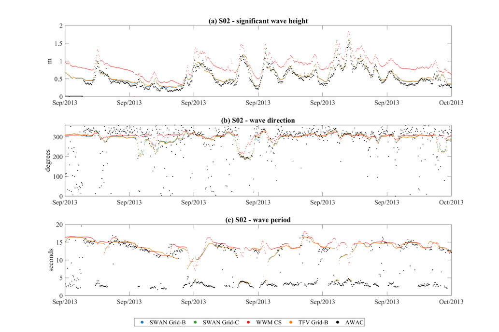{width="5.672017716535433in" height="4.2555555555555555in"}

**Figure 7.4.** Comparison of (a) significant wave height, (b) wave direction, and (c) wave period comparing models and data in the CSIEM platform (SWAN-B, SWAN-C, WWM, TUFLOW-FV) and AWAC data at site S01 in for a period in 2013.

As the raw wave model data is internally interpolated into the selected hydrodynamic model mesh used by TUFLOW-FV, tests were also undertaken to ensure the raw model boundary conditions values were being applied correctly. This is also shown Figure 7.5, showing the TUFLOW-FV (TFV) wave model predictions at the same location for the "B" grid.

### 2013 and 2023 wave climate validation

Further comparison of the WWM wave model outputs was undertaken against the available JPPL-AWAC data at S01 and S02 (available in 2013), and against data from Success Bank and Parmelia Bank ADV data summarised WWMSP9-AWAC measuring coastal processes (available in 2023).

#### 2013 {.unnumbered}

Performance against the JPPL S01 & S02 AWAC data suggested the WWM wave model generally over-predicted the significant wave height by a factor of upto 2 (Figure 7.5 and 7.6). Within the TUFLOW-FV modelling, a bias-correction option was therefore applied to the significant wave height from WWM, and when doing using a factor of 0.5, the scaled output used within the CSIEM model generally agreed well with the field data, with a regression coefficient \> 0.47 and MAE \< 0.052 m at both sites.

#### {.panelset .unnumbered}

##### JPPL-AWAC : S01 {.unnumbered}

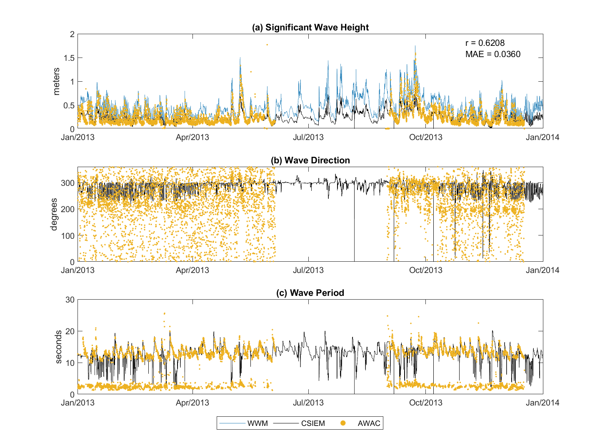{width="6.1262478127734035in" height="4.369907042869642in"}

**Figure 7.5-i.** Comparison of (a) significant wave height, (b) wave direction, and (c) wave period of WWM, CSIEM, and AWAC data at site S01 in year 2013. Click to enlarge.

##### JPPL-AWAC : S02 {.unnumbered}

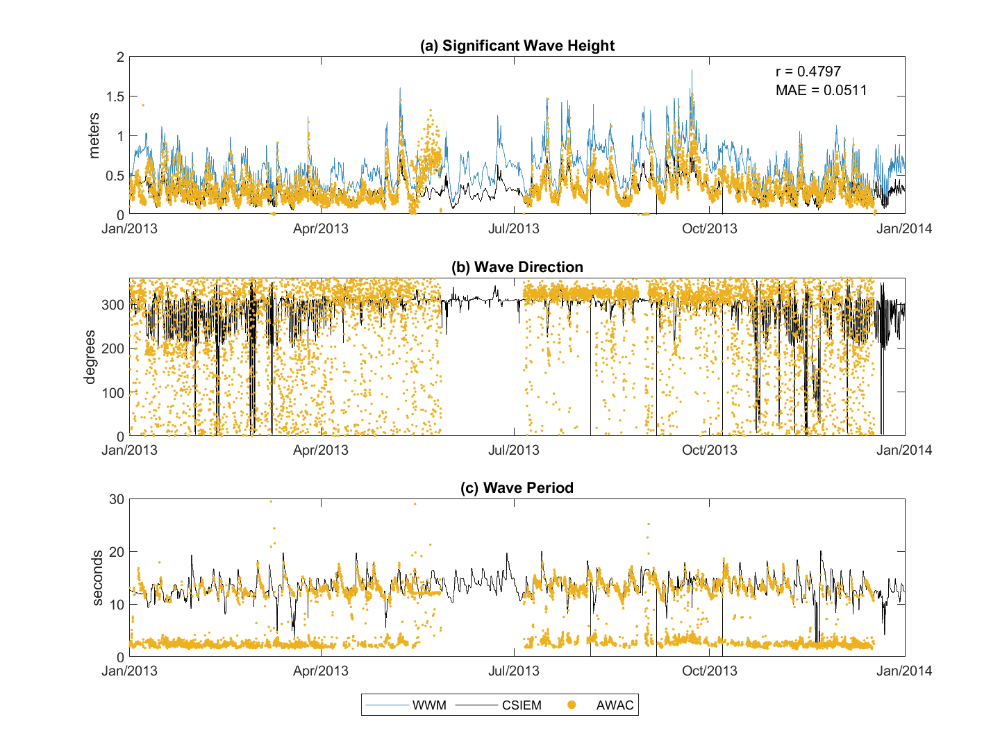{width="6.126388888888889in" height="4.4079122922134735in"}

**Figure 7.5-ii.** Comparison of (a) significant wave height, (b) wave direction, and (c) wave period of WWM, CSIEM, and AWAC data at site S02 in year 2013. Click to enlarge.


#### 2023 {.unnumbered}


Similar comparisons were made between the model outputs to the ADV data collected at sites of Parmelia Bank A (115.7128°E, 32.1200°S) and Parmelia Bank B (115.7201°E, 32.1333°S) (Figure 7.X & 7.X). The results suggested that with bias correction to the significant wave height from WWM, the CSIEM output generally agreed well with the field data, with a regression coefficient \> 0.76 and MAE \< 0.22 m for these two sites.

The observed wave direction showed more variability with periods where the model diverges from the observations, particularly during some high-variability phases. The model\'s performance for wave period is mixed. While the general trend is captured, there is significant scatter in the observed data, particularly in shorter wave periods.

#### {.panelset .unnumbered}

##### WWMSP9-AWAC : PB-A {.unnumbered}

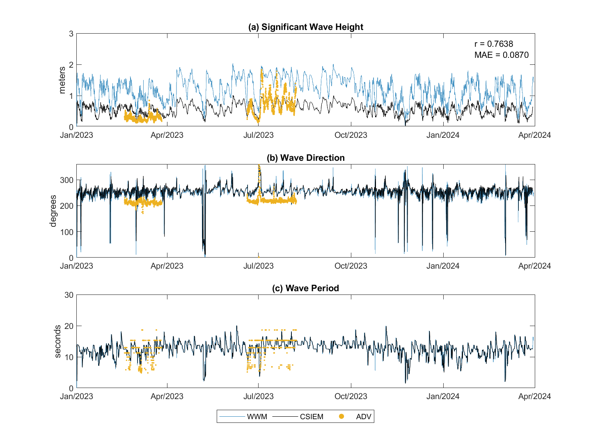{width="6.287557961504812in" height="4.395062335958006in"}

**Figure 7.6-i.** Comparison of (a) significant wave height, (b) wave direction, and (c) wave period of WWM, CSIEM, and ADV measurements at Parmelia Bank A in year 2023/24.

##### WWMSP9-AWAC : PB-B {.unnumbered}

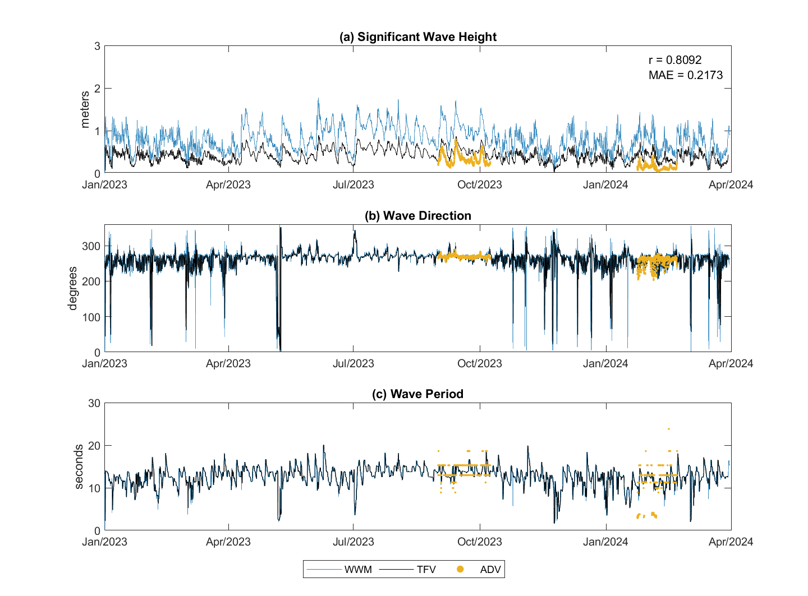{width="6.288194444444445in" height="4.46465113735783in"}

**Figure 7.6-ii.** Comparison of (a) significant wave height, (b) wave direction, and (c) wave period of WWM, CSIEM, and ADV measurements at Parmelia Bank B in year 2023/24.


## Water surface elevation

Simulated surface water elevations at the Fremantle tidal gauge station (FFBH) were compared against data from the years 2013 and 2022 (Figure 7.7). The model confidently captures the temporal variation in the tidal elevations over the simulation period with a correlation coefficient of 0.9310 and MAE of 0.0034 m. The seasonal shift reflects the expected chanegs due to winter strengthening of the Leeuwin Current effect on the local sea-level.

#### {.panelset .unnumbered}

##### DOT-FFBH : 2013 {.unnumbered}

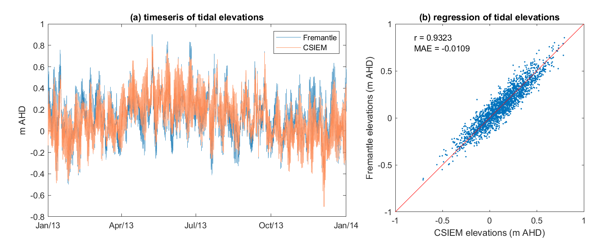{width="6.301388888888889in" height="2.5479166666666666in"}

**Figure 7.7-i.** Comparison of surface water elevations against Fremantle gauge data in year 2013.

##### DOT-FFBH : 2022 {.unnumbered}

{width="6.301388888888889in" height="2.5479166666666666in"}

**Figure 7.7-ii.** Comparison of surface water elevations against Fremantle gauge data in year 2022.

## Synoptic-scale validation of variation of temperature and salinity

Water temperature and salinity patterns were subject to an iterative calibration process, comparing the grab data and continuous data available for these variables against the model at several assessment zones. Initial experience with earlier versions of CSIEM had highlighted issues associated with incorrect seasonal trends in salinity and biases in temperature to be considered when refining simulation performance. In addition, a wider range of years have since been considered in the model assessment process. Refinements included adjustments to the ocean boundary inputs (see salinity bias-correction in Chapter 6) and parameter calibration in the heat balance model.

A interaction tool for exploring model validation plots is [<span style="color: blue">available via the **MARVL-VIEWER** web-app</span>](https://csiem-mv.seaf.org.au); select the year of interest and navigate to the water temperature and salinity variables. In these plots, any data within the CSIEM "data-warehouse" from the various compiled data-sets will show in that polygon, and is used in the model error assessment. Exmaple outputs are shown below in Figure 7.8.

{width="5.514583333333333in" height="2.9906616360454943in"}
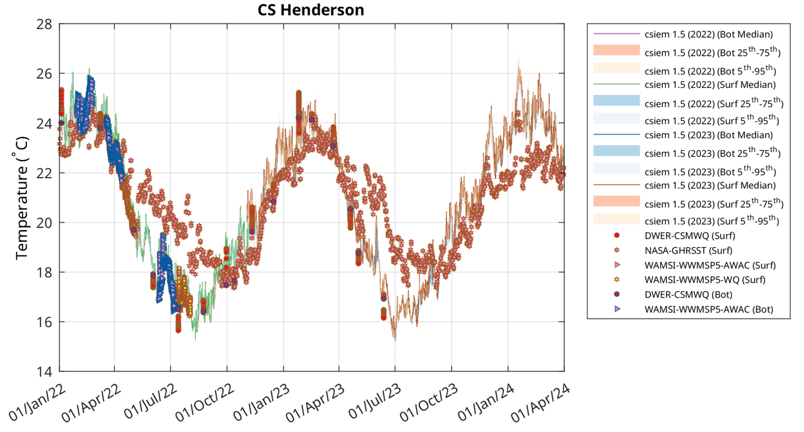{width="5.514583333333333in" height="2.9742530621172354in"}
{width="5.514844706911636in" height="2.9901957567804023in"}

**Figure 7.8.** Comparison of water temperature in three regions (a-c) of the model between Jan 2022 and Apr 2024, comparing the model simulations against various observed and satellite-based data-sets in the `csiem-data` catalogue.

In general, over the available simulated years (6 years) the modelled data closely aligns with the field observations for temperature and salinity, capturing both the seasonal trends and variations throughout the year, and between assessment polygons. The high correlation coefficient (r>0.9 for temperature and salinity) and low mean absolute error (MAE~0.2°C for temperature and MAE=0.2 psu for salinity) indicates an excellent agreement between the model and observations across a range of hydrodynamic conditions. 

Episodes of short-term stratification are resolved in response to solar heating or river inflows, as indicated between the difference between surface and bottom (explored further in Sections 7.X and 7.X).


## Currents and water circulation

Following the general assessment of water levels, temperature and salinity as outlined in the above sections, the model's resolution of key hydrodynamic circulation features was further examined. This included a point-scale comparison of the model against velocity data collected in both Owen Anchorage and within Cockburn Sound, and a subsequent analysis of the two-layer flow dynamics and residual circulation features.

### Water velocity validation

#### Owen Anchorage {.unnumbered}

Modelled eastern and northern currents were compared to the ADV data collected at sites of Parmelia Bank A (115.7128°E, 32.1200°S),  Parmelia Bank B (115.7201°E, 32.1333°S), Success Bank A, and Success Bank B  as part of WWMSP Project 9.1 (Hansen et al. 2025). These data span both winter and summer conditions and are shown in Figure 7.X & 7.X. The model captures the temporal variation in the currents over the measurement periods, with a correlation coefficient \>0.45 and MAE\< 0.0187 m/s. The important shifts in direction are captured well.

#### {.panelset .unnumbered}

##### WWMSP9-AWAC: PB-A {.unnumbered}

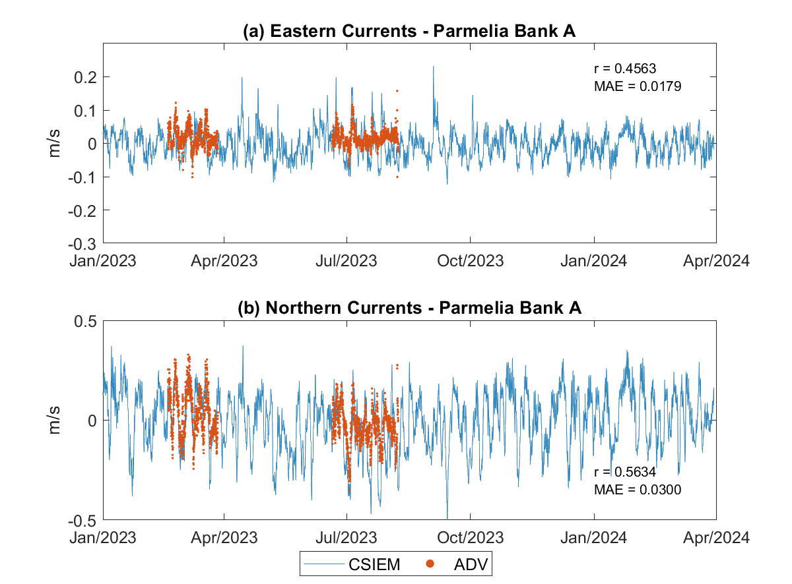{width="6.131402012248469in" height="4.425925196850394in"}

**Figure 7.9-i.** Comparison of (a) eastern and (b) northern currents between CSIEM outputs and ADV measurements at Parmelia Bank A in year 2023/24.

##### WWMSP9-AWAC: PB-B {.unnumbered}

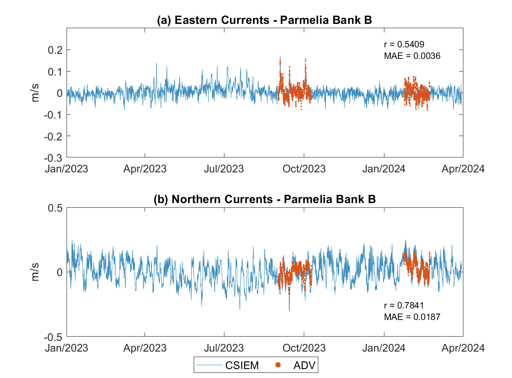{width="6.13125in" height="4.405433070866142in"}

**Figure 7.9-ii.** Comparison of (a) eastern and (b) northern currents between CSIEM outputs and ADV measurements at Parmelia Bank B in year 2023/24.

##### WWMSP9-AWAC: SB-A {.unnumbered}

{width="6.131402012248469in" height="4.425925196850394in"}

**Figure 7.9-iii.** Comparison of (a) eastern and (b) northern currents between CSIEM outputs and ADV measurements at Success Bank A in year 2023/24.

##### WWMSP9-AWAC: SB-B {.unnumbered}

{width="6.13125in" height="4.405433070866142in"}

**Figure 7.9-iv.** Comparison of (a) eastern and (b) northern currents between CSIEM outputs and ADV measurements at Success Bank B in year 2023/24.

#### Cockburn Sound {.unnumbered}

Further comparison of current profiles was made between the CSIEM outputs and historical AWAC data collected at site S01 (115.7627°E, 32.2009°S, on east shelf of Cockburn Sound) from JPPL (Figure 7.10). The model was able to well capture the phase (switch of current directions) and the magnitudes of currents in comparison to the data.


#### {.panelset .unnumbered}

##### JPPL-AWAC : S01 {.unnumbered}


{width="6.131402012248469in" height="4.425925196850394in"}

**Figure 7.10-i.** Comparison of (a) eastern and (b) northern currents between CSIEM outputs and JPPL AWAC measurements at site S01 in year 2013.


##### JPPL-AWAC : S02 {.unnumbered}

{width="6.13125in" height="4.405433070866142in"}

**Figure 7.10-ii.** Comparison of (a) eastern and (b) northern currents between CSIEM outputs and JPPL AWAC measurements at site S02 in year 2013.


### Monthly-mean circulation

The circulation in Cockburn Sound is strongly governed by wind, particularly the prevailing south-westerly sea breeze during the summer months. The summer wind pattern induces a two-layer circulation with surface waters are driven northward by the wind, while a compensatory return flow develops at depth, moving southward. In winter the circulation reverses with a southerly tendency. The mean monthly currents are shown in Figure 7.11. 

#### {.panelset .unnumbered}

##### Jan {.unnumbered}

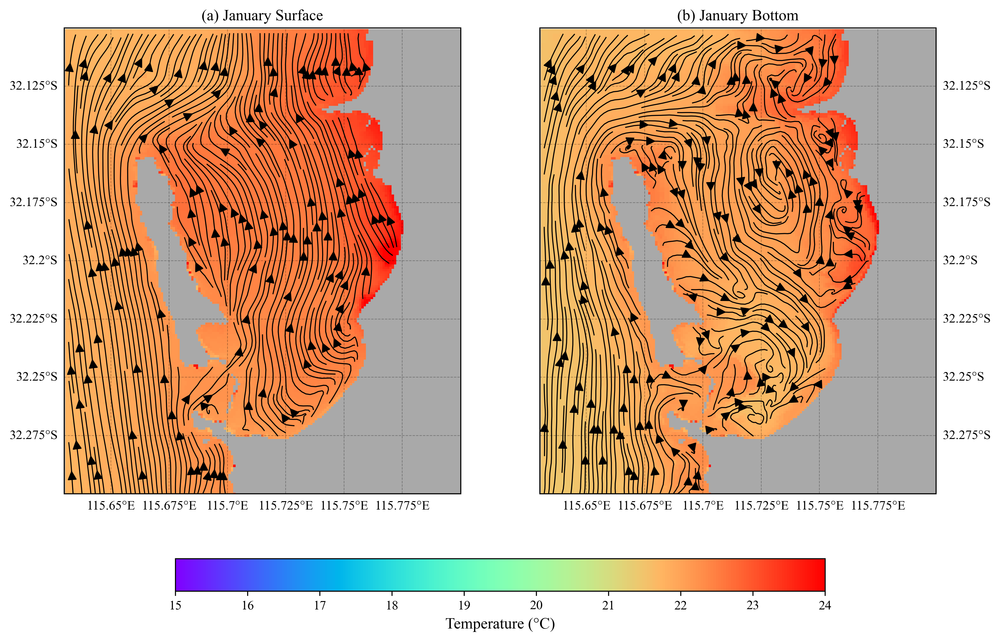{width="95%"}

**Figure 7.11-i.** Comparison of (a) surface-layer and (b) bottom-layer streamlines based monthly-mean currents for the year 2023.

##### Feb {.unnumbered}

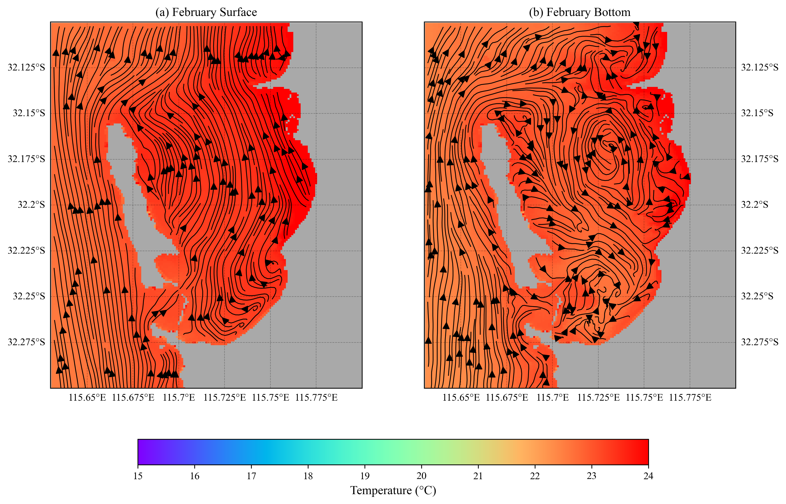{width="95%"}

**Figure 7.11-ii.** Comparison of (a) surface-layer and (b) bottom-layer streamlines based monthly-mean currents for the year 2023.

##### Mar {.unnumbered}

{width="95%"}

**Figure 7.11-iii.** Comparison of (a) surface-layer and (b) bottom-layer streamlines based monthly-mean currents for the year 2023.

##### Apr {.unnumbered}

{width="95%"}

**Figure 7.11-iv.** Comparison of (a) surface-layer and (b) bottom-layer streamlines based monthly-mean currents for the year 2023.

##### May {.unnumbered}

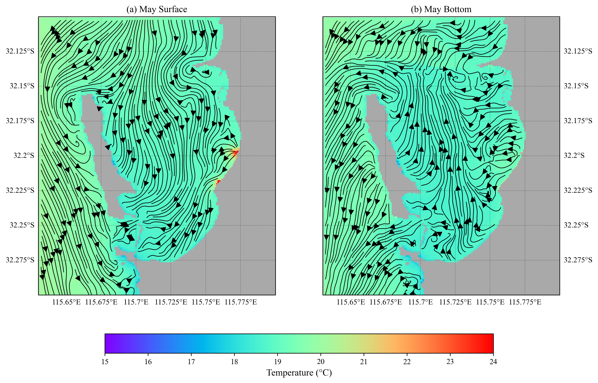{width="95%"}

**Figure 7.11-v.** Comparison of (a) surface-layer and (b) bottom-layer streamlines based monthly-mean currents for the year 2023.

##### Jun {.unnumbered}

{width="95%"}

**Figure 7.11-vi.** Comparison of (a) surface-layer and (b) bottom-layer streamlines based monthly-mean currents for the year 2023.

##### Jul {.unnumbered}

{width="95%"}

**Figure 7.11-vii.** Comparison of (a) surface-layer and (b) bottom-layer streamlines based monthly-mean currents for the year 2023.

##### Aug {.unnumbered}

{width="95%"}

**Figure 7.11-vii.** Comparison of (a) surface-layer and (b) bottom-layer streamlines based monthly-mean currents for the year 2023.

##### Sep {.unnumbered}

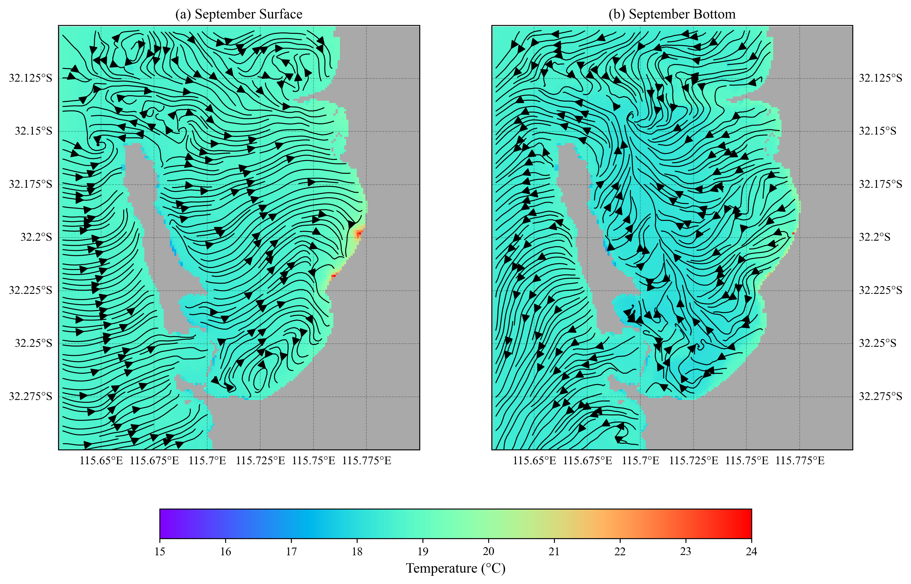{width="95%"}

**Figure 7.11-ix.** Comparison of (a) surface-layer and (b) bottom-layer streamlines based monthly-mean currents for the year 2023.

##### Oct {.unnumbered}

{width="95%"}

**Figure 7.11-x.** Comparison of (a) surface-layer and (b) bottom-layer streamlines based monthly-mean currents for the year 2023.

##### Nov {.unnumbered}

{width="95%"}

**Figure 7.11-xi.** Comparison of (a) surface-layer and (b) bottom-layer streamlines based monthly-mean currents for the year 2023.

##### Dec {.unnumbered}

{width="95%"}

**Figure 7.11-xii.** Comparison of (a) surface-layer and (b) bottom-layer streamlines based monthly-mean currents for the year 2023.


### Residual currents

Additionally, the residual circulation has previously been described by Xiao et al. (2024) under summer conditions. The anti-clockwise eddy has been highlighted, due to its relevance during periods when Pink Snapper form spawning aggregations, since larvae are thought to be retained in the Sound due to the nature of this particular circulation feature.

To demonstrate the residual flow circulation we compute the residual velocities in each cell and compute net streamlines based on this velocity field. Unlike in the above section, the residual velocities were computed using a Godin-filter to remove the tidal dynamics, but retain the sub-tidal variability A monthly summary of residual currents for 2023 are shown in Figure 7.12. The results show a southward tendency in the winter months, and a weak clockwise gyre, and a northerly flow tendancy and anti-clockwise feature in other months. 

{width="97%"}

**Figure 7.12.** Streamlines showing the residual flow circulation features, based on the monthly average of surface residual currents. 


## Assessment of exchange through Cockburn Sound

Controls on the exchange dynamics of Cockburn Sound have been described previously by 
Ruiz-Montoya & Lowe (2014) and Xiao et al. (2024). They highlight the variability in exchange controlled by variable patterns in wind-forcing (including the seasonal and diurnal shifts in wind patterns), seasonal changes in the along-shore sub-tidal pressure gradient, and also due to significant events such as associated with continental shelf waves propogating along the Perth coast. 

Within the CSIEM domain, a series of "node-strings" are included across key regions within the domain to compute mass fluxes. An example of the weekly net flow into the sound through the northern transect (from Woodman Point to the top of Garden Island) in 2013, shows the seasonal shift associated with the changing wind and water current patterns (Figure 7.13). In general, whilst there is variability from year to year, there is a northerly flow tendency from October to April and a southely tendancy during winter between May and September. 


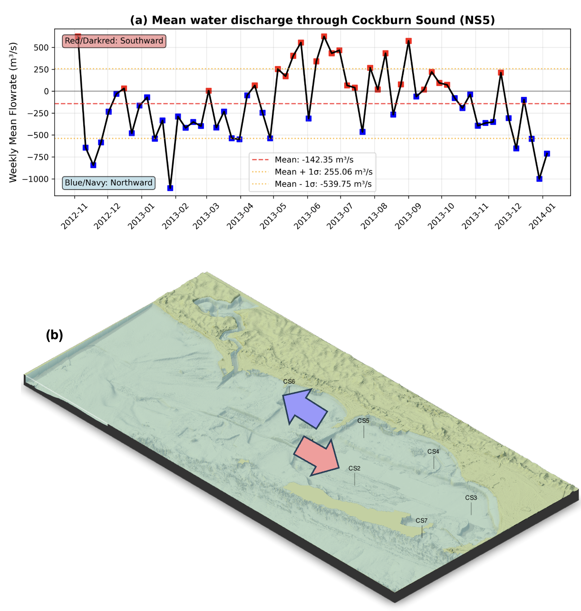{width="6.301388888888889in" }

**Figure 7.13.** (a) Model results showing the net weekly flow through the CS North transect (NS5). (b) schematic showing the flow direction in context of the local domain.


The summer dynamics are also further explored following a similar analysis as in Xiao et al. (2024). In Figure 7.14, the summer pattern of wind, are shown alongside the variability in the mean water level, and the alongshore pressure gradient (Ruiz-Montoya & Lowe, 2014), to explain the variability in weekly exchange volumes and directions. Exchange reversal is associated with a shift in wind patterns and associated shift in direction of the water pressure gradient, for example, as seen in the 3rd week of January and the 1st week of February in 2023.

{width="6.301388888888889in" }

**Figure 7.14.** Analysis of controls on Cockburn Sound exchange flows, summarising the wind regime (a), mean water level variation (b), the regional alongshore pressure gradient force (c), and the net exchange flow (d). 


The Ruiz-Montoya & Lowe (2014) and Pattiarachi et al. (2025) data-sets (termed UWA-ADCP and WWMSP5-AWAC, respectuvely), and the Xiao et al. (2024) FVCOM modelling, all highlight the characteristic two-layer flow that occurs across the northern transect. This is also seen above in the current-profile validation and residual circulation plots in Section 7.X. The pattern of exchange is therefore complex, varying both through time, and also vertically across the transect. The variation leads to variability in the rate of flushing of the internal Cockburn SOund waters. To depict the overall effect of the changign two-layer flow dynamic on the water retention time, a water "age" tracer was included into the simulation, and a transect shows locations of net retention (Figure 7.15). Playing the animation shows relatively "new" water coming in from areas around Cockburn Sound (both in from the North and South), and the retention of relatively "old" water within the main basin. Importantly, periods of strong two-layer flow occur whereby "new" water inserts into the lower portion of the basin, before it is subjected to vertical mixing. 


{width="97%" }

**Figure 7.15.** Transect animation of CSIEM "water age" variable and vertical current vectors, highlighting variability in water flow direction and the two-layer exchnage between CS and OA. 

## D'Adamo regimes

In his seminal work on Cockburn Sound dynamics, D'Adamo (1992), summarised several key regimes that occur throughout the year. As part of the Southern Metropolitan Coastal Water Study (SMCWS) a simple plot was introduced to show the typical annual cycle in S, T and ρ differences between Cockburn Sound and the adjacent shelf waters. In this plot, diagonals are lines of density difference, and based on either field or model data, the seasonal shifts in density difference between the embayment and surrounding
ocean can be depicted.  D'Adamo (1992) used this plot comparing the salinity difference versus temperature difference in order to show reversals of density difference, evolving month-by-month and circling around through consecutive seasons. The significance of the plot is to highlight the shifting environment within which the Cockburn Sound embayment is operating, and in particular when strong barotropic or baroclinic conditions will be dominating water exchange.

To understand the models' ability to capture the shifts in regimes, the plot was replicated using outputs from the CSIEM simulations (Figure 7.16), and based on modelled data extract from the same locations as in the original analysis.

The results for the modelled calender year 2021 are most similar to the 1990's data-set originally used in the D'Adamo analysis, since a significant low-salinity river plume occurred within winter and persisted into spring in that year, similar to the 1992-1994 period originally studied. The other years that were investigated in the model show the monthly evolution, but notably the dry years (2015 and and 2023/4) have their seasonal cycle restricted to occur within regimes X and Y. This is expected as a result of the very low flows in these years through the Swan-Canning and Peel-Harvey systems, and also noting that since the original D'Adamo study, the high-salinity PSDP discharge now occurs within the Sound, and causes a seasonally persistent salinity increase, and also since the low-salinity waste water plumes are now discharged to the west of Garden Island. 


#### {.panelset .unnumbered}

##### D'Adamo : 2021 {.unnumbered}

{width=90%}

**Figure 7.16-i.** Year 2021.

##### D'Adamo : 2022 {.unnumbered}

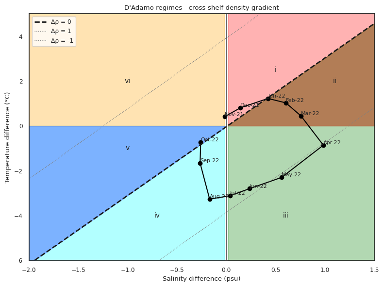{width=90%}

**Figure 7.16-ii.** Year 2022.

##### D'Adamo : 2023 {.unnumbered}

{width=90%}

**Figure 7.16-iii.** Year 2023.

##### D'Adamo : Reference {.unnumbered}

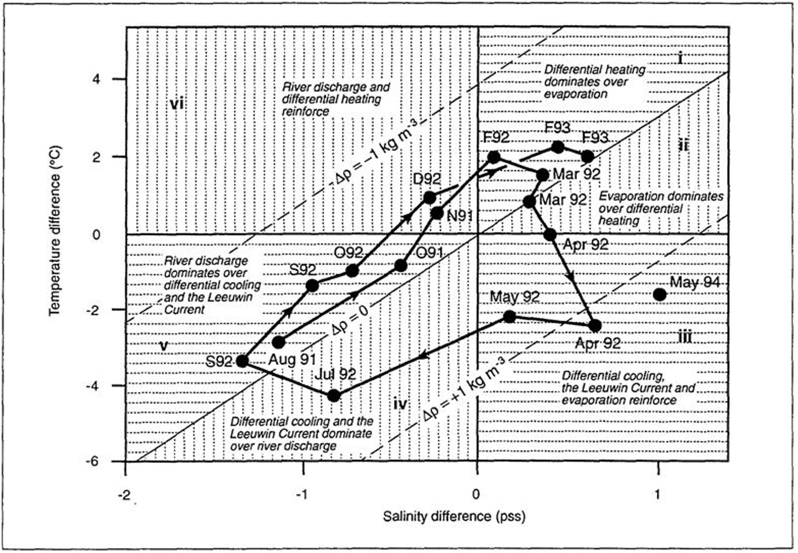{width=95%}

**Figure 7.16-iv.** "Density regime plot originally presented in X, showing the field observations of the SMCWS study presented in terms of the gradient between the within-sound and offshore density conditions".


## River inflow events influencing Cockburn Sound

As outlined above, the effect of high versus low river flow events within the Swan-Canning basin can influence the regimes experienced by the Sound. Form the point of the view the assessing CS ecosystem conditions, this also has particular relevance in terms of computing nutrient budgets and loads. Given the changing flow directions along the Perth coast (see section XX), the timing and magnitude of the Swan-Canning flow events moving through Fremantle will influence they nature or Swan Estuary water entering into Cockburn Sound. An example of CSIEM output for the 2021 winter period is shown in Figure 7.17.

{width="95%" }

**Figure 7.17.** Multi-panel animation of the 2021 winter flow season, and connectivity of the river plume into the Cockburn Sound.

Comparison of bottom versus surface water salinity and temperature during 2021 highlight the effect of the river pulses throughout the sound, as shown for an example in the central region of the main Cockburn Sound main basin. 

To demonstrate the spatial extent of river influence, a satellite image with a clear CDOM signal showing the river plume, was compared to a simulation undertaken with a conservative tracer (TRC_tr1) added to the Canning and Narrows inflows (Figure 7.18). Noting that CDOM (measured) and TRC_tr1 (modelled) variables are not directly equivalent, and slight timing differences between the snapshots, the comparison nonetheless shows the promising performance of the model in capturing the general flow tendency, the plume extent, and its pattern of dispersion through Cockburn Sound.

{width="95%" }

**Figure 7.18.** Comparison of river plume extent during August 2021, as depicted in satellite imagery (left, using CDOM as an indicator of river water presence), and also the model river inflow tracer (right, TRC_tr1).


River tracers used within CSIEM have also been analysed to understand the river mass flux into (and out of) the CS region. This shows the seasonal pulse of material entering the Sound during winter conditions, and this is highly variable depending on the river flow magnitude in any given year (Figure 7.18).

#### {.panelset .unnumbered}

##### 2013 {.unnumbered}

{width="90%"}

**Figure 7.18-i.** River tracer throughflow analysis for the simlated year **2013**. (a) net exchange through the CS-North transect, (b) the weekly "river tracer load" moving through CS-North and South, for a river constituent with a hypothetical concentration of 1 g/m3, and c) the weekly "discharge tracer load" exiting through CS-North and South, for a discharge constituent with a hypothetical concentration of 1 g/m3.

##### 2015 {.unnumbered}

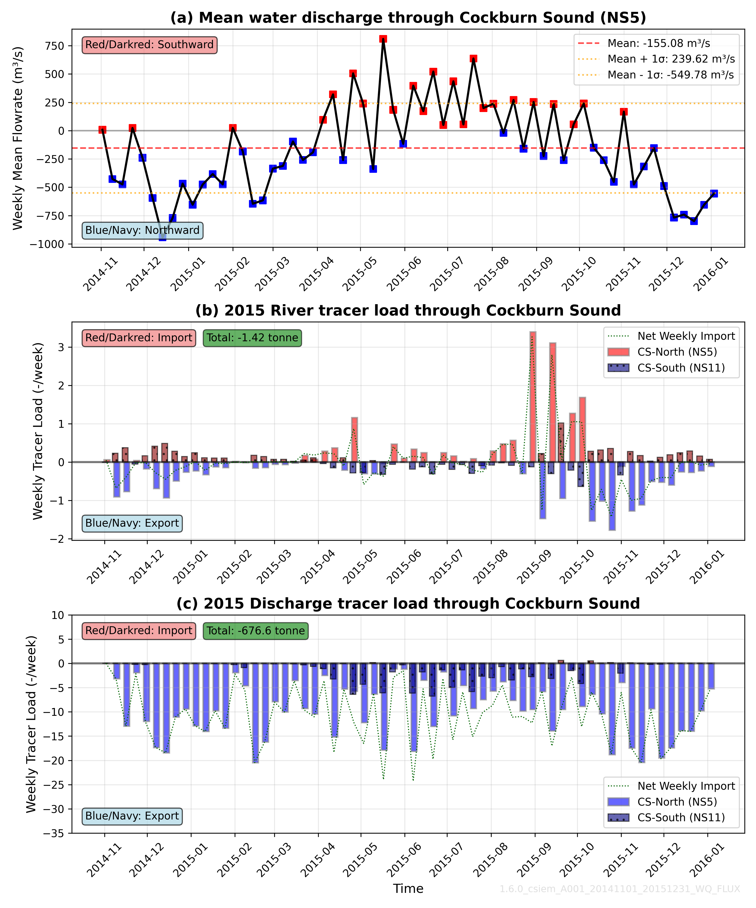{width="90%"}

**Figure 7.18-ii.** River tracer throughflow analysis for the simlated year **2015**. (a) net exchange through the CS-North transect, (b) the weekly "river tracer load" moving through CS-North and South, for a river constituent with a hypothetical concentration of 1 g/m3, and c) the weekly "discharge tracer load" exiting through CS-North and South, for a discharge constituent with a hypothetical concentration of 1 g/m3.


##### 2020 {.unnumbered}

{width="90%"}

**Figure 7.18-iii.** River tracer throughflow analysis for the simlated year **2020**. (a) net exchange through the CS-North transect, (b) the weekly "river tracer load" moving through CS-North and South, for a river constituent with a hypothetical concentration of 1 g/m3, and c) the weekly "discharge tracer load" exiting through CS-North and South, for a discharge constituent with a hypothetical concentration of 1 g/m3.


##### 2021 {.unnumbered}

{width="90%"}

**Figure 7.18-iv.** River tracer throughflow analysis for the simlated year **2021**. (a) net exchange through the CS-North transect, (b) the weekly "river tracer load" moving through CS-North and South, for a river constituent with a hypothetical concentration of 1 g/m3, and c) the weekly "discharge tracer load" exiting through CS-North and South, for a discharge constituent with a hypothetical concentration of 1 g/m3.


##### 2022 {.unnumbered}

{width="90%"}

**Figure 7.19-v.** River tracer throughflow analysis for the simlated year **2022**. (a) net exchange through the CS-North transect, (b) the weekly "river tracer load" moving through CS-North and South, for a river constituent with a hypothetical concentration of 1 g/m3, and c) the weekly "discharge tracer load" exiting through CS-North and South, for a discharge constituent with a hypothetical concentration of 1 g/m3.


##### 2023/4 {.unnumbered}

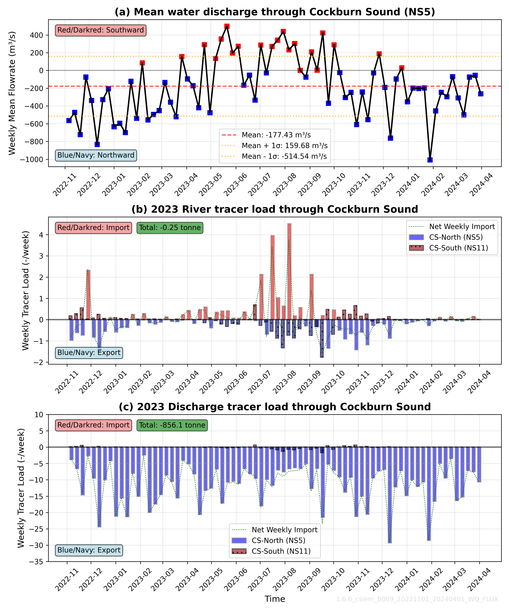{width="90%"}

**Figure 7.18-vi.** River tracer throughflow analysis for the simlated year **2023/4**. (a) net exchange through the CS-North transect, (b) the weekly "river tracer load" moving through CS-North and South, for a river constituent with a hypothetical concentration of 1 g/m3, and c) the weekly "discharge tracer load" exiting through CS-North and South, for a discharge constituent with a hypothetical concentration of 1 g/m3.


## Thermal stratification

A key feature of Cockburn Sound in summer and autumn is short to medium periods of stratification (Dalseno et al. 2022; Xiao et al., 2024). The model has therefore been explored in terms of its ability to resolve periods of density stratification. 


{width="90%" }

**Figure 7.19.** Multi-panel plot the 2023 early summer period, showing the different patterns of vertical structure within Cockburn Sound and Owen Anchorage region.


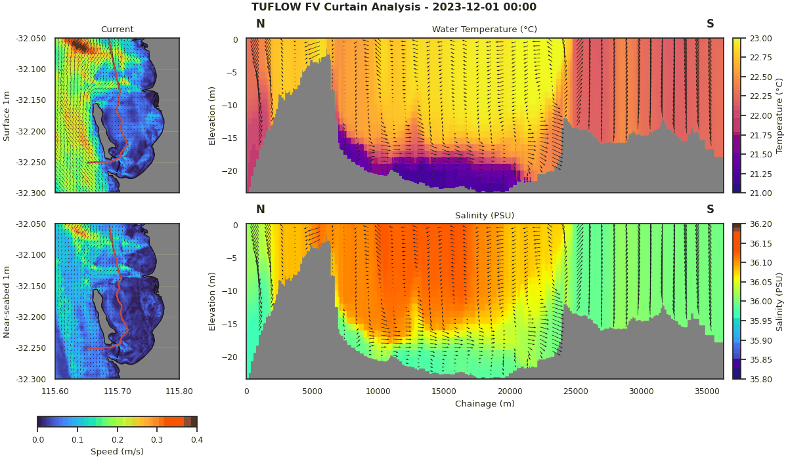{width="90%" }

**Figure 7.20.** Multi-panel animation of the 2023 early summer period, showing the thermal stratification developing in the main basin of Cockburn Sound.


## Influence of industry discharges on temperature and salinity

Outputs of the model at various times are able to show the effect of surface cooling waters released to the Sound (Figure 7.21), and the brine discharge (Figure 7.22). The influence of these discharges on the background water temperature and salinity levels are able to be seen in the "`KS-South`" assessment polygon (visible through ([<span style="color: blue">**MARVL-VIEWER**</span>](https://csiem-mv.seaf.org.au)). In particular the bottom salinity anomaly and 


{width="2.9080358705161853in" height="3.8627449693788276in"}
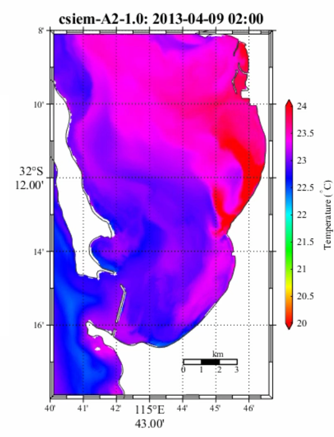{width="3.0098042432195977in" height="3.9365583989501314in"}

**Figure 7.21.** Comparison of water temperature within Cockburn Sound for two time snapshots in April 2013.

{width="6.301388888888889in" height="3.067361111111111in"}

**Figure 7.22.** Output of the CSIEM model demonstrating the plume from the PSDP brine discharge, as both a salinity anomaly, and discharge tracer. 


## Summary

This chapter describes a comprehensive assessment of the outputs from the hydrodynamic model TUFLOW-FV, which is the core engine used within the CSIEM platform. This assessment of the model's performance demonstrates the model's ability to resolve waves, currents and key circulation features within Cockburn Sound and the surrounding waters. This assessment has been made in the context of development of an integrated approach to ecosystem prediction, linking met-ocean conditions, biogeochemistry and ecology in a coordinated way over the scales relevant to prediction challenges for cumulative EIA.

Development of the CSIEM model during the WWMSP Project 1.2, and reported herein, was co-ordinated in parallel to other applications of the CSIEM model focusing on hydrodynamics, flushing and sediment transport as part of Westport's assessment of port options, and environmental impact assessment. Note further validation metrics have been undertake through this process using a Westport specific mesh configuration, and these two independently undertaken assessments of the model can be viewed as complementary.

Examples presented in this chapter have been selected to demonstrate general aspects of the model performance for specific years and periods. Note that the model has been applied acorss many years of different conditions, and a detailed catalogue of the model validation plots of key parameters for all the CSIEM assessment polygons and all the available data sets is able to be interrogated via the [<span style="color: blue">**MARVL-VIEWER**</span>](https://csiem-mv.seaf.org.au). Further focused validation plots exploring dynamics of these system and the response during specific events are also able to be made using the numerous specific scripts included in the `csiem-marvl` repository.

Beyond this scope, there are a range of areas for further investigation and refinement to be considered during applications with this version and for consideration during developments of the platform.

- CSIEM A, B and C meshes have been compared in terms of their performance in capturing currents, temperature and salinity, however, a formal sensitivity assessment of model accuracy to different mesh configurations in resolving the currents and stratification under different forcing conditions will enable more informed selection of the appropriate mesh for different applications.

- The analysis of the WWM wave model showed seasonal and event changes in significant wave height are higher than in presented in Pattiaratchi and Janekovic (2024), suggesting potential differences in methodology, or model versions. The wave prediction methodology described in Pattiaratchi and Janekovic (2024) describes two-way hydrodynamic-wave coupling with the model SCHISM-WWM, whereas the 13-year data-set archived to the CSIEM platform was run without two-way coupling, potentially explaining the difference.

- Further assessment of the model in resolving plume dynamics, both associated with the low-discharge desalination and industrial discharge plumes, and also the occasional high-discharge flow pulses from the Swan and Peel systems can be undertaken as part of a more focused assessment.


