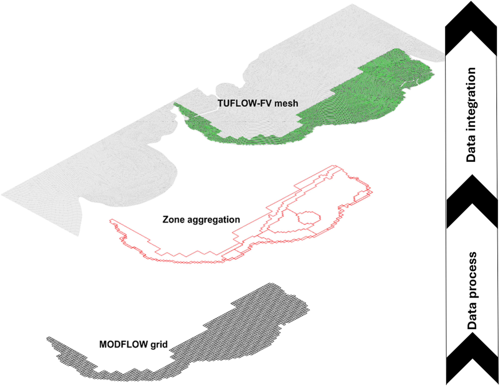
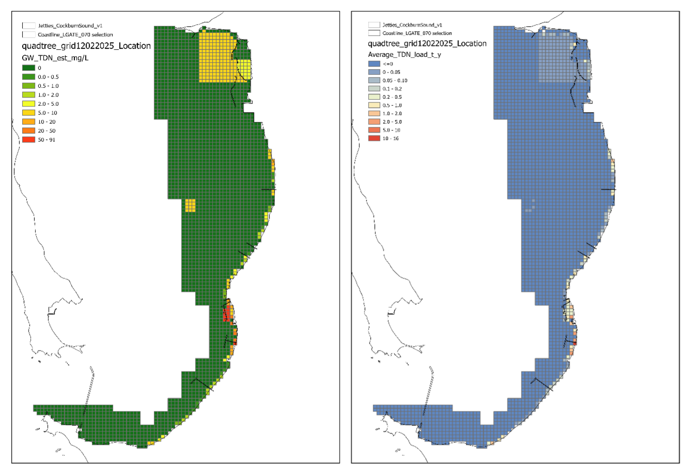
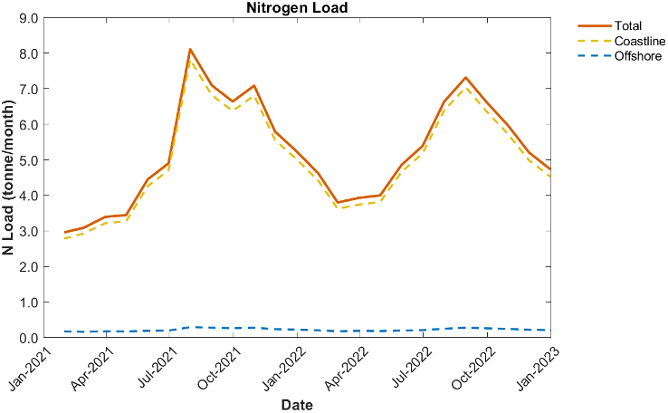
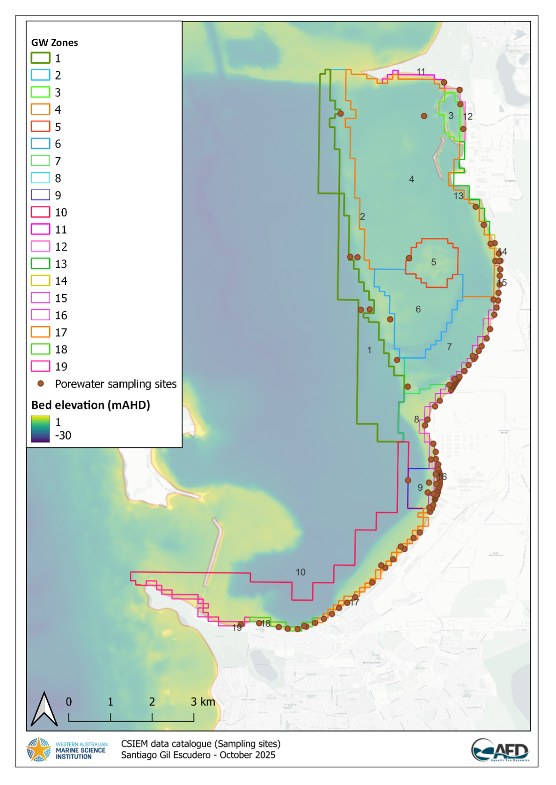
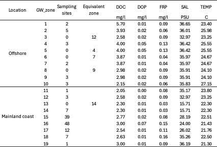
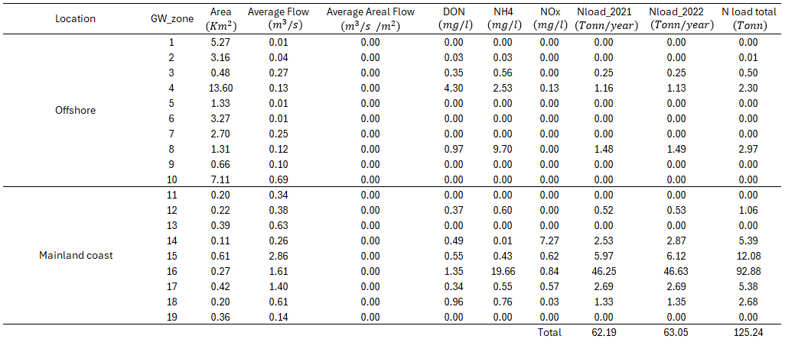

# Submarine Groundwater Discharge {#groundwater}

## Overview

Submarine Groundwater Discharge (SGD) measurements in Cockburn Sound highlight significant spatial and seasonal variability, as influenced by factors such as rainfall and recharge dynamics within the nearby aquifer system (Loveless et al., 2008). Studies utilizing radium isotopes as tracers have shown that SGD rates vary seasonally, with greater discharge occurring following winter precipitation events. This discharge contributes nitrogen to coastal waters, which may exacerbate eutrophic conditions, particualrly in the southern areas of Cockburn Sound such as Mangles Bay (Loveless & Oldham, 2010).

Groundwater has emerged as one of the predominant nitrogen sources for the Sound following the redirection of urban and industrial wastewater outflows to the Cape Peron Sepia Depression ocean outfall (Greenwood et al., 2016). The total SGD nitrogen supply had previously been estimated to be between 450 and 920 tonnes of Total Nitrogen (TN) per year, depending on annual rainfall, though these estimations were thought to have been potentially overestimated and could have dropped in recent years (Donn et al., 2015). 

More recent modelling within the WAMSI-Westport Marine Science Program, has allowed a more contemporary estimate of flows and N loads, based on a combination of MODFLOW groundwater modelling and porewater nutrient sampling, as reported in Donn et al. (2025). These loads are considerably lower than prior estimates. Nonetheless, the loads can make a significant contribution to the nutrient budget in the Sound, and are integrated within the CSIEM workflows.  

This Chapter presents the process of quantifying and spatially representing groundwater-derived nutrient loads in Cockburn Sound, for the purposes of incorporating them into the CSIEM platform. It describes the data sources, zone delineation, calculation methodology, and resulting estimates of water and nutrient fluxes.

*This chapter provides a general summary of the model; please note some aspects are specific to a particular version of the model as new updates are included. The descriptions presented in this Chapter are specific to V1.6+.*  

 

## Data Sources and Approach

The groundwater boundary conditions for the Cockburn Sound area were developed using results from the MODFLOW groundwater model, which were provided by CSIRO (Donn et al., 2025). The data were delivered in XLXS format and contained monthly groundwater flux and nitrogen load values for each grid cell, covering the period from 2021 to 2022. 

Post-processing involved grouping the water fluxes and loads by "zones" and aligning them spatially and temporally with the TUFLOW FV surface grid, which forms the hydrodynamic component of the CSIEM platform (Figure 8.1).

A monthly resolution dataset was created from the MODFLOW groundwater model results and available data in order to simulate continuous nutrient inputs from groundwater into Cockburn Sound, contributing to the nutrient balance of the study area. 

The resulting data product provides a continuous set of key groundwater properties that serve as boundary conditions describing SGD for incorporation into CSIEM simulations.

{width="95%"}

**Figure 8.1.** Data processing workflow to connect the groundwater model (MODFLOW) and the surface hydrodynamic model (TUFLOW-FV).

## Zone Delineation

The spatial distribution of nitrogen loads derived from groundwater discharge is illustrated in the figure below, based on the total nitrogen map computed by the CSIRO groundwater flow model, and interpolated N concentrations. This map offers a regional perspective on nitrogen delivery into Cockburn Sound and was used to support the delineation of groundwater input zones used within the CSIEM hydrodyanamic-biogeochemical model (Figure 8.2).

{width="95%"}

**Figure 8.2.** Regional view of nitrogen delivery into Cockburn Sound (Source: Donn et al., 2025)

To spatially organize the input conditions in Cockburn Sound, a set of groundwater input zones, referred to as “GW zones” in the modelling workflow, were delineated. These zones group MODFLOW pixel-level data into larger hydrologically coherent areas and serve as boundary condition units in the CSIEM framework. Delineation was based on spatial groupings of groundwater discharge magnitudes. Each zone is associated with a polygonal shapefile and includes attributes such as area, average groundwater inflow, and assigned nutrient concentrations (Figure 8.3).

{width="95%"}

**Figure 8.3.** Assigned groundwater input polygons.

## Zone Load Calculations

As part of the workflow for incorporating groundwater modelling results into the CSIEM surface hydrodynamic model, monthly output data provided by CSIRO were used, containing groundwater flow (m³/month) and total dissolved nitrogen (TDN, tonnes/month) for each cell of the model domain (Donn et al., 2025). These data were processed to generate time series of total groundwater discharge and the corresponding nutrient loads to Cockburn Sound. For each groundwater zone, total discharge was calculated by summing the fluxes (Q) from all cells discharging within that zone. Similarly, nitrogen load (N load) was estimated as the sum of the contributions from each cell, calculated as the product of groundwater flow and the concentration of TDN.

In addition, the nitrogen speciation dataset provided by CSIRO was incorporated to define representative fractions of the main nitrogen species for each GW zone: ammonium (pNH₄⁺), nitrate/nitrite (pNOx), and dissolved organic nitrogen (pDON) (Donn et al. ,2025). The dataset comprises 2,669 model cells that were aggregated to the 19 GW zones. For each monthly timestep, the total nitrogen load (TDN) supplied by the CISRO mixing model outputs was multiplied by these zone-specific fractions, yielding species-resolved loads while preserving mass balance species (see Table 8.1). Each species load was subsequently normalised by the corresponding groundwater discharge and converted to concentrations (mmol/m³). These concentrations form the groundwater boundary conditions applied in the CSIEM surface hydrodynamic model, ensuring consistency between the nutrient loads and the concentrations represented in the system.

**Table 8.1.** Summary of nurient concentrations and paritioning fractions used per GW zone.

{width="95%"}

In several groundwater zones, particularly those with low flow conditions, the total nitrogen flux resulted in values close to zero. In such cases, the derived nitrogen concentrations also remained low, even when the representative speciation fractions were high, since these fractions only redistribute the existing nitrogen mass without increasing it. CSIRO noted that in some sectors, the mixing model tends to produce TDN values close to zero, meaning that the derived nitrogen species directly reflect this magnitude. It is therefore important to recognise an inherent limitation: in groundwater zones where TDN ≈ 0, the calculated fluxes and concentrations will also approach zero, regardless of the speciation fractions applied.

The resulting time series describe the seasonal and interannual dynamics of groundwater contributions to Cockburn Sound, both in terms of discharge volume and nitrogen composition. These results are fundamental for understanding the biogeochemical functioning of the system and for defining realistic groundwater and nutrient boundary conditions in the hydrodynamic model. A summary of the derived time series for total groundwater discharge and nitrogen loading in Cockburn Sound is presented in Figure 8.4 and Figure 8.5.

{width="95%"}

**Figure 8.4.** Time series of total groundwater flow (Q), grouped by coastal (beach) and offshore (shelf) regions.

{width="95%"}

**Figure 8.5.** Time series of total groundwater nitrogen load (N Load), grouped by coastal (beach) and offshore (shelf) regions.

Representative porewater data for each GW zone were incorporated. Key water quality parameters such as DOC, DOP, total phosphorus, salinity and temperature, were available from porewater sampling sites distributed across Cockburn Sound (see Figure 8.6). The site data was mapped to each GW zone via the porewater sample locations, giving 138 unique IDs. Annual means were calculated by zone, and zones with no available porewater sampling information were filled using values from nearby or equivalent zones. The respective constants used in each of the GW Zones are presented in Table 8.2.

{width="95%"}

**Figure 8.6.** Porewater sampling sites (data source: Donn et al., 2025).

**Table 8.2.** Hydrodynamic and nutrient parameters constants used by GW zone.

{width="95%"}

After processing the results of the MODFLOW groundwater model, the results were transformed into a format suitable for incorporation by the TUFLOW FV hydrodynamic model. To this end, a boundary condition dataset was generated that specifies the time-varying groundwater fluxes and the associated nutrient concentrations for each GW zone (converted to mmol m⁻³ for model input). To extend the temporal coverage and support the long-term simulations, the original data set (2021-2022) was used to span the period from 1980 to 2024, preserving seasonal patterns and allowing for consistent nutrient forcing over the entire model time frame. A summary of the delineated infiltration zones, including their surface area, mean flow (m³/s), areal mean flow (m³/s/m²) and applied mean concentrations of NH₄⁺, NOₓ and DON (mg/L), is presented in Table 8.3.

**Table 8.3.** Summary of delineated groundwater seepage zones used as boundary conditions in the CSIEM model.

{width="95%"}

## SGD Tracer Simulation 

As a final step in the process of integrating groundwater inputs into the CSIEM model, a passive tracer (TR2) was incorporated into the simulation to explicitly represent the spatial and temporal distribution of groundwater within the water column. Figure 7 illustrates the surface concentration of this tracer, which reflects the zones of greatest influence of coastal groundwater flow within the study area. This representation enables us to visually assess the extent of simulated groundwater discharges, support the validation of boundary conditions derived from the MODFLOW model, and explore their potential influence on the biogeochemical dynamics of Cockburn Sound.

{width="95%"}

**Figure 8.6.** Surface concentration of groundwater tracer (TR2) in Cockburn Sound, expressed as a percentage of the water column volume.

## References

Donn, M., Bekele, E., Wu, H., Prommer, H., Furness, A., Woodbury, R., Rayner, J., & Davis, G. (2025). Baseline assessment of groundwater/surface water nitrogen flux into Cockburn Sound – Final Report. WAMSI Westport Marine Science Program, Project 3.3.4b.

Greenwood, J., Keesing, J.K., Donn, M.J., & McFarlane, D.J. (2016). Nitrogen Budget for Cockburn Sound, Western Australia. Report to the Cockburn Sound Management Council and the Western Australian Department of Water. CSIRO, Australia.

Loveless, A., & Oldham, C. (2010). Natural attenuation of nitrogen in groundwater discharging through a sandy beach. Biogeochemistry, 98, 75–87. https://doi.org/10.1007/S10533-009-9377-X

Loveless, A., Oldham, C., & Hancock, G. (2008). Radium isotopes reveal seasonal groundwater inputs to Cockburn Sound, a marine embayment in Western Australia. Journal of Hydrology, 351, 203–217. https://doi.org/10.1016/J.JHYDROL.2007.12.010

