# Sediment Biogeochemistry {#candi-aed}

## Overview {#sediment-overview}

The store of carbon and nitrogen in marine sediments can be a major factor
controlling coastal water quality. A significant fraction of organic material
that deposits into sediments is recycled and re-released back to the
water column as inorganic, bioavailable nutrients, which can subsequently fuel
primary productivity. The remainder can be assimilated via processes such as
denitrification, or buried into deeper sediments. This cycling and movement of materials in surficial sediments, termed *early diagenesis*, is highly dynamic and regulated by temperature, $O_2$ availability
and physical processes acting at the sediment–water interface. In many coastal
ecosystems, early diagenesis is further complicated by macroinvertebrate
bioturbation and the presence of aquatic vegetation. 

In coastal zones, high inputs of organic carbon and nutrients to the sediment
may arise from autochthonous sources (e.g. phytoplankton, benthic algae,
seagrass) and allochthonous sources (e.g. catchment-derived material).
In highly polluted systems, long-term deposition can build a legacy pool of
carbon and nutrients and establish biogeochemical conditions that promote
$O_2$ consumption and, in extreme cases, $H_2S$ production.

Specifically within Cockburn Sound, the legacy loading of wastewater and industrial
effluents from the 1950s to the 1980s led to excessive primary production and
nutrient enrichment of naturally sandy sediments. Construction of the Garden
Island causeway in the 1970s reduced the rate at which nutrients were flushed out
of Cockburn Sound, allowing the build up (Zhou *et al.*, 2024). Water quality has been monitored for decades and has improved following reductions in point-source nutrient inputs, such as wastewater treatment
plants. However, the sediments within and surrounding Cockburn Sound
retain some legacy stores of nutrients that supply bioavailable N and P
to the water column, though the relative importance of these sources has remained uncertain. 

Sediment cores analysed by Zhou *et al.* (2024) revealed a nutrient
accumulation history spanning roughly the last 100 years. Lead isotopes 
used to date the upper ~70 cm of sediment suggested an average sedimentation rate
of ~0.5 cm y^-1^. The upper 6 to 10 cm were characterised as a mixed layer with no
clear isotopic signature, consistent with physical mixing and/or bioturbation.
Below this layer, clear step changes in nutrient concentrations were observed:
low values prior to the 1950s, an increase in the 1950s (linked to water-column
pollution), and a further increase in the 1980s (associated with the causeway).
Despite reductions in nutrient inputs since the 1980s, nutrient concentrations
in the surface mixed layer remain highest, suggesting a shift to a higher
nutrient state that may have yet to fully reverse. 

Sediment N and C stocks have been estimated previously, however, these estimates have rmeained uncertain. The sharp redox gradient that typifies coastal sediments causes a complex
series of chemical reactions, mediated by diverse microbial communities, and
occurring over timescales from days to decades. This complexity has made it
difficult to quantify the nature of $DIN$ fluxes to the water column, and rates of denitrification vs long-term burial. Furthermore, areas of N-rich groundwater along the eastern coast have also been identified as a contributor to sediment N, with NH\_4^+, NO\_3^- and dissolved organic nitrogen ($DON$) able to build up in the pore waters of shallow beach sediments and along Kwinana Shelf.

The respiration of organic matter in the sediment can also maintain a sediment oxygen demand ($SOD$) that can impair water column $O_2$ conditions. $O_2$ profile measurements in the water generally show that Cockburn Sound is well mixed and oxygenated from the surface to bottom, but can experience low oxygen in the deep basin during periods of high temperature and low wind, when stratification occurs and reaeration from the atmosphere is reduced. Dalseno *et al.* (2024) recorded bottom-water $O_2$
as low as 0.08 mmol L^-1^ , while shallower waters remained around 0.22 mmol
L^-1. They concluded that sediment respiration was driving these
episodes, and the Cockburn Sound basin is vulnerable to hypoxia when experiencing vertical stratification and warm temperatures.

This chapter describes the development and assessment of the sediment biogeochemistry model used within the CSIEM platform to understand the mass fluxes across the sediment–water interface, and rates of processing of oxygen, carbon and nutrients within the different sediment types of Cockburn Sound. CANDI-AED is the sediment early diagenesis model used for this purpose and is calibrated based on recent data-set collected within the WAMSI-Westport Marine Science Program (Eyre *et al.*, 2025). The model results are analysed to resolve variability in sediment–water $O_2$, carbon and nutrient fluxes among the different sediment types,a and the results are used to complete a sediment biogeochemical budget for carbon, nutrients and related compounds under present-day conditions. This information provides the foundation for the water column biogeochemical model described in Chapter 11.


## Model Description and Approach {#model-description}

### Overview {#overview-approach}

The Cockburn Sound sediment modelling is based around a synthesis of available sediment grab and flux data. Review of this data was used to develop a conceptual model for different sediment "functional types", and these conceptualisations were used as the basis to configure and calibrate the numerical model CANDI-AED.

At the time of development, sediment diagnesis models in the literature have tended to focus on offshore sediments or coastal unvegetated sediments, and therefore were not adequate to represent some key features of Cockburn Sound, such as extensive areas of shallow sediments with an active microphytobenthos layer or areas supporting seagrass habitats. In this model, we therefore developed customisations to simulate these environments, and applied unique model configurations to each sediment type as guided by the available sediment core incubation data.

### Categorisation of sediment types {#sediment-types}

The sediments within Cockburn Sound have been mapped by Skene *et al.* (2002) and vary between sandy and muddy -sand. Areas within Cockburn Sound ans Owen Anchorage can be broadly categorised as i) **deep** sediments in depsotional zones that do not receive light for photosynthesis and tend to have finer grain sizes, and ii) more sandy **shallow** sites, that support benthic microalgae or seagrass meadows. Although shallow sites were more numerous, the deep areas occupy a larger fraction of Cockburn Sound’s 
area, making them particularly important for system-scale budgets. At the same 
time, seagrass and benthic algae habitats are critical from an ecological
perspective and for understanding coupled nitrification–denitrification.

Eyre *et al.* (2025) collected 12 cores for incubation experiemnts, and four were in deep areas and eight in shallow areas. Two shallow sites (7 and 8) did not have seagrass. 
Core descriptions indicate that most sediments are sandy, with well-mixed
upper 10 cm, and grey with occasional black patches, consistent with limited
sulfate-reducing “muddy ooze”. The cores collected by Zhou *et al.* (2024) were also considered and theri (*CS13*) core was spatially close to one of the Eyre *et al.* (2025) deep muddy cores, while their (*MB*) core was close to one of Eyre's shallow cores, providing a useful cross reference.

Based on observations from 14 cores, four major sediment environments were
defined from offshore to nearshore as (Figure 10.1):

1. Offshore – mostly dark and oligotrophic sediments with low organic matter  
2. Deep-dark
3. Shelf with benthic microalgae communities  
4. Shelf with seagrass


{width="95%"}

**Figure 10.1.** Schematic of the four major environments in the greater Cockburn Sound area. Cross section of the sediment and water, from the deeper regions west of Garden Island on the left, to the shallow waters that are affected by groundwater on the right. Red rectangles indicate a 1D sediment profile representing that environment that are the focus of the modelling simualtions.

The differences that separate these environments are sediment type, light availability,
organic matter loading and organic matter sources,  which is associated with differences in $DIC$ and $O_2$ fluxes, and denitrification efficiency (Table \@ref(tab:sed-env)).

```{r tab:sed-env, echo=FALSE}
knitr::kable(
  data.frame(
    Item            = c(
      "**Drivers**:",                 # blank row
      "Light",
      "OM amount",
      "OM source",
      "**Response**:",                 # blank row
      "$DIC$ efflux",
      "Net $O_2$ flux",
      "O2 input pattern",
      "Denitrification efficiency"
    ),
    Offshore        = c(
      "",                 # blank row
      "Dark",
      "Low",
      "Phyto-detritus",
      "",                 # blank row
      "Low",
      "Small uptake",
      "Diffusive",
      "Low"
    ),
    Deepdark        = c(
      "",                 # blank row
      "Dark",
      "Medium",
      "Phyto-detritus",
      "",                 # blank row
      "Large",
      "Large uptake",
      "Mixed",
      "Medium"
    ),
    `Shelf-microalgae` = c(
      "",                 # blank row
      "Light",
      "High",
      "Benthic microalgae",
      "",                 # blank row
      "Small",
      "Small efflux",
      "Photosynthetic activity (~2mm)",
      "High"
    ),
    `Shelf-seagrass` = c(
      "",                 # blank row
      "Light",
      "High",
      "Seagrass detritus",
      "",                 # blank row
      "Small",
      "Small efflux",
      "Photosynthesis (root exudation to ~5cm)",
      "High"
    ),
    check.names = FALSE
  ),
  caption = "Summary of the four major sediment functional types identified for the greater Cockburn Sound region."
)
```

Offshore sediment data was not collected and so was not a focus of this description. Thus, the next three sections outline the conceptual basis for the Deep-dark, Benthic algae and Seagrass environments; for brevity the latter two are referred to as ‘Benthic algae’ and ‘Seagrass’, rather than more accurately describing them each time as, say, ‘Shelf-based benthic microalgal communities’ and ‘Shelf-based seagrass communities’.

To provide context for the relative amounts of each environment in Cockburn Sound, an estimate was made of their areas. To do this, the habitat suitability index (HSI) of Chapter 15 was adopted. HSI refers to the suitability of seagrass habitat, scaling from 0 (unsuitable) to 1 (suitable), accounting for many factors including light environment (depth, turbidity), wave exposure, substrate etc. For this calculation, the light component of HSI was used such that values less than 0.5 were classified as having too little light for photosynthesis, and therefore being in the Deep-dark environment. The choice of an HSI cutoff of 0.5 was consistent with the methodology of Zhai *et al.*in the seagrass habitat project and was a suitable method for simplifying the whole environment into categories of either suitable or not suitable. Estimated seagrass extent from seagrass surveys (see the chapter on Seagrass Habitable Area) were then designated as the Seagrass environment. Any area with a light HSI greater than 0.5 but not falling in the seagrass survey area was designated as the Benthic algae environment. Note that the Benthic algae habitat was not based on surveys of benthic algae, and there is uncertainty over all of the factors that contribute to benthic algae suitability. Nonetheless, this represented a suitable light environment and was consistent with the core data from Eyre *et al.* (2025).

Table 6 Areas of three of the sediment environments in Cockburn Sound

XXXX Table missing XXXX

{width="95%"}

**Figure 10.2.** Left – Cockburn Sound with aerial photograph. Shallower areas are visible as paler blue. Core sites are red and yellow circles; Right – cores and major sediment environments.

This approach allowed an update of the sediment storage budget (Table 7). The areas from Table 6 were applied as weighted averages to the % sediment measurements from Eyre *et al.* (2024). Two deep cores had high % organic C (1.41 and 1.85) and since the deep area is 67% of the total, the final organic C budget estimate is much higher using this method. At close to 40 000 t, this is higher than the simple average method, closer to 30 000 t, and the estimate made here from Keesing *et al.* (2011), closer to 10 000 t. The TN estimate using this weighted method is similar to the simple average, around 5000 t.

Table 7 Estimate of mass storages in the top 2 cm of Cockburn Sound in t.

XXXX Table missing XXXX

### Sediment biogeochemistry model (CANDI-AED) {#candi-aed}

For each fo the three main sediment environment CANDI-AED was used to resolve the vertical profiles of sediment solutes and solids by solving advection–diffusion–reaction equations with depth. The main chemical reactions are driven by microbial degradation of organic matter, coupled to a series of redox processes, and mediated by bio-physical effects associated with bioturbation and bioirrigation.

The model domain extends from the sediment–water interface to a specified depth, and is forced at the upper boundary by bottom-water concentrations
and particualte mater fluxes, and at the lower boundary by burial and porewater advection. A full description of the core CANDI-AED equations and parameterisation is given in the [AED manual (Chapter 14)](https://aquaticecodynamics.github.io/aed-science/sediment-biogeochemistry.html). In this implementation, a range of extensions were added to capture the effects of microphytobenthos and seagrass metabolism on sediment biogeochemistry.

### Sediment model simulation setup

#### Initial simulation setup

Concentrations for $O_2$, $NH_4^+$, $NO_3^-$, $PO_4^{3-}$, salinity and $SO_4^{2-}$ from recent years were simulated using the output of the water column model. It used a one-way coupling approach, where the bottom water concentrations and fluxes were written to a file then loaded into the sediment model (Figure 10.3). The organic matter from the water column model was multiplied until it gave an average of around 8500 mmol m\(^{-2}\) y\(^{-1}\), which retained the seasonality of the water column model but gave the assumed organic matter input from the measured cores.

{width="95%"}

**Figure 10.3.** Schematic of the initial sediment modelling approach. The water column model was run. Its bottom water results were exported to a file then loaded into the sediment model.

Other boundary values were set using standard values from the literature. This included $MnO_{2A}$ and $Fe(OH)_{3A}$ fluxes, and bottom water DIC, $N_2$ and $N_2O$ concentrations (Table 3).

A 30 cm sediment was simulated with 400 equally-sized vertical layers (0.75 mm each). (Results plots below zoom in to the top 20 or 15 cm of these 30 cm.) According to Zhou *et al.* (2024) 30 cm depth corresponded to a date of around 1992. The model was run with time steps of one day. Bioturbation was set to 50 cm2 y^-1^ at the sediment-water interface, decaying exponentially to 0 with depth at 8 cm deep. A spin-up period of 5 years was used, with constant boundary fluxes and concentrations, to allow the system to reach equilibrium before using a dynamic boundary. The dynamic boundary was the output from the initial water column model simulations, written to a file then was loaded in as the upper boundary of the sediment model, rather than a dynamic boundary (Figure 10.4).

Table 8 Summary of key variables and their boundary conditions

XXX table missing XXXX

XXXX Figure missing XXXX

**Figure 10.4.** Illustration of the simulation approach. A constant average value for 5 years for spinup then a time-varying sediment boundary.

#### Organic matter setup

CANDI-AED has options for a simple or complex set of organic matter species and reactions (*OMModel* = 1 or 2). The simple method was chosen, with the aim that the complex method could be used in future work. With this method, two particulate species, labile and refractory, degrade straight to $DIC$ and release $NH_4^+$ and $PO_4^{3-}$, and there are no dissolved organic species (Figure 10.5). A third phase of $POMspecial$ was optionally added, in this case to simulate seagrass detritus and a one-off organic matter bloom.

{width="33%"}

**Figure 10.5.** Overall organic matter oxidation process using the setting *OMModel* = 1.

$POMR$ was calibrated to reach an equilibrium so that sediment TOC% in the top 10 cm was around 5000 mmol L^-1^  solids.

Calibrating organic carbon involved the result of balancing three key components of organic matter: influx, initial concentration profile and reaction rate (Figure 10.6). The target was a steady concentration profile and a $DIC$ efflux of around 8500 mmol m\(^{-2}\) y\(^{-1}\). The organic matter reaction rate constant was set to 2 y^-1^. Greenwood *et al.* (2016) had estimated a rate of 0.73 y^-1^, which they compared to the range of estimated degradation rates 0.365 to 3.65 y^-1^ from Wijsman *et al.* (2002) and Greenwood (2010). Middelburg *et al.* (2019) estimated a general rate of degradation based on organic matter age, which gave around 2.4 for organic matter one month old, and 0.2 for one year old.

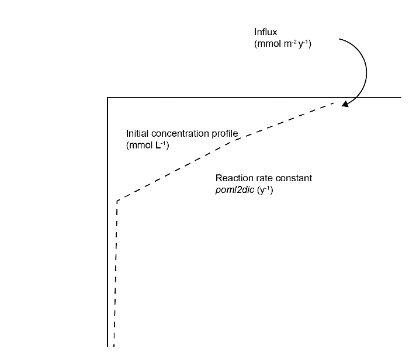{width="33%"}

**Figure 10.6.** Illustration of the three major calibration inputs for organic matter: $POML$ influx, the initial concentration profile and the kinetic reaction rate constant.

#### $O_2$ penetration

Photos from Eyre *et al.* (2025) suggested that $O_2$ penetrated most of cores 2, 3 and 4, but the amount of bioturbation was not clear. The Pb isotope work from Zhou *et al.* (2024) indicated a mixed depth to 6 or 10 cm, which suggests that $O_2$ should be mixed to around 8 cm, either by physical mixing or bioturbation. Keesing *et al.* (2011) reported sediment samples from six sites in Cockburn Sound, with an anaerobic sand depth of 1, 1.5, 2 and 1 cm, as well as one site where the sand appeared aerobic at greater than 10 cm, and one site where the depth could not be determined. Jorgensen *et al.* (2022) developed an empirical formula for $O_2$ penetration depth (OPD) based on diffusive $O_2$ uptake (DOU), as well as another empirical formula for DOU based on water depth. This 20 m deep environment should have an OPD of around 2 cm. There is enough spatial heterogeneity from these studies that one overall OPD cannot be determined, however, $O_2$ to at least 2 cm is justified.

#### Denitrification model

The traditional sediment models that CANDI-AED was based on have an N redox model that resembles that in Figure 10.7. In broad terms, $NH_4^+$ is oxidised by $O_2$ to $NO_3^-$ (red pathway) and in the absence of $O_2$, $NO_3^-$ oxidises organic matter, producing $N_2$ as a by product. Since the $N_2$ is chemically inert (N-fixation is usually not included in sediment models) it leaves the N redox cycle, hence the term denitrification.

{width="33%"}

**Figure 10.7.** Nitrogen redox model used in most sediment models.

CANDI-AED has a complex nitrogen redox model (Figure 10.8). This model adds the species $NO_2^-$ and $N_2O$ and allows two different denitrification pathways: reduction of $N_2O$ with organic matter (denitrousation); and reduction of $NO_2^-$ with $NH_4^+$ (deammonification, sometimes known as anammox).

{width="95%"}

**Figure 10.8.** The N redox model used in CANDI-AED. Red pathways indicate oxidation by $O_2$, brown pathways oxidation of organic matter by an N species and the blue pathway is $NH_4^+$ oxidation by $NO_2^-$. Dashed brown lines indicate the release of NH4 from organic matter upon oxidation.

The rate constants and partitioning constants are presented in Figure 10.9. Organic matter reactions were 2 y^-1^ for the reaction of $POML$, for all N redox pathways. The reaction equation is then the product of concentration and the rate constant, hence the final rate is in mmol L^-1^ y^-1^. $NH_4^+$ was released with each $POML$ oxidised, given by the C:N ratio. The rate of $NH_4^+$ oxidation by $O_2$ wa given by kNH4O2, and then the partitioning of reaction products into $NO_2^-$ and $N_2O$ was set by another constant and the $O_2$ concentration. Similarly, the rate of $NO_2^-$ oxidation of organic matter was 2 y^-1^, and the partitioning of reaction products was set by another constant and the $NO_2^-$ concentration.

{width="95%"}

**Figure 10.9.** N redox model with the rate constants or partitioning constants drawn over the pathway arrows.

#### C:N ratio

The C:N ratio was set using parameters for $POML$ and $POMR$. Eyre *et al.*calculated C:N ratios in the top 2 cm. The deep mud sites had a ratio around 6.5:1, which indicated the organic matter was close to Redfield ratio, and hence it was derived from phyto-detritus. The seagrass sites ranged from 7:1 to 9:1, and site 12 had a ratio 11.5:1. These higher C ratios indicated that seagrass was the source of organic matter.

The C:N from Zhou *et al.*was around 9.5 in the mud core CS13 and 8 in the seagrass core MB. The mud core C:N from Zhou *et al.* did not agree with the mud cores from Eyre *et al.* (2025). It suggested that Zhou *et al.* (2024) found more refractory organic matter than in the core from Eyre *et al.*The refractory organic matter may be legacy organic matter at this core site.

### Parameterisation of specific environments

#### Deep-dark sediment environment

**Deep-dark observations**: Most of the area in Cockburn Sound was deep and without seagrass or benthic algae, as characterised by cores 1 to 4 from Eyre *et al.* (2025). These cores contained around 0.5 mmol L^{-1} chlorophyll. It was assumed this was predominantly undegraded phytoplankton. These sediments were observed to have a total organic matter concentration between 500 to 4000 mmol C L-1 solids, including the legacy refractory organic matter, and an influx of labile phyto-detritus. The cores from these sediments produced a $DIC$ efflux around 8500 mmol m-2 y-1, and had a C:N ratio from 6.6 to 9.5.

These areas had $O_2$ penetration into the sediment because of the apparently low organic matter influx. Photos from Eyre *et al.* (2025) suggested that $O_2$ penetrated most of cores 2, 3 and 4, but the amount of bioturbation was not clear. The Pb isotope work from Zhou *et al.* (2024) indicated a mixed depth to 6 or 10 cm, which suggests that $O_2$ should be mixed to around 8 cm, either by physical mixing or bioturbation. Keesing *et al.* (2011) reported sediment samples from six sites in Cockburn Sound, with an anaerobic sand depth of 1, 1.5, 2 and 1 cm, as well as one site where the sand appeared aerobic at greater than 10 cm, and one site where the depth could not be determined. Jorgensen *et al.* (2022) developed an empirical formula for $O_2$ penetration depth (OPD) based on diffusive $O_2$ uptake (DOU), as well as another empirical formula for DOU based on water depth. This 20 m deep environment should have an OPD of around 2 cm. There is enough spatial heterogeneity from these studies that one overall OPD cannot be determined, however, $O_2$ to at least 2 cm is justified.

The deep $O_2$ caused a flux of $NO_3^-$ out of the sediment, created by the nitrification of $NH_4^+$, and the low concentration of $NO_3^-$ in the water column. As with most sediment environments, there was a flux of $NH_4^+$ out of the sediment (around 50 mmol m\(^{-2}\) y\(^{-1}\)). Denitrification did not occur at a large scale because $O_2$ inhibited oxidation of organic matter by N species and there was not enough organic matter to reach below the aerated zone. $N_2$ flux was measured at around 200 mmol m\(^{-2}\) y\(^{-1}\).

Legacy refractory organic matter was oxidised by sulfate reduction in the deep sediments below the aerobic zone, and $H_2S$ production was indicated by the cores, but not measured.

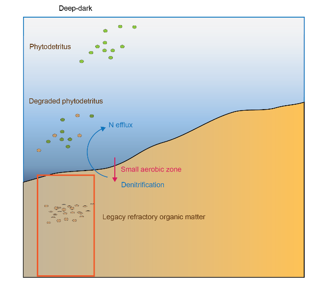{width="33%"}

**Figure 10.10.** Deep aerobic conceptual model.

**Deep-dark processes and assumptions**: Deep-dark sediment was the largest part of Cockburn Sound and it had the simplest setup in CANDI-AED. The initial calibration of the Cockburn Sound sediment models was based on this environment. The following rationale was used:

- $DIC$ effluxes corresponded to organic carbon oxidation and therefore organic carbon deposition (around 8500 mmol m\(^{-2}\) y\(^{-1}\))

- The organic carbon to organic nitrogen ratio was 6.6:1

- Organic N was released as $NH_4^+$ upon degradation of organic matter. Therefore, there was one $NH_4^+$ released for each 6.6 $DIC$ produced

- $O_2$ uptake was roughly equivalent to $DIC$ plus oxidation of $NH_4^+$, Fe2+, $H_2S$ and CH4, if any anaerobic processes occurred

- $N_2$ flux should have been around 200 mmol m\(^{-2}\) y\(^{-1}\), according to the measured data. There should have been a small amount denitrification where $O_2$ concentration declined, and did not inhibit denitrification reactions.

The cores had concentration data for TOC%, TN%, TP% and chlorophyll-a (mg m-2 in 2 mm). Eyre *et al.*measured %COC ranging from 0.2% to 1.9% in the top 2 cm. This converted to around 500 to 4000 mmol C L-1 solids according to the following calculation steps:

Or, as a simpler rule of thumb, 1% TOC was 2250 mmol L^-1^  solids.

Zhou *et al.*measured TOC% at 3.0% all the way down to around 45 cm (corresponding to the time period around 1980 to 2018). This converted to around 7000 mmol C L-1. Historically, TOC had a stepped increase in the 1950s from 1.5% to 2%, then in the 1980s to 3% and remains at 3%.

The TOC% measurements being from around 4000 to 7000 mmol C L-1 solids provided us an order of magnitude to set the initial condition. The corresponding TN measurement from Eyre *et al.*was around 300 mmol L^-1^  solids, and from Zhou *et al.*around 500 mmol L^-1^ .

**Deep-dark key calibration criteria**:  Key criteria used to guide calibration of these cores was:

- $DIC$ efflux around 8500 mmol m\(^{-2}\) y\(^{-1}\)

- Aerobic sediment and $O_2$ influx of around 8500 mmol m\(^{-2}\) y\(^{-1}\)

- $NH_4^+$ efflux around 50 mmol m\(^{-2}\) y\(^{-1}\)

- $N_2$ efflux around 200 mmol m\(^{-2}\) y\(^{-1}\)

#### Benthic algae sediment environment

**Benthic algae observations**: There were areas on the shelf that had benthic algal communities in the sediment. This corresponded with Eyre *et al.* (2025).’s cores 7 and 8. According to Eyre’s lab core experiments, there was a net production of $O_2$ over the course of a day from photosynthesis (more $O_2$ production in the light than consumption in the dark) and hence a net efflux of $O_2$ into the water column. (This was not the usual assumption for fluxes in sediment models.)

Benthic algal communities supplied enough $O_2$ and organic matter that nitrification-denitrification could occur. Unlike the deep sites, there was a net uptake of $NH_4^+$ into the sediment from nitrification.

Flux of $DIC$ and $O_2$ at the sediment-water interface should have been very small or close to zero, as measured in the cores. Flux of $N_2$ was around 200 to 350 mmol m\(^{-2}\) y\(^{-1}\) in cores 7 and 8.

{width="33%"}

**Figure 10.11.**  Photosynthetic aerobic conceptual model for shallow sediments, including seagrass and microalgae.

**Benthic algae processes and assumptions**: CANDI-AED was set up for this environment using the following rationale:

- Benthic algal communities were added to the model as a state variable called $MPB$ (microphytobenthos), which grew at kgpp × biomass up to carrying capacity (Figure 10.12). $MPB$ was quantified in units of mmol C L-1

- Carrying capacity was set to 100 mg Chl-a m-2, which, following unit conversions (see below) came to 150 mmol C L-1

- $MPB$ assimilated $DIC$ and breathed out O2. At carrying capacity this continued as maintenance

- One mole of $DIC$ was absorbed for one mole of $O_2$ exuded

- $MPB$ decayed to labile particulate organic matter ($POML$) at death rate kmpbd × biomass

- $MPB$ grew in the light zone (top 2 mm of sediment) and had net primary productivity (NPP) in the light zone. It was *NPP* because the model did not simulate time at a sub-daily scale

- $MPB$ was mixed below light depth by bioturbation

- $MPB$ decayed to $POML$ at all depths

{width="50%"}

**Figure 10.12.**  Summary of the conceptual model setup for the Benthic algae environment

{width="50%"}

**Figure 10.13.** Schematic of the concentration of MPB. $MPB$ is mixed deep into the sediment and decays to $POML$.

The respiration and *NPP* assumptions were performed as follows:

Total respiration = 17 000 mmol m\(^{-2}\) y\(^{-1}\)

(8500 from algal detritus + 8500 from benthic algae)

*NPP*/R ratio was approximately 0.74 (from the measured data of sites 7 and 8)

*NPP* was 17 000 × 0.75 = 13 000 mmol $O_2$ m-2 y^-1^

But $O_2$ flux across the sediment-water interface was close to zero, so the $O_2$ produced by the $MPB$ was used to oxidise organic matter

The concentration of $MPB$ was calculated as follows:

- Total respiration (vertically integrated) = 17000 mmol m\(^{-2}\) y\(^{-1}\)

- Total gross primary production rate = 13 000 mmol m\(^{-2}\) y\(^{-1}\)

- $DIC$ flux (at sediment-water interface) = close to 0 net daily flux

- $O_2$ flux (at sediment-water interface) = close to 0 net daily flux

- $N_2$ flux (at sediment-water interface) = 200 to 350 mmol m\(^{-2}\) y\(^{-1}\)

#### Seagrass sediment environment

**Seagrass observations**: Some areas had seagrass and therefore seagrass detritus as a source of refractory organic matter. The cores from Eyre *et al.*were cores 5, 6, 9, 10, 11 and 12. Cores 5 and 6 were from a seagrass restoration area whereas the others were naturally surviving seagrass areas.

The seagrass roots injected some $O_2$ into the upper layers of the sediment. The seagrass detritus also consumed the $O_2$ as it was buried in the deep sediments. Since the organic matter was buried deeper than the aerobic zone, sulfate reduction took place.

There was limited denitrification because it was inhibited by $O_2$ in the root area and inhibited by $H_2S$ in the sulfate reduction area. There was still a net efflux of $O_2$ out of the sediment and net consumption of $NH_4^+$. The cores that fit this environment did not show either a definite uptake or efflux of $NO_3^-$ at the sediment-water interface. This environment had high organic matter input and consumption while still having high denitrification (Figure 10.14), because of the root-injected $O_2$ promoting coupled nitrification-denitrification, as well as the high organic matter load.

$N_2$ flux across the sediment-water interface could be from 100 to 600 mmol m\(^{-2}\) y\(^{-1}\) based on the data from cores 10, 11 and 12.

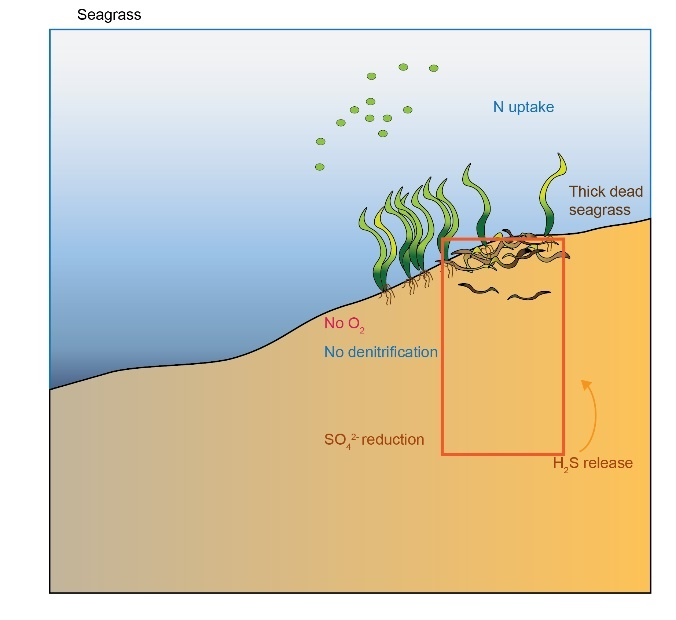{width="33%"}

**Figure 10.14.**  Seagrass environment conceptual model

**Seagrass processes and assumptions**: CANDI-AED was set up for this environment using the following rationale:

- Seagrass had a constant biomass

- Roots assimilated $DIC$ and exude $O_2$ in the sediment, at a 1:1 molar ratio (Figure 10.15)

- Roots went down 5 cm and exuded constant $O_2$ with depth and time

- Bottom water $O_2$ concentration remained the same as other simulations (around 0.2 mmol L^-1^ ) despite photosynthesis from seagrass leaves

- Physical sediment mixing rates were the same despite the roots possibly binding the sediment

- Seagrass deposited leaf detritus at the sediment-water interface

- Seagrass detritus reaction rate constant was 1 y^-1^ ($POML$ was 2 y^-1^)

- Seagrass detritus influx at the sediment-water interface was calibrated to the respiration rate (starting around 10 000 mmol m\(^{-2}\) y\(^{-1}\) (120 g m-2 y^-1^))

{width="33%"}

**Figure 10.15.** Summary of the conceptual model setup for the Seagrass environment

The respiration rate was calculated as follows:

- Respiration: 4000 µmol m\(^{-2}\) h\(^{-1}\) (from the data in cores 9, 11, 12)

 = 35 000 mmol m\(^{-2}\) y\(^{-1}\)

- The overall $O_2$ production ratio to carbon oxidation was (GPP/R) = 1.2 (from the data in cores 9, 11, 12)

- *NPP* = 42 000 mmol m\(^{-2}\) y\(^{-1}\)

- From the $MPB$ setup, $MPB$ *NPP* was 13 000 mmol m\(^{-2}\) y\(^{-1}\)

 therefore roots $O_2$ = 42000 - 13 000

 = 29 000 mmol m\(^{-2}\) y\(^{-1}\)

**Seagrass key calibration criteria**:

- Total $DIC$ production rate = 35 000 mmol m\(^{-2}\) y\(^{-1}\)

- Total *NPP* rate = 42 000 mmol m\(^{-2}\) y\(^{-1}\)

- $DIC$ flux (at the sediment-water interface) = close to 0 (net daily flux)

- $O_2$ flux (at the sediment-water interface) = close to 0 (net daily flux)

- $N_2$ flux (at the sediment-water interface) = between 100 and 600 mmol m\(^{-2}\) y\(^{-1}\)

### Sensitivity to water quality changes

#### Seasonal simulation setup

The seasonal setup involved using the dynamic boundary for a year, looped continuously, after the 5 year steady period. (Two years are presented in the results figures.) Dynamic boundary fluxes were $POML$, $POMR$, and dynamic boundary concentrations were $O_2$, $NH_4^+$, $NO_3^-$, NO2-, $PO_4^{3-}$, salinity and $SO_4^{2-}$. Constant fluxes were used for MnO2 and Fe(OH)3 and constant concentrations were used for $DIC$ and $N_2$. For each sediment environment, this boundary fluctuation was the same. Seasonal fluctuations were not applied to the seagrass detritus.

#### Low $O_2$ period setup

Dalseno *et al.* (2024) described how Cockburn Sound was largely well oxygenated, until periods of low wind cause low $O_2$ concentration in the bottom water. To replicate this type of event, a simulation was run with a period of low bottom water O2. The seasonal setup was repeated and $O_2$ concentration dropped from 0.22 to 0.08 mmol L^-1^  (7 to 1 mg L-1) for 30 days in April (Figure 10.16). Based on the observations of Jorgensen *et al.* (2022), lower $O_2$ concentration and should produce a lower $O_2$ flux, while the total organic matter oxidation rate should remain the same.

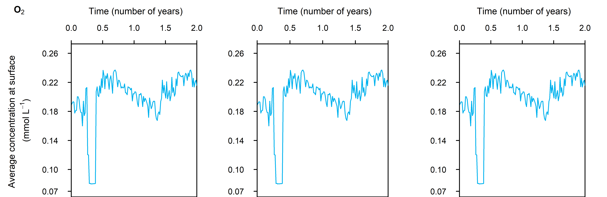{width="94%"}

**Figure 10.16.**  Concentration-time plot of the bottom water boundary for the low $O_2$ simulation.

#### High organic matter period setup

To replicate the effect of a one-off pollution or algal bloom event, a higher organic matter flux was added for 31 days in March (100 000 mmol m\(^{-2}\) y\(^{-1}\), Figure 10.17). An extra POM variable was used, and $POML$ and $POMR$ remained the same as in the other simulations. The seasonally-fluctuating boundary was used.

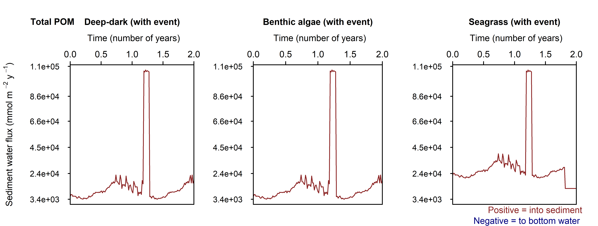{width="94%"}

**Figure 10.17.**  Flux-time plot of the POM fluxing in at the sediment-water interface.

### Sensitivity to groundwater inflow

#### Groundwater observations

The equilibrium simulation was extended with groundwater inflow into the deepest layer of sediment. Part of the motivation behind including this environment was the recommendations of Greenwood *et al.* (2016), who estimated two N flux budgets for Cockburn Sound, with the lower (450 t y^-1^) and upper (920 t y^-1^) amount of groundwater setting the difference. Greenwood *et al.* (2016) set the range based on rainfall variability, following Donn *et al.* (2015). Greenwood *et al.* (2016) compared these values to previous estimates of 2100 (for 1978, from CSMC 2001) and 300 t N y^-1^ (for 2000, from CSMC 2001), which combined groundwater influx with atmospheric and catchment inputs. Greenwood *et al.* (2016) also mentioned the possible addition of a further 185 t N y^-1^ from managed aquifer recharge in the future.

As outlined in Table 1, thousands of t y^-1^ are thought to be recycled in Cockburn Sound, and groundwater represents only hundreds of t y^-1^. However, groundwater would be the major external flux of TN in this system, given that the atmosphere was around 10 t y^-1^ and the northern sea boundary was around 51 t y^-1^. Combined burial and denitrification were proposed to be in balance with the groundwater input, however, there is uncertainty about these amounts. The simulation in CANDI-AED can help to estimate groundwater input, and separately estimate burial and denitrification.

Further, the Greenwood *et al.* (2016) flux budget assumed that TN would be released from the sediment as $NO_3^-$ rather than $NH_4^+$ or other DIN species. Therefore, another motivation for the CANDI-AED project is to estimate the speciation of DIN from the sediment.

In recent work, Donn *et al.* (2025) with CSIRO collected groundwater samples and conducted numerical modelling of groundwater, to estimate the groundwater flow and TN species concentration in Cockburn Sound. They conducted several sampling campaigns, along the beach and offshore from a boat. A summary of the concentrations of some of the key variables from each sampling campaign is given in Table 9. A schematic cross-section of the underwater environment with the flow path and sampling locations is given in Figure 10.18.

Donn *et al.* (2025) also used a 2D groundwater model to estimate flow velocities, and, combined with the measured concentrations, estimated the loads of key species into Cockburn. Escudero *et al.* (2026) then used these flows and loads to apply average loads to the CSIEM hydrodynamic model, as well as inputs to CANDI-AED. The model from Donn *et al.* (2025) predicted very little flow, and therefore load, to most areas of Cockburn Sound. For the years 2021 and 2022, using this method predicted around 60 t y^-1^, which was much lower than the hundreds of t y^-1^ estimated by Greenwood *et al.* (2016).

Table 9 Summary of groundwater sample concentrations (mmol L-1)

XXXX Table missing XXXX

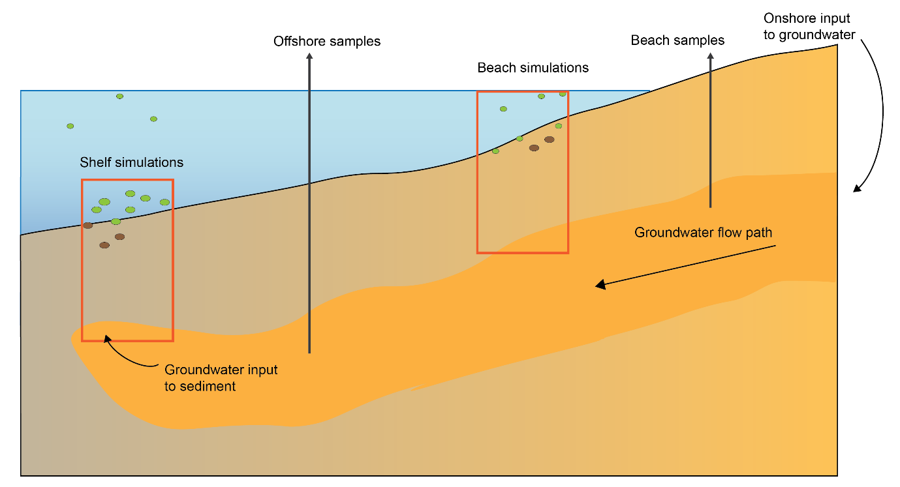{width="94%"}

**Figure 10.18.**  Groundwater-sediment conceptual model

#### Groundwater processes and assumptions

This environment was set up by extending the Deep-dark environment with groundwater settings. Benthic algae and seagrass settings were not used, so that the effect of groundwater could be more easily compared.

Four locations were used with groundwater input. Two locations were at the beach, which had high groundwater flow velocity. One at the beach had high DIN loads (Beach high) and the other had low DIN loads (Beach low). Two locations were further offshore (hundreds of m), which had lower groundwater flow velocity. One of these had relatively high DIN concentration (Shelf high) and one low DIN concentration (Shelf low).

Porewater flow was advected upwards at the 30 cm deep bottom boundary, using the poreflow parameter, pf. (The analogue of this at the sediment-water interface is the effective downward advection of porewater from sediment deposition, woo.) Concentrations were added at the bottom-most layer of the sediment as a time-varying boundary, for $NH_4^+$, $NO_3^-$, NO2-, $PO_4^{3-}$, $SO_4^{2-}$, $DIC$ and salinity. A summary of area, TN flux and TN load is given in Table 10, along with the groundwater zone referenced in the chapter on submarine groundwater discharge. Concentration values for these variables were taken from the analysis in the chapter on submarine groundwater discharge (Table 10). Example plots of pf and $NH_4^+$ are shown in Figure 10.19 and Figure 10.20.

Table 10 Summary of area, porewater velocity and average groundwater flux and load of TN. Flux was calculated as the product of pf and TN concentration. Load was calculated as the product of TN mass per volume, porewater flux and area.

XXXX Table missing XXXX

Table 11 Average concentrations for key variables used for the bottom boundary of the four groundwater locations (mmol L-1)

XXXX Table missing XXXX

XXXX Figure missing XXXX

**Figure 10.19.**  Groundwater flow velocity as applied to the bottom boundary of the sediment domain with daily timesteps (cm y^-1^).

XXXX Figure missing XXXX

**Figure 10.20.**  Ammonium concentration as applied to the bottom boundary of the sediment domain with daily timesteps (cm y^-1^).


## Model calibration and assessment

### Calibration of equilibrium conditions

#### Deep-dark environment steady results

**C and $O_2$ balance**: The $DIC$ and $O_2$ fluxes were calibrated to be in balance. The resulting $DIC$ efflux was around 9000 mmol m\(^{-2}\) y\(^{-1}\) (out of the sediment) and $O_2$ uptake was around 8000 mmol m\(^{-2}\) y\(^{-1}\) (into the sediment).

To achieve this balance, the main parameter calibration step was using higher irrigation than the model default option. The initial irrigation parameter (α0) taken from the sediment model of Van Cappellen and Wang (1996) was 200 y^-1^ and this was increased to 3300 y^-1^. The purpose of this was to allow mixing of $O_2$ deeper into the sediment. When using the original, lower mixing rate, the sediment and bottom waters were not aerobic and most organic matter was consumed by sulfate reduction. In that case, the $O_2$ flux did not reach a value close to 8500 mmol m\(^{-2}\) y\(^{-1}\): once the concentration of $O_2$ in the top 1 mm of sediment was 0 mmol L^-1^ , $O_2$ could not diffuse into the sediment faster than it could react with the organic matter. There was clearly a high sediment $O_2$ demand, but not a high flux of O2. Increasing the irrigation parameter allowed both demand and flux.

With this irrigation setup and flux result, aerobic oxidation of organic matter and $O_2$ presence were simulated to around 8 cm, which followed the bioturbation settings of exponential decay from the surface to 8 cm. At 2cm, which was the depth mentioned above where we were confident that some $O_2$ should be present, it was around 25% of the concentration at the sediment-water interface.

**Redox pathways**: With a large amount of $O_2$ mixed into the sediment, this inhibited the other redox pathways (Figure 10.21). Beneath the depth of $O_2$ penetration, organic matter supply had been mostly exhausted and so the other pathways did not have high reaction rates.

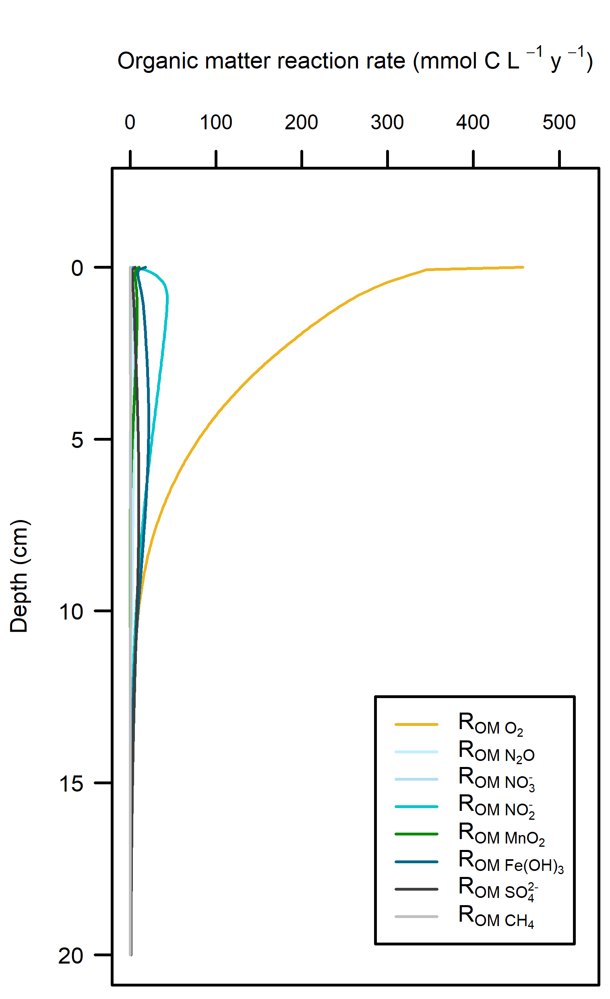{width="33%"}
{width="33%"}

**Figure 10.21.**  – Left: redox reaction rates for the Deep-dark simulation, primarily aerobic (yellow). Right: favourability of each redox pathway, scaling between 0 and 1, the product of limitation and inhibition.

The organic matter reaction rate was around 500 mmol L^-1^  y^-1^ at the sediment-water interface and decreased to zero around 15 cm deep. To check this fundamental step, this rate and depth were compared with similar observations from other key sediment models. Van Cappellen and Wang (1996) had a reaction rate of around 140 mmol L^-1^  y^-1^ at the sediment-water interface, decaying to around zero at around 10 cm. The measured data used for this paper were from Canfield *et al.* (1993) from a site (S4) 190 m deep (Eyre *et al.*2025 took cores from 20 m deep). Canfield *et al.* (1993) measured $O_2$ uptake and total C oxidation at 16.06 and 15.76 mmol m-2 d-1. $O_2$ was measured at 0 below 7 mm. Boudreau (1996) had a reaction rate of around 6 mmol L^-1^  y^-1^ at the sediment-water interface. The coastal-estuarine sediment simulated by Wang and Van Cappellen (1995) had an organic matter oxidation rate of 9800 mmol L^-1^  y^-1^ (27 mmol m-2 d-1), which was about 70 at the sediment water interface and around 50 mmol L^-1^  y^-1^ at 6 cm deep. This comparison showed that the Cockburn simulation included much more organic matter oxidation than similar studies, in order to reach the benchmark 8500 mmol m\(^{-2}\) y\(^{-1}\) $DIC$ flux reported by Eyre *et al.*Although these studies had a lower total organic matter oxidation rate, these studies also had aerobic oxidation exhausted within the top 1 cm. In these studies, sulfate reduction was the main redox pathway from 2 cm down. One explanation for this difference may be that the hydrodynamic environment was much more energetic in Cockburn.

{width="33%"}

**Figure 10.22.**  Depth profile of organic matter oxidation and $NH_4^+$ release in the steady Deep-dark simulation

**Denitrification**: Denitrification occurred, and $N_2$ fluxed from the sediment into the water column at around 200 mmol m\(^{-2}\) y\(^{-1}\), which matched the measured data from Eyre *et al.*Denitrification efficiency was 44% (N2 flux per DIN flux).

#### Benthic algae environment steady results

**C and $O_2$ balance**:

The $DIC$ and $O_2$ were again calibrated to be in balance. Respiration (production of DIC) was 17 000 mmol m\(^{-2}\) y\(^{-1}\) and *NPP* (net production of O2) was 13 000 mmol m\(^{-2}\) y\(^{-1}\) : this meant that most of the organic matter was consumed aerobically. This was achieved by tuning the rate that $MPB$ produced $O_2$ and consumed $DIC$ (312 y^-1^). This parameter was very sensitive and this system could easily have an imbalance between respiration and *NPP* in another simulation with different organic matter amounts. $O_2$ flux across the sediment-water interface was measured at very low rates, and the simulation produced a very low $O_2$ flux of 150 mmol m\(^{-2}\) y\(^{-1}\), which captured the measured data well. The $DIC$ flux was measured at around 4000 and simulated at 6000 mmol m\(^{-2}\) y\(^{-1}\).

**Redox pathways**: The *NPP* provided $O_2$ in the top 2 mm of the sediment, which maintained aerobic respiration. The extra organic matter from $MPB$ biomass consumed oxidants as well, which allowed for more N redox reactions and sulfate reduction than in the Deep-dark sediments (Figure 10.23).

{width="33%"}
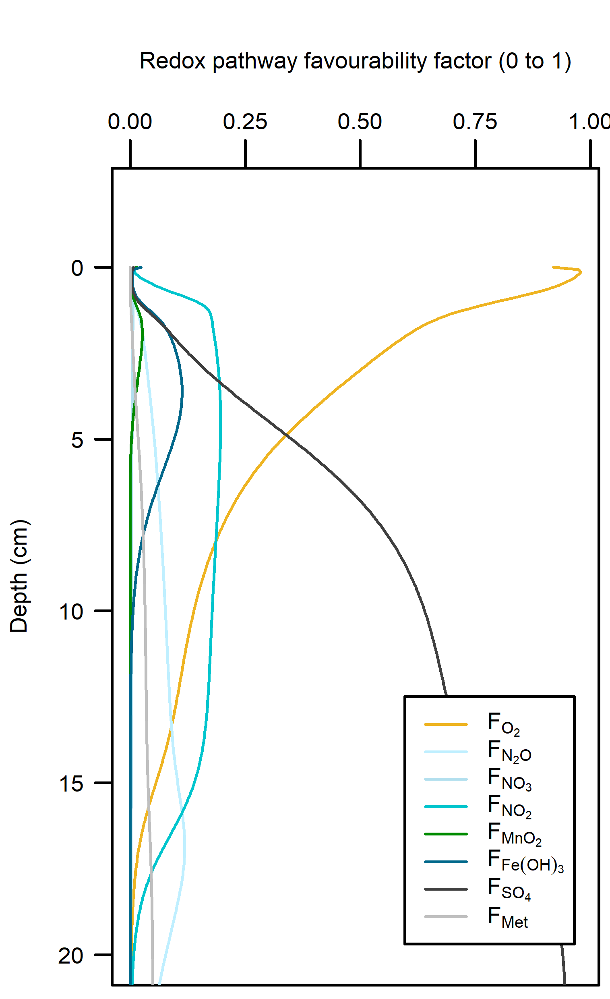{width="33%"}

**Figure 10.23.**  – Left: redox reaction rates for the Benthic algae simulation. Right: favourability of each redox pathway, scaling between 0 and 1, the product of limitation and inhibition.

**Denitrification**:

The Benthic algae environments produced a sediment-water $N_2$ flux of around 750 mmol m\(^{-2}\) y\(^{-1}\), which was around three times as much as expected from the measured data. Denitrification efficiency was 54%.

#### Seagrass environment steady results

**C and $O_2$ balance**: The $DIC$ and $O_2$ production and consumption were again calibrated to be in balance. Respiration was 35 000 mmol m\(^{-2}\) y\(^{-1}\) and *NPP* (net production of O2) was 41 000 mmol m\(^{-2}\) y\(^{-1}\), where their targets were 35 000 and 42 000 mmol m\(^{-2}\) y\(^{-1}\), respectively. This was achieved by tuning the rate that seagrass roots produced $O_2$ and consumed $DIC$ (1100 mmol L^-1^  y^-1^) and tuning the flux of POMSpecial deposition, as seagrass detritus (17 000 mmol m\(^{-2}\) y\(^{-1}\), reaction rate constant 1 y^-1^). $O_2$ flux across the sediment-water interface was measured at very low values, and the simulation produced a high $O_2$ efflux of 12 000 mmol m\(^{-2}\) y\(^{-1}\). The $DIC$ flux was measured at close to zero but simulated at 6000 mmol m\(^{-2}\) y\(^{-1}\) into the sediment. Therefore, although the $DIC$ and $O_2$ production and consumption matched the assumptions that went into the design of the simulation, the final simulated flux across the sediment-water interface was larger than the measured values. The $DIC$ efflux of around 6000 mmol m\(^{-2}\) y\(^{-1}\) is still considered an oligotrophic environment, according to the classification from Eyre and Ferguson (2009).

**Redox pathways**: Aerobic reactions dominated in the top 5 cm of sediment where the roots were present, and then sharply declined below that depth (Figure 10.24). Sulfate reduction was the dominant pathway below 5 cm.

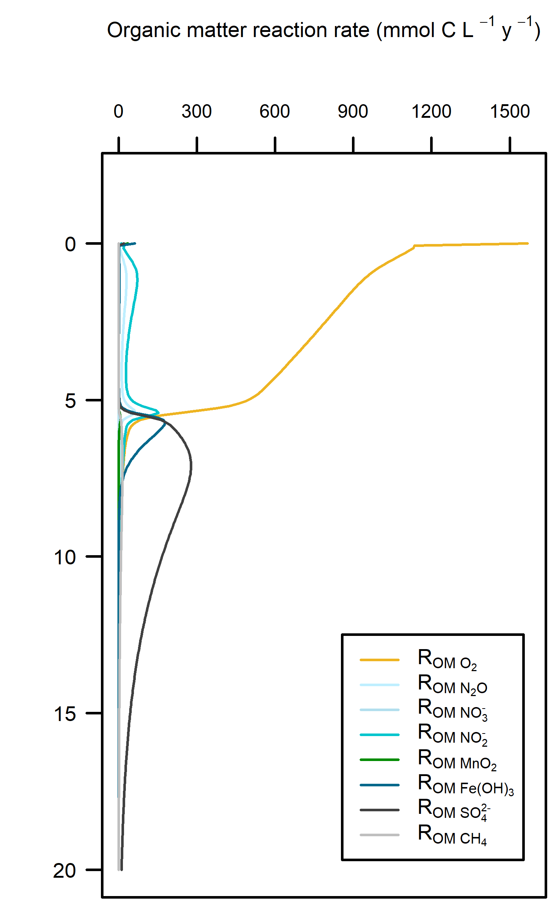{width="33%"}
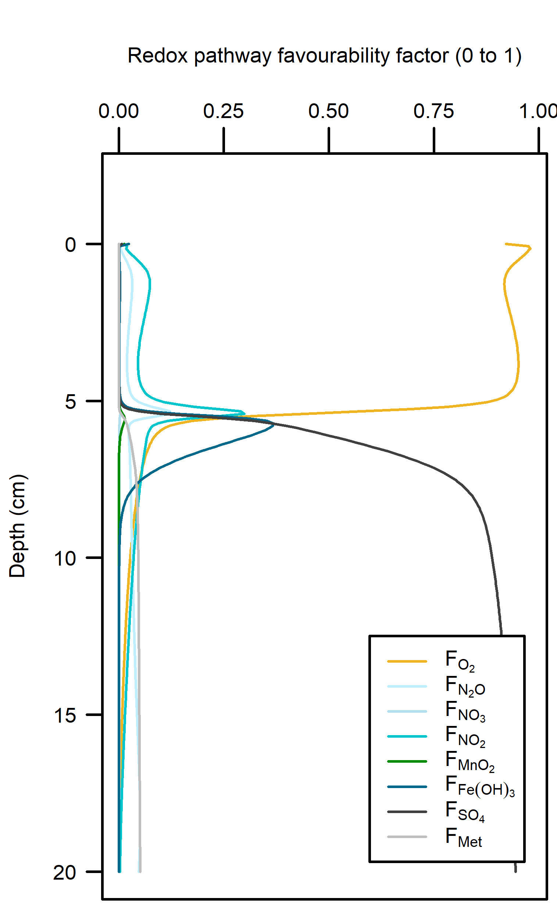{width="33%"}

**Figure 10.24.**  – Left: redox reaction rates for the Seagrass simulation. Right: favourability of each redox pathway, scaling between 0 and 1, the product of limitation and inhibition.

**Denitrification**: In between the aerobic and sulfate reducing zones there was a tight band where N redox reactions were possible (see the light yellow lines just below 5 cm in Figure 21). There was just enough $O_2$ available to keep producing oxidised N species that ultimately led to denitrification. $N_2$ flux was around 450 mmol m\(^{-2}\) y\(^{-1}\). Denitrification efficiency was 45%.

### Summary of equilibrium C and N pathways

Overall, these environments had a lot of aerobic oxidation of the incoming organic matter (Figure 10.25). With a greater load of organic matter from benthic algae biomass or seagrass detritus there was a greater total oxidation rate, and therefore more N redox and sulfate reduction. The greater organic matter oxidation rate was partially compensated by the extra $O_2$ added by the benthic algae and seagrass roots in the top of the sediment.

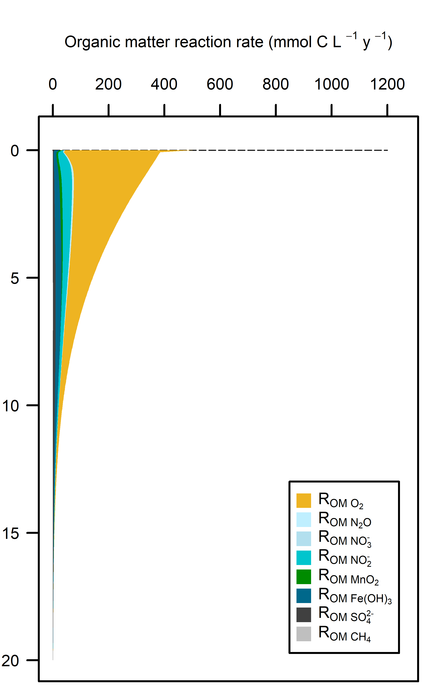{width="33%"}
{width="33%"}
{width="33%"}
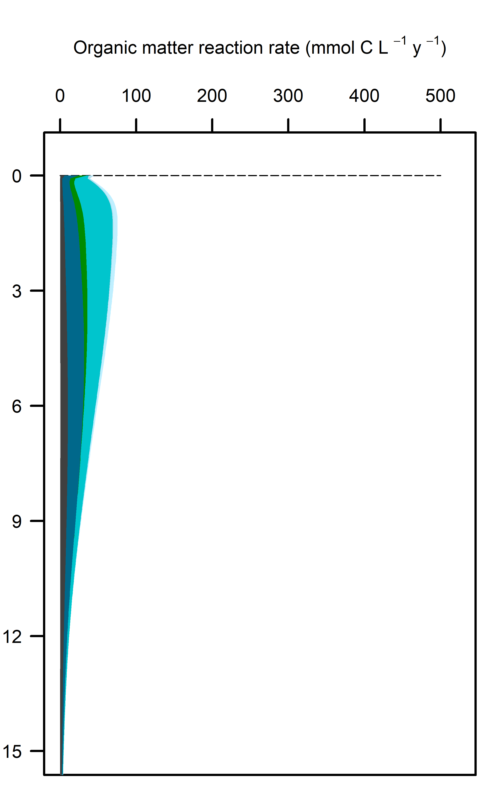{width="33%"}
{width="33%"}
{width="33%"}

**Figure 10.25.**  Above – area plots of redox pathways for each of the environments left to right. Below –area plots zoomed in to the top 15 cm showing only the anaerobic redox pathways.

The main processes of N redox cycling were:

- oxidation of $NH_4^+$ to $NO_2^-$ and

- oxidation of organic matter by $NO_2^-$ and $N_2O$.

These pathways promoted denitrification ($N_2$ production) from $N_2O$ oxidation of organic matter. These were the largest rate processes seen in the sediment (Figure 10.26, see also Figure 10.27 for the map of N redox cycling in CANDI-AED, where these red and brown profiles correspond with the red and brown pathway arrows). The seagrass environment had the largest peak of summed N redox rates at just below 5 cm and they continued to around 10 cm. However, the other two environments allowed these processes to occur from 0 to 10 cm, around twice the depth.

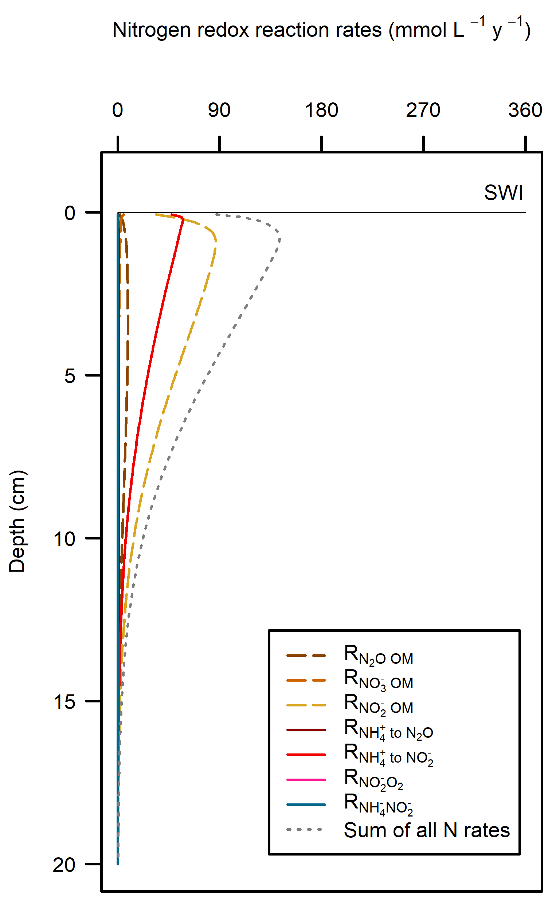{width="33%"}
{width="33%"}
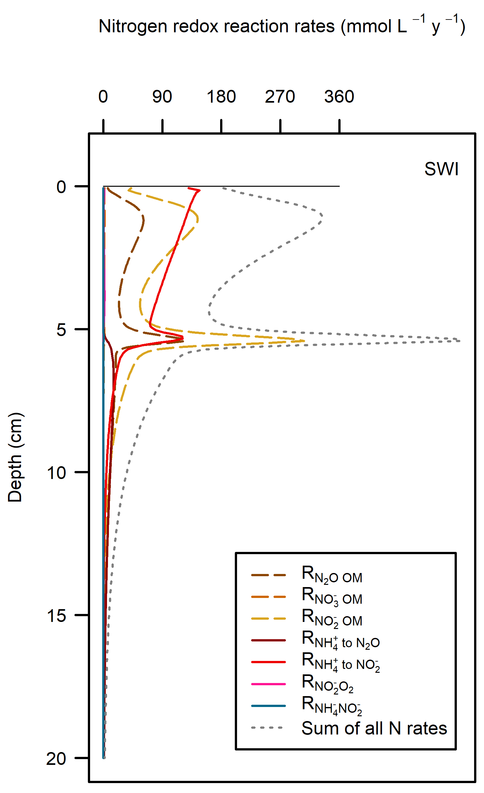{width="33%"}

**Figure 10.26.** N redox pathways for each of the environments. Pathways of organic matter oxidation by N are shown in brown dashed lines and N oxidation by $O_2$ are shown in red solid lines.

{width="33%"}

**Figure 10.27.**  N redox pathway map, copied from Figure 10.8. The pathways that had the highest rates are emphasised here with thick lines: organic matter oxidation by $NO_2^-$ and $NH_4^+$ oxidation by $O_2$.

**Flux and mass N budgets**: The influx of N from algal detritus and seagrass combined for all of Cockburn Sound was 3087 t y^-1^ (Table 12). For comparison with other budgets, the benthic algal biomass and seagrass can be considered part of the sediment internal cycling, and the $POML$ detritus from the Deep-dark component (2174 t y^-1^) reflects the load from phytoplankton detritus. Similarly, the organic N input is in line with Greenwood’s estimate of around 2000 t y^-1^.

The simulated net DIN flux across the sediment-water interface for the whole of Cockburn Sound was 1034 t y^-1^ from the sediment to the water. The N outflux of 1034 t y^-1^ is broadly in line with the estimate from Greenwood (2016), who calculated an N flux of around 1500 t y^-1^. The biggest difference between these results and the result of the Greenwood model is Greenwood’s assumption of a net outflux of $NO_3^-$, whereas, according to these results, most of the flux is $NH_4^+$ and $N_2$ (430 and 2012 t y^-1^).

The $N_2$ flux of 2012 is an indication of denitrification. The total of organic N entering the sediment is roughly in balance with the DIN being recycled to the water column and the $N_2$ lost to denitrification (Figure 28). If this were the case, the sediment would be removing total N from the Cockburn system each year, especially since the assumed inputs of N are assumed to be much lower. It is more likely an overestimation of the amount of organic N entering the sediment, calibrated to satisfy the reported amounts of $DIC$ efflux. Although the seagrass was simulated to take up DIN from the sediment pore water, its simulated growth was not limited by low N concentration. This should be included in future simulations of the seagrass sediment environment. Future simulations should more generally examine the settings for organic matter inputs from benthic algae and seagrass leaf detritus. A future coupled simulation could also utilise the water column TN concentrations and benthic algae and seagrass modules, to close the total N loop. Despite these limitations, these results give a useful approximation of general N fluxes and the individual N speciation.

Table 12 N budget fluxes in t y^-1^ from each sediment environment and the total. In this table, negative indicates flux from the sediment to the water.

XXXX Table missing XXXX

{width="33%"}

**Figure 10.28.**  Schematic of the N flux budget in t N y^-1^, approximated to the nearest 1000.

The stores of N were calculated as the sum of all N species then multiplied by their weighted areas, in the top 2 cm of sediment, resulting in 3417 t (Table 13). Greenwood had estimated around half of this amount at 1505 t. All of the uncertainties described above relating to the amount of benthic algae biomass and seagrass detritus apply for this calculation. Another major uncertainty is the amount of refractory organic N in the sediment. Future work can run longer simulations of the 20th century, depositing refractory organic N in the polluted decades and capture the measured amount of deep N, while still maintaining the surface fluxes from recent organic N deposition.

Table 13 Stores of N in the top 2 cm of sediment, in t, as simulated with CANDI-AED.

XXXX Table missing XXXX

### Sensitivity of sediment processes to water quality events

#### Seasonal variability results

C and $O_2$ balance

$DIC$ flux was approximately the same as in the steady simulation, but varied around 2000 mmol m\(^{-2}\) y\(^{-1}\), or 20 to 30% seasonally. The Seagrass environment retained the large uptake into the sediment from the steady calibration. $DIC$ concentration was close to the boundary concentration of around 2 mmol L^-1^  In the seagrass environment, above 5 cm $DIC$ concentration was closer to 1 mmol L^-1^ . From 5 to 10 cm there was the biggest range of concentration (Figure 10.29).

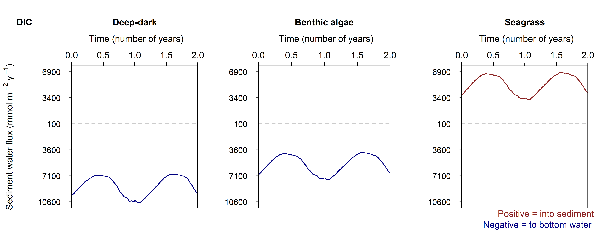{width="33%"}

{width="33%"}

**Figure 10.29.**  Summary figure of two years of $DIC$ under seasonally fluctuating conditions. Left to right – Deep-dark, Benthic algae communities and Seagrass environments. Top – flux over time. Middle – concentration over depth plotted at four times in the year. Bottom – plot of concentration, depth and time, with the bottom water shown above the sediment-water interface.

$O_2$ flux varied around 2000 mmol m\(^{-2}\) y\(^{-1}\), or 20% seasonally. The simulation matched the few measured data points in the Deep-dark and Benthic algae environments, but not the seagrass environment. The Benthic algae environment was fluctuating around net production to net consumption of $O_2$, as the $POML$ boundary flux increased (Figure 10.30).

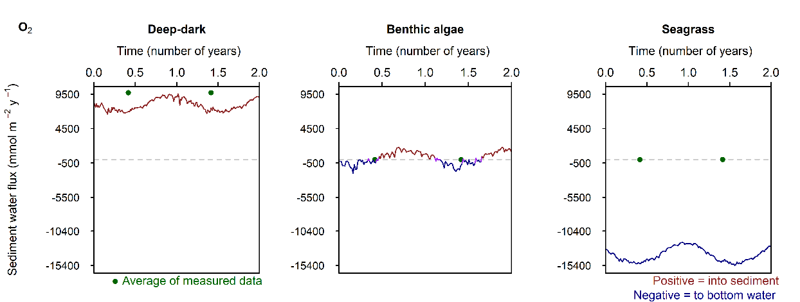{width="33%"}

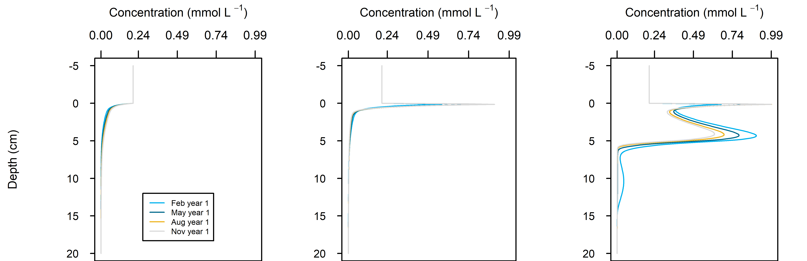{width="33%"}

{width="33%"}

**Figure 10.30.**  Summary figure of two years of $O_2$ under seasonally fluctuating conditions. Left to right – Deep-dark, Benthic algae communities and Seagrass environments. Top – flux over time, including measured data. Middle – concentration over depth plotted at four times in the year. Bottom – plot of concentration, depth and time, with the bottom water shown above the sediment-water interface.

**N and denitrification**: All environments had a net release of DIN (NH4+, $NO_3^-$, NO2-, $N_2O$ and $N_2$). The three environments had a range of DIN flux of around 250, 1500 and 150 mmol m\(^{-2}\) y\(^{-1}\), and 30, 350 and 5%. Most of the DIN concentration was $N_2$, and the second-most was $NH_4^+$ (Figure 10.31).

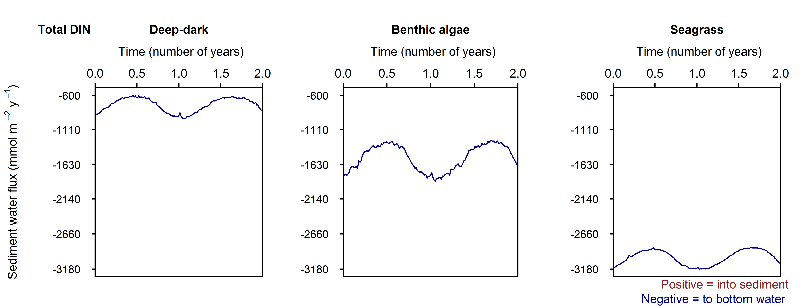{width="33%"}

{width="33%"}

**Figure 10.31.**  Summary figure of two years of DIN under seasonally fluctuating conditions. Left to right – Deep-dark, Benthic algae communities and Seagrass environments. Top – flux over time. Bottom – plot of concentration, depth and time, with the bottom water shown above the sediment-water interface.

Seagrass had the highest total $N_2$ flux, which was also the least sensitive to seasonal fluctuations, since the model had a steady supply of seagrass detritus that was not subject to boundary fluctuations (Figure 10.32).

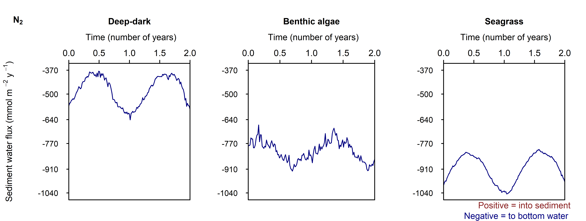{width="33%"}

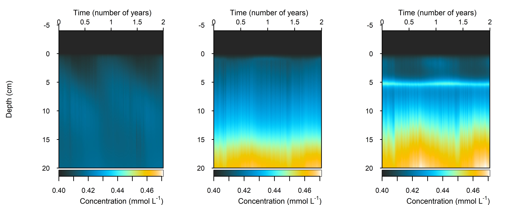{width="33%"}

**Figure 10.32.**  Summary figure of two years of DIN under seasonally fluctuating conditions. Left to right – Deep-dark, Benthic algae communities and Seagrass environments. Top – flux over time. Bottom – plot of concentration, depth and time, with the bottom water shown above the sediment-water interface. $NH_4^+$ flux in the Deep-dark environment fluctuated between flux into and out of the sediment seasonally (Figure 10.33).

{width="33%"}

{width="33%"}

**Figure 10.33.**  Summary figure of two years of DIN under seasonally fluctuating conditions. Left to right – Deep-dark, Benthic algae communities and Seagrass environments. Top – flux over time. Bottom – plot of concentration, depth and time, with the bottom water shown above the sediment-water interface.

**Flux and mass budgets**: The total mass of N material in the seasonally fluctuating simulations was similar to that of the steady simulation, since the steady simulation was based on an average of seasonal fluctuations (Table 13).

Table 14 N budget fluxes in t y^-1^ from each sediment environment and the total, during the seasonally fluctuating simulation. In this table, negative indicates flux from the sediment to the water.

XXXX Table missing XXXX

#### Low $O_2$ period results

**C and $O_2$ balance**: The drop in the $O_2$ boundary caused sediment $O_2$ concentration to drop to 0 mmol L^-1^  in the Deep-dark environment. The Benthic algae environment had $O_2$ in the top 2 mm where benthic algae were photosynthesising. $DIC$ concentration and flux in the sediment continued unaffected by the drop in $O_2$.

In the Deep-dark environment, during the low $O_2$ event, $O_2$ flux into the sediment was lower (Figure 10.34). This does not mean that demand dropped, since the organic matter input was the same: organic matter was oxidised via anaerobic processes. In the Benthic algae and Seagrass environments, $O_2$ flux into the water column increased, because of the diffusion from the sediment surface into the water column. Thus, a sediment environment that creates $O_2$, under a water column with low $O_2$, supplies $O_2$ to the water while undergoing more anaerobic reactions. Whether this would have an effect on the $O_2$ concentration of the water column was not determined by this setup and a coupled sediment-water column model would be needed.

Sediment $O_2$ concentration recovered very quickly after the boundary $O_2$ concentration returned. This is a result of the high mixing rate that was calibrated in the initial steady Deep-dark setup. If the boundary $O_2$ drop was the result of less mixing with the atmosphere, the mixing through the water column and at the sediment-water interface may have also been less, and the recovery might have been slower. This would be another experiment that a coupled sediment-water column model could investigate.

{width="33%"}

{width="33%"}

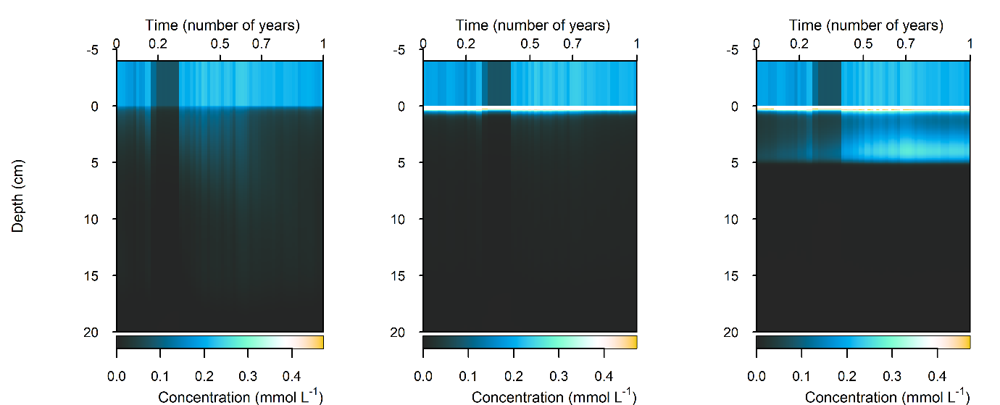{width="33%"}

**Figure 10.34.**  Summary figure of $O_2$ flux and concentration in the $O_2$ drop simulation. Left to right – Deep-dark, Benthic algae communities and Seagrass environments. Top – flux over time, including measured data. Middle – concentration over depth plotted at four times in the year. Bottom – plot of concentration, depth and time, with the bottom water shown above the sediment-water interface.

N and denitrification

During the drop in $O_2$, the Benthic algal environment had the most prominent increase in DIN flux to the water column, around 300 mmol m-2 y1, or 40% (Figure 10.35). In the other two environments there was only a small increase compared to the normal seasonal variation. All environments had an increase in $NH_4^+$ flux and a decrease in $NO_2^-$ flux and concentration. The $NO_2^-$ concentration went close to 0 mmol L^-1^  in the sediment (Figure 10.35, Figure 10.36 and Figure 10.37). Thus in a situation with no sediment $O_2$, any $NO_2^-$ present was reacted to $N_2$ and the $NO_2^-$ was not replaced. With less $O_2$, the $NH_4^+$ was not oxidised to $NO_2^-$ and so $NH_4^+$ concentration increased, and hence $NH_4^+$ efflux increased.

This shows a mechanism for how a disturbance to the baseline condition led to more $NH_4^+$ at the expense of NOx, which is a pattern seen in other scenarios described below. This also shows the temporary increase in denitrification caused by low $O_2$, but also how denitrification ceases after the oxidised N species such as $NO_2^-$ are exhausted. Eyre *et al.* (2025) mentioned the necessity of short periods of low $O_2$ for coupled nitrification-denitrification.

{width="33%"}

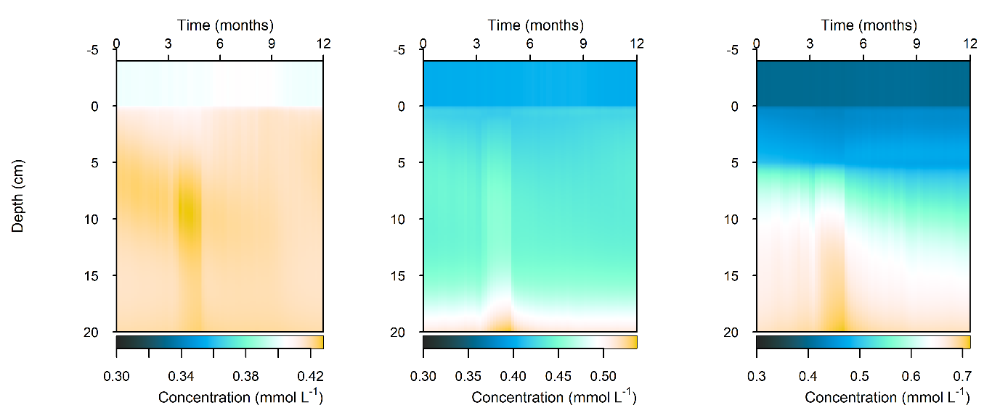{width="33%"}

**Figure 10.35.**  Summary figure for DIN under the $O_2$ drop. Left to right – Deep-dark, Benthic algae communities and Seagrass environments. Top – flux over time, including measured data. Bottom – plot of concentration, depth and time, with the bottom water shown above the sediment-water interface.

{width="33%"}

{width="33%"}

**Figure 10.36.**  Summary figure for $NH_4^+$ under the $O_2$ drop. Left to right – Deep-dark, Benthic algae communities and Seagrass environments. Top – flux over time, including measured data. Bottom – plot of concentration, depth and time, with the bottom water shown above the sediment-water interface.

{width="33%"}

{width="33%"}

**Figure 10.37.**  Summary figure for $NO_2^-$ under the $O_2$ drop. Left to right – Deep-dark, Benthic algae communities and Seagrass environments. Top – flux over time, including measured data. Bottom – plot of concentration, depth and time, with the bottom water shown above the sediment-water interface.

{width="33%"}

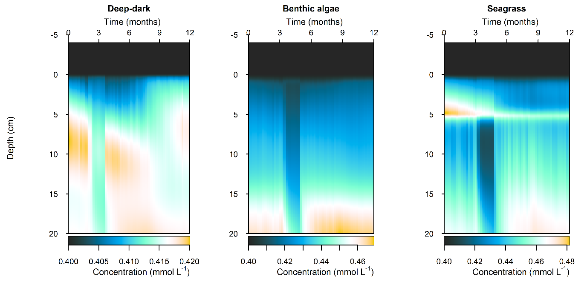{width="33%"}

**Figure 10.38.** Summary figure for $N_2$ under the $O_2$ drop. Left to right – Deep-dark, Benthic algae communities and Seagrass environments. Top – flux over time, including measured data. Bottom – plot of concentration, depth and time, with the bottom water shown above the sediment-water interface.

#### High organic matter period results

C and $O_2$ balance

The organic matter pulse created an extra $DIC$ flux of around 50% more than the seasonal variation. The flux returned to its previous state within around 1 month (Figure 10.39). The effect of the extra organic matter was most clearly seen in the Deep-dark environment, where natural organic matter influx was low and there was no $O_2$ from photosynthesis.

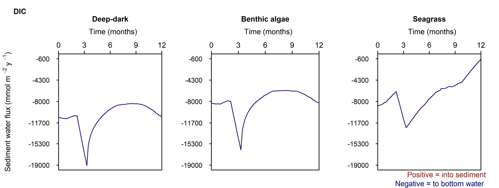{width="33%"}

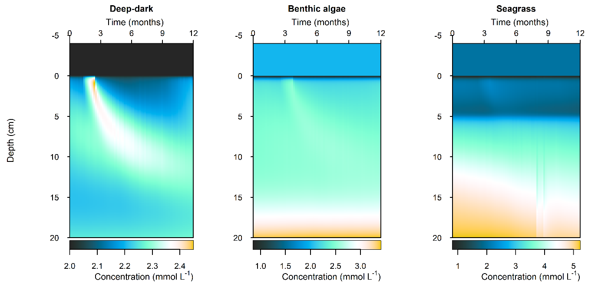{width="33%"}

**Figure 10.39.**  Summary figure of $DIC$ under the increase in organic matter. Left to right – Deep-dark, Benthic algae communities and Seagrass environments. Top – flux over time. Bottom – plot of concentration, depth and time, with the bottom water shown above the sediment-water interface.

The one-off increase in organic matter concentration created a bigger flux of $O_2$ into the sediment in the case of the Deep-dark and Benthic algae environments, and a smaller flux to the bottom water in the case of the Seagrass environment (Figure 39). The recovery after the event was slower than in the $O_2$ drop simulation, because the extra organic matter was buried as a solid, rather than diffused as a solute.

{width="33%"}

{width="33%"}

{width="33%"}

**Figure 10.40.**  Summary figure of $O_2$ under organic matter increase. Left to right – Deep-dark, Benthic algae and Seagrass environments. Top – flux over time, including measured data. Middle – concentration over depth plotted at four times in the year. Bottom – plot of concentration, depth and time, with the bottom water shown above the sediment-water interface.

N and denitrification

The organic matter pulse caused an increased efflux of DIN, most of which was $NH_4^+$ and $N_2$ (Figure 10.41). Since the organic matter persisted in the sediment for around three months, the legacy of higher $NH_4^+$ and $N_2$ also persisted for three months (Figure 10.41, Figure 10.42). The Seagrass environment did not have a noticeable change in efflux of total DIN or $NH_4^+$, however, there was a greater efflux of $N_2$ (Figure 10.43). This indicated that denitrification could increase, assisted by the $O_2$ supplied to the sediment by the roots.

{width="33%"}

{width="33%"}

**Figure 10.41.**  Summary figure of DIN under organic matter increase. Left to right – Deep-dark, Benthic algae communities and Seagrass environments. Top – flux over time. Bottom – plot of concentration, depth and time, with the bottom water shown above the sediment-water interface.

{width="33%"}

{width="33%"}

**Figure 10.42.**  Summary figure of $NH_4^+$ under organic matter increase. Left to right – Deep-dark, Benthic algae communities and Seagrass environments. Top – flux over time. Bottom – plot of concentration, depth and time, with the bottom water shown above the sediment-water interface.

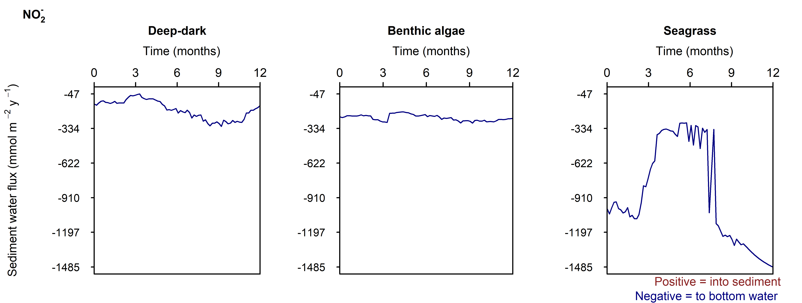{width="33%"}

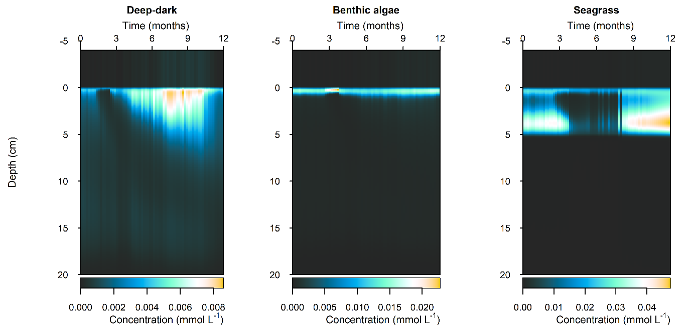{width="33%"}

**Figure 10.43.**  Summary figure of $NO_2^-$ under organic matter increase. Left to right – Deep-dark, Benthic algae communities and Seagrass environments. Top – flux over time, including measured data. Bottom – plot of concentration, depth and time, with the bottom water shown above the sediment-water interface.

{width="33%"}

{width="33%"}

**Figure 10.44.**  Summary figure of $N_2$ under organic matter increase. Left to right – Deep-dark, Benthic algae communities and Seagrass environments. Top – flux over time. Bottom – plot of concentration, depth and time, with the bottom water shown above the sediment-water interface.

### Sensitivity of sediment processes to groundwater N inputs

Across the four groundwater environments, in most cases the sediment-water interface fluxes were close to the same as in the baseline Deep-dark environment (Figure 10.45). One major difference to the baseline was a shift in the N redox chemistry from producing $NO_3^-$ to more $NH_4^+$. As with the low $O_2$ and high organic matter simulations, any disturbance to the baseline shifts this system towards $NH_4^+$. As noted in the introduction to this report, Greenwood *et al.* (2016) had assumed that the sediment supplied $NO_3^-$ only, however, this simulation produced fluxes of $NH_4^+$ at around the same level as $NO_2^-$ (Table 14). The Deep-dark $NO_3^-$ flux was into the sediment, and in the Beach high simulation, it oscillated from influx to efflux with the seasonal rainfall on the mainland (Figure 40).

Another difference from the baseline was the increased flux of $N_2$ in the beach environments. $N_2$ flux was nine and six times higher in the beach environments than in the Deep-dark simulation. The well oxygenated water column may have been capable of fuelling nitrification-denitrification reactions, and so extra DIN added to the sediment from the groundwater was removed from the system.

Whereas in the Deep-dark environment, key N variables were concentrated in the top 5 cm of the sediment, the Beach high simulation had these variables concentrated below 15 cm (Figure 10.46). $NH_4^+$ and $NO_3^-$ accumulated with depth and $NO_2^-$ had a peak around 12 cm. The N redox reactions continued at the surface but a small peak of extra redox reactions could be seen at around 12 cm (Figure 42).

**Figure 10.45.**  Sediment-water interface fluxes for each of the four groundwater environments compared to the baseline Deep-dark environment, which had no groundwater.

Table 15 Average fluxes (mmol N m¯² y¯¹) for key variables for the four groundwater environments compared to the baseline Deep-dark flux.

XXXX Table missing XXXX

**Figure 10.46.**  Sediment-water interface fluxes of key N variables for the Deep-dark environment (left) and the Beach high environment (right). (Y axis limits are not the same on the left and right.)

**Figure 10.47.**  Contour plots of time, depth and concentration for key N variables compared for the Deep-dark baseline (left) and Beach high (right) simulations.

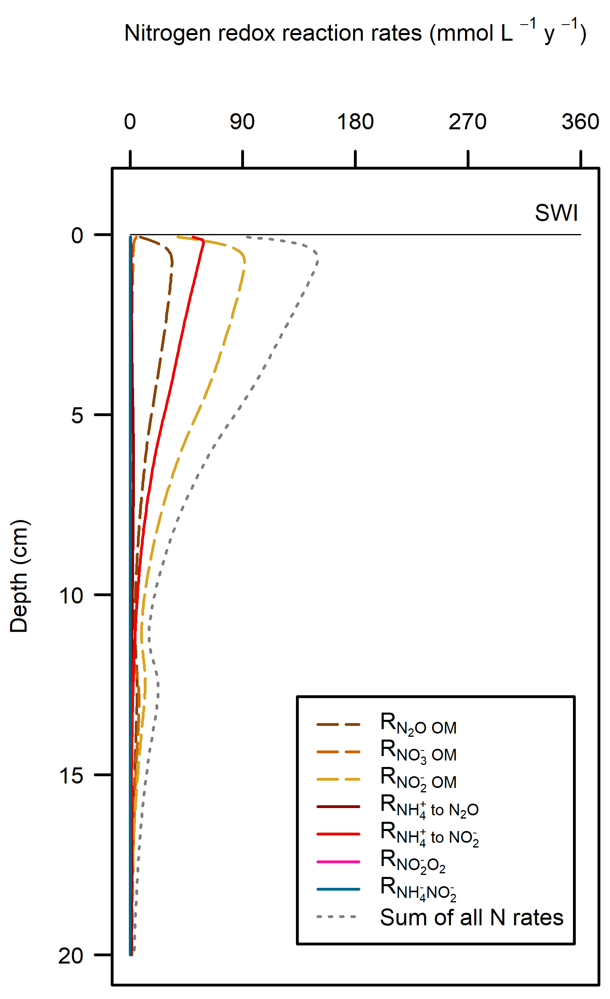{width="33%"}

**Figure 10.48.**  Rate-depth profile of N redox reactions for the Beach high simulation. Note the small increase in rates at 12 cm.

## Summary

This study synthesised biogeochemistry data from Cockburn Sound and integrated it into the CANDI-AED model. Four major types of sediment environment were defined to cover the range of conditions experienced along the Perth coast, and the model was calibrated to each type, to quantify indicative sediment carbon and nutrient stocks, and sediment-water flux rates.

The largest sediment area, the Deep-dark environment, was able to process algal detritus with mostly aerobic oxidation. $O_2$ flux was around 8000 mmol m^-2^ y^-1^ and the reaction rate was around 500 mmol L-1 y-1 at the sediment-water interface. The implication of having $O_2$ in the top mm of sediment is that the deeper sediment does not become a source of legacy PO43- or experience a heavy build-up of $H_2S$ and sulfi$DIC$ minerals. Sediment $O_2$ is able to maintain $NO_x$ and promote nitrification-denitrification and so remove some of the external N load from the system. These areas were effective at denitrification, with a denitrification efficiency of 44%, that is, the remaining 56% of DIN was returned to the water column as $NO_x$ and $NH_4^+$ .  

The shallow sediments in the photic zone (Benthic algae and Seagrass environments) also had $O_2$ in the uppermost sediment layers. The benthic algae itself and the seagrass leaf detritus were extra sources of organic C and N, which caused more $O_2$ demand, but the benthic algae and seagrass roots produced a layer of $O_2$ that maintained aerobic oxidation and nitrification-denitrification below the $O_2$ depth. These photosynthetic environments were only around one third of the Cockburn area, but produced almost half of the denitrification. There were uncertainties with how the model configured the amount of organic N entering the sediment, however, the general conclusion is drawn that any extra $O_2$ in these environments allowed for greater denitrification.

For the whole of the simulated Cockburn Sound, the model calculated an influx of approximately 3000 t y-1 organic N entering the sediment. There was a mass of approximately 3000 t stored in the sediment as organic N, inorganic N and benthic algae biomass. The model fluxed both $NO_x$ and $NH_4^+$ from the sediment to the water column in roughly equal proportions, at around 1000 t y^-1^. Denitrification was calculated at around 2000 t y-1. One implication of this is that even though the sediment is aerobic, the model predicts that the sediment still supplies $NH_4^+$  to the water column, rather than just $NO_3^-$ , as was assumed by Greenwood et al. (2016). The second implication is that the sediment is removing twice as much N as it is returning to the water column. If this were the case, this would not correspond with the conceptual model from several studies, in which most of the N is constantly recycled between the sediment, water column and biomass.

The seasonal and one-off simulations showed that the sediment is responsive to deoxygenation and that it also recovers quickly. The N redox simulation showed that the drop in $O_2$ led to a greater N2 efflux (indicating denitrification), primarily through less $O_2$ inhibition. There was also a greater efflux of $NH_4^+$ and it appeared that any stress to the environment shifted the N redox system to releasing more $NH_4^+$ . 

The simulations with groundwater brought more DIN and led to greater $NH_4^+$  flux, rather than $NO_3^-$ . Much of the DIN was denitrified to N2 but there were still greater overall DIN fluxes to the water column from those areas with groundwater intrusion.

For capturing dynamic interactions between the sediment and water, CANDI-AED can be coupled to a water column model. The current version of the water column model has fluxes at the sediment-water interface that are constant in time and for each material zone. Coupling to CANDI-AED will provide a dynamic relationship at the sediment water boundary, along with the benthic microalgae and seagrass modules. It will also provide richer results for the sediment model, which currently has either a constant boundary or one that is hard-coded, and thus unresponsive to sediment flux. For example, if CANDI-AED is currently fluxing $NH_4^+$  to the water column, the boundary concentration of $NH_4^+$  remains the same. 

Uncertainty remains over the contribution from legacy organic matter on benthic fluxes. The report from Eyre *et al.* (2025) suggested that the $DIC$ flux was mostly from freshly deposited phyto-detritus, however the cores from Zhou et al. (2024) identified a pool of organic matter remaining from 20th century eutrophication. The results of this model matched the assumption that the organic matter profile was in balance with the incoming phytodetritus, and did not show a tendency for organic matter accumulation to the values seen in the Zhou cores (~2% TOC in the top 10 cm of sediment), however, there may be a less reactive fraction present that is yet to be resolved in the model.
