# Bio-optical Conditions {#light-climate}

## Overview

The underwater light climate in Cockburn Sound and Owen Anchorage is one of the most important attributes that links human activities, water quality and seagrass health. CSIEM includes advanced light simulation capability, able to resolve the light climate and variability in the drivers of light attenuation.

Capturing the underwater light environment requires an understanding the role of different Inherent Optical Properties (IOP's), which control the absorption and scattering of light. These IOPs include algal cells, detrital particles, chromophoric DOM (CDOM), and different types of inorganic sediment particles. Each of these properties can also vary considerably over space and time, both over seasonal time-scales by also over events such as a local algal bloom, or river flood event (Figure 12.1). Daily shipping and dredging operations within the shallow waters can also lead to complex patterns of water turbidity.

{width="6.301388888888889in" height="2.001388888888889in"}

**Figure 12.1.** Snapshots taken from Sentinel-2 imagery showing periods where different optical properties can dominate water properties in and around Cockburn Sound.

A range of high quality light-related data-sets have been collected for assessing the light, including long-term monitoring of turbidity and light attenuation, in situ PAR and spectral light sensors (Figure 12.2), and from remote sensing. Developing a well-calibrated light model is a useful way to help integrate the diversity of data from these sources and capture the variability in this key driver of productivity. Additionally, key anthropogenic stressors associated with Cockburn Sound activities are related to dredging and in order to support advanced analysis or EIA, having a well parameterised light model is essential.

## Bulk PAR attenuation model 

Photosynthetically Active Radiation (PAR; 400–700 nm) decreases with depth as it is absorbed and scattered by pure water, suspended inorganic sediments, phytoplankton pigments (chlorophyll-_a_), and particulate and
dissolved organic matter. In a bulk (band-averaged) model, this loss of light is represented with a diffuse
attenuation coefficient for PAR, \(K_{d,\text{PAR}}\) (m\(^{-1}\)).

If \(I_{\text{PAR}}(z)\) is downwelling PAR irradiance (e.g. mol photons m\(^{-2}\) s\(^{-1}\)) at depth \(z\) (m),
then:

\[
I_{\text{PAR}}(z)
= I_{\text{PAR}}(0^-)\,
\exp\left[-\int_0^{z} K_{d,\text{PAR}}(z')\,\mathrm{d}z'\right]
\]

where \(I_{\text{PAR}}(0^-)\) is PAR just below the water surface.  
For a vertically uniform water column this simplifies to:

\[
I_{\text{PAR}}(z)
= I_{\text{PAR}}(0^-)\,\exp\left(-K_{d,\text{PAR}}\,z\right).
\]

To parameterise \(K_{d,\text{PAR}}\), the model decompose the attenuation into contributions from:

- background (pure) water,
- two classes of inorganic suspended sediment,
- phytoplankton chlorophyll-_a_,
- particulate organic carbon (POC),
- dissolved organic carbon (DOC).

A simple linear-additive formulation is:

\[
K_{d,\text{PAR}}(z)
= K_{w}
+ k_{\text{ss1}}\,C_{\text{si1}}(z)
+ k_{\text{ss22}}\,C_{\text{si2}}(z)
+ k_{\text{chla}}\,\text{Chl}(z)
+ k_{\text{poc}}\,\text{POC}(z)
+ k_{\text{doc}}\,\text{DOC}(z)
\]

where:

- \(K_{w}\) is the background attenuation of PAR by pure water (m\(^{-1}\));
- \(C_{\text{ss1}}\) and \(C_{\text{ss2}}\) are concentrations of two inorganic sediment fractions  
  (e.g. fine silt and coarse sand; typically mg m\(^{-3}\) or g m\(^{-3}\));
- \(\text{Chl}\) is chlorophyll-_a_ concentration (mg Chl m\(^{-3}\));
- \(\text{POC}\) is particulate organic carbon concentration (mmol C m\(^{-3}\) or mg C m\(^{-3}\));
- \(\text{DOC}\) is dissolved organic carbon concentration (same units as POC);
- \(k_{\text{si1}}, k_{\text{si2}}, k_{\text{chl}}, k_{\text{POC}}, k_{\text{DOC}}\) are specific PAR attenuation
  coefficients (e.g. m\(^2\) per unit concentration), calibrated from observations or literature.

For constant concentrations over depth, the benthic PAR at depth \(H\) (e.g. seagrass canopy height or seabed) is:

\[
I_{\text{PAR, benthic}}
= I_{\text{PAR}}(H)
= I_{\text{PAR}}(0^-)\,\exp\left[-\left(
K_{w}
+ k_{\text{si1}}\,C_{\text{si1}}
+ k_{\text{si2}}\,C_{\text{si2}}
+ k_{\text{chl}}\,\text{Chl}
+ k_{\text{POC}}\,\text{POC}
+ k_{\text{DOC}}\,\text{DOC}
\right)H\right].
\]

This formulation is run as default in the CSIEM hydrodynamic–biogeochemical simulations to resolve spatial and temporal variability in underwater light climate and benthic PAR. This can be optionally extended to include spectrally-resolved light, as discussed in Section 10.3.

The coefficients of this model have been determined based on iterative refinement based on a) adjustment of the specific attenuation factors to match Kd, and b) validation against benthic PAR sensors. A summary table of coefficients in shown in Table 12.1.

**Table 12.1.** PAR attenuation parameters

| Variable | Units | Default CSIEM value | Typical values used within coastal embayments |
|---------|--------|------------------------|----------------------------------------------------|
| \(K_{w}\) | m\(^{-1}\) |   | Background water attenuation typically **0.04–0.07 m\(^{-1}\)** in clear coastal waters |
| \(k_{\text{ss1}}\) | m\(^2\) mg\(^{-1}\) |   | Fine suspended sediments: **0.01–0.03 m\(^2\) mg\(^{-1}\)**; higher for silts and clays with strong scattering properties. |
| \(k_{\text{ss2}}\) | m\(^2\) mg\(^{-1}\) |   | Coarser inorganic particles: **0.002–0.01 m\(^2\) mg\(^{-1}\)**; attenuation drops with increasing particle size. |
| \(k_{\text{chl}}\) | m\(^2\) mg Chl\(^{-1}\) |   | Phytoplankton chlorophyll-specific attenuation **0.015–0.03 m\(^2\) mg\(^{-1}\)**; ~0.02 m\(^2\) mg\(^{-1}\) commonly used in estuarine models. |
| \(k_{\text{POC}}\) | m\(^2\) mmol C\(^{-1}\) |   | POC optical effects vary by composition; equivalent to **0.001–0.01 m\(^2\) mg C\(^{-1}\)**. For mmol C units, this corresponds approximately to **0.012–0.12 m\(^2\) mmol C\(^{-1}\)** (using 1 mmol C ≈ 12 mg C). |
| \(k_{\text{DOC}}\) | m\(^2\) mmol C\(^{-1}\) |   | DOC influences light mainly via CDOM absorption. Typical coastal CDOM attenuation **0.001–0.02 m\(^2\) mg C\(^{-1}\)**, equivalent to **0.012–0.24 m\(^2\) mmol C\(^{-1}\)**. Strongly elevated values occur near riverine or groundwater inputs. |

### K_d validation

EXTC figures

### Benthic PAR validation

PAR figures 

## Spectrally-resolved bio-optical model 

From CSIEM 1.5 and above, an implementation of a spectrally-resolved light model was added to the AED model, and this chapter outlines the approach to this model, and assessment of ist accuracy that was undertaken. The model includes both an above and below water component, and can be integrated in with the water quality and biological components within AED. This model is benchmarked against the known reference approaches within the HydroLight / EcoLight software, and validated against an available below-water spectral data-set.

### Model description

The light model in CSIEM is based on OASIM. Light is propagated from 250 nm to 4 microns in 33 spectral bands, and reported out to a user-defined resolution which for default applications  uses an interpolated wavelength vector that spans 280nm to 1.1um in 16 steps. The above water illumination is provided in the same 33 OASIM bands via one of two available methods, one based on OASIM downwelling radiation calculations, and a second custom method developed specifically for Cockburn Sound. The air/sea interface is a wind-roughened surface with a proportion of diffusely reflecting sea foam when near-surface wind speeds exceed 4 m/s. The above and below water model components are each described separately in the next sections.

#### Above-water

For sun and sky illumination OASIM includes a model for direct (sun) and diffuse (sky and cloud) down-welling solar radiation across the visible spectrum and out to 4 microns, (the long-wave spectral limit for solar-sourced photons of any practical significance to terrestrial energy flux). This model is driven by estimates of atmospheric column water vapour, stratospheric ozone, aerosol type and abundance, and cloud opacity (inferred from liquid water path), plus solar zenith angle and time of year.

Some of the inputs to this model are difficult to estimate sufficient to obtain agreement with an independent estimate of the short-wave surface flux (SWSF), a value from a third-party source in which we have confidence. Thus we added a second illumination model from Curtin University based upon simulations using the RADTRAN-X model within EcoLight which we could constrain to match the SWSF.

In this revised CSIEM model, direct and diffuse down-welling solar radiation are calculated under an aerosol regime consistent with local conditions as characterised by quality assured aerosol optical depth data from the AERONET station at Rottnest Island. Appendix B provides detail on the CSIEM illumination model . As input, it accepts the solar zenith angle, day of year and SWSF. The SWSF is converted to an estimate of cloud clover so that the direct and diffuse irradiances can be interpolated from look-up tables that are indexed by solar zenith angle (actually the coefficients of a fourth order polynomial in cosine of solar zenith angle) and a cloud cover that is discretized to values of 0 and from 0.3 to 1.0 in 0.1 increments (less than 0.3 is treated as unoccluded sun). These estimates of direct and diffuse surface irradiance are computed at 5 nm spectral resolution then aggregated to the 33 spectral bands adopted in the OASIM model.

#### Below-water

Light propagation in the water column is an implementation of the OASIM underwater model. Light in 33 OASIM spectral bands, distinguished as separate streams of direct and diffuse light provided by the Atmosphere model, is diminished as it crosses the air/sea interface. In each spectral band the bulk optical properties of each discrete layer of the in-water model act upon the light streams via scattering and absorption. The bulk optical properties are the volumetric aggregates of absorption, total scattering and back-scattering, expressed in units of extinction per metre. The aggregate is for the combination of sea water and several optically active biota and sediment species, quantified in the CSIEM model by concentration and inherent optical properties (IOPs). In each layer there is some redirection of the direct beam via scattering into the diffuse component, and there is some diminution of both direct and diffuse streams via absorption. The photosynthetically available radiation (PAR) at levels in the water column are available by integration across the OASIM bands that capture the spectral range 400 to 700nm.

### Light climate exploration and benchmarking

In application of the light model within Cockburn Sound we first undertake a controlled assessment of CSIEM by comparing and benchmarking against expected profiles across a gradient of conditions. For this purpose, locations in Table 7.1 were selected.

**Table 7.1.** Location of sites for model validation, including seafloor depth (metres below mean sea level).

  ----------------------------------------------------------------------------------------------------
  **LOCATION**         **NOTES**                                    **LON**   **LAT**   **SEAFLOOR**
  -------------------- -------------------------------------------- --------- --------- --------------
  Deep_Basin           middle of Cockburn Sound                     115.709   -32.187   21.60

  East_Garden_Island   seagrass area                                115.685   -32.196   10.88

  Freshwater_Bay       Swan estuary with high DOM and CHLA          115.778   -32.001   14.83

  Kwinana_Shelf        more turbid coastal water                    115.753   -32.214   7.95

  Mangles_Bay          southern Cockburn Sound                      115.716   -32.271   11.94

  Mullaloo_Beach       general northern coast                       115.677   -31.743   8.12

  Owen_Anchorage       coastal water                                115.704   -32.107   15.08

  Validation           site for light validation at kwinana Shelf   115.748   -32.196   7.04

  West_Rottnest        open ocean water                             115.397   -32.019   62.91
  ----------------------------------------------------------------------------------------------------

{width="6.268055555555556in" height="7.834722222222222in"}

**Figure 7.1**. Absorption and scattering (/m) of optically active constituent species at 400nm for each site over the sunlit portion of the two days of the CSIEM simulation.

Summary plots are shown in Figure 7.2 that characterise these 9 locations in terms of extinction by optically active species and split into extinction due to absorption and to scattering. The results labelled 'TOTAL' represent the combined effect of all species. The aggregation is over the two days of the CSIEM simulation and are drawn from EcoLight computations for each profile at the half hour time-step of the CSIEM for the sunlit hours. The first figure is at 400nm, the second at 550nm and the third at 700nm.

For the three spectral channels, and for all sites except the open-ocean West Rottnest site, sediment is the dominant contributor to extinction. 

The relative proportion of Total absorption to scattering is highest at 700 nm. The plots show how, in general, the dominant absorber at 400nm is CDOM and at 700nm is the sea water itself.

The relative proportion of Total scattering is greatest at 550 nm. At 400 nm Total scattering dominates, but Total absorption also contributes a significant impact to spectral extinction. At 400 nm, at most sites the scattering due to sediment dominates, although at the open-ocean West Rottnest site extinction due to sediment scattering is similar to extinction due to ch-a and POC.

There is a close association between both scattering and absorption of Chl and POC at all three wavelengths. At Freshwater Bay the contribution of Total scattering is an order of magnitude larger than at all other sites.

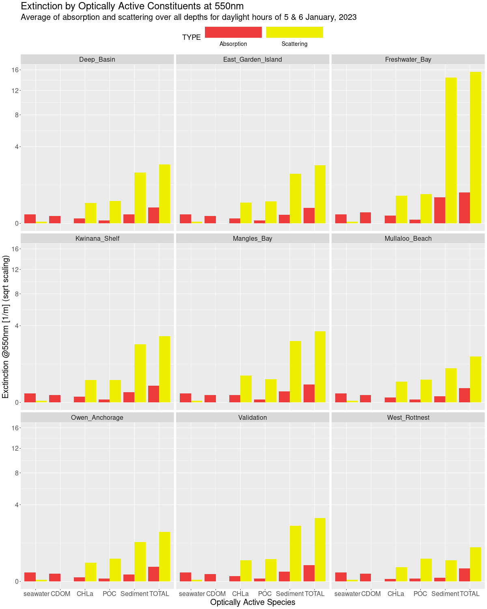{width="6.268055555555556in" height="7.834722222222222in"}**Figure 7.2**. Absorption and scattering (/m) of optically active constituent species at 550nm for each site over the sunlit portion of the two days of the CSIEM simulation.

{width="6.268055555555556in" height="7.834722222222222in"}**Figure 7.3**. Absorption and scattering (/m) of optically active constituent species at 700nm for each site over the sunlit portion of the two days of the CSIEM simulation.

Figure 7.4 shows the shortwave radiation from CSIEM model data (upper panel) and from the weather observation data (lower panel) for the daylight hours of the two model simulation days. By choosing noon and 4pm on each day we have clear and cloudy conditions at the two solar zenith angles of approximately 10 and 50 degrees.

**\**
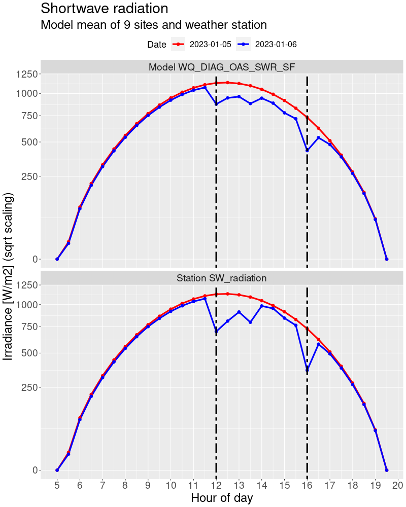{width="5.0in" height="6.240277777777778in"}**Figure 7.4**. Shortwave flux from CSIEM model and from weather data. From 11:30 to 16:30 on 6 January, some amount of cloudiness diminishes the shortwave radiation compared to the clear sky conditions of the previous day, and cloudiness is greatest at noon and 4pm. These are the times we will use in comparing CSIEM model results with EcoLight to provide clear and cloudy conditions at two solar zenith angles.

Figure 7.5 shows the surface illumination from NASA's Coupled Ocean and Atmosphere Radiative Transfer (COART) and from the newly developed light model in CSIEM for the 4 times identified in Figure7.4. Whilst there can be noticeable differences in the direct/diffuse mix of light at the ocean surface, this plot shows a general agreement with an alternate well-regarded model. This supports the veracity of the Curtin light model and its implementation in CSIEM.

{width="5.840277777777778in" height="7.0in"}

**Figure 7.5**. Surface illumination at the OASIM band centres from COART and Curtin light models for the 4 comparison times in Fig B4. COART was run at 1nm resolution and aggregated to the OASIM bands.

### PAR Comparisons

The plots on the following pages show comparisons between PAR computed using CSIEM and EcoLight for the 9 locations and 4 times. The solar zenith angle at noon is about 11 degrees and at 4pm about 49 degrees. The plots are grouped into sites with similar bathymetry.

The agreement between CSIEM and EcoLight is very good, and much improved relative to a single band light propagation model (which is included as an uninformed reference by which to compare).

Dashed lines on each plot indicate the depth at irradiance falls to 10% of the near-surface value. For all sites the 10% depth is greater for CSIEM than for Ecolight. This shows the diffuse attenuation coefficient of downwelling PAR, K~PAR~, is slightly lower for CSIEM than for Ecolight.

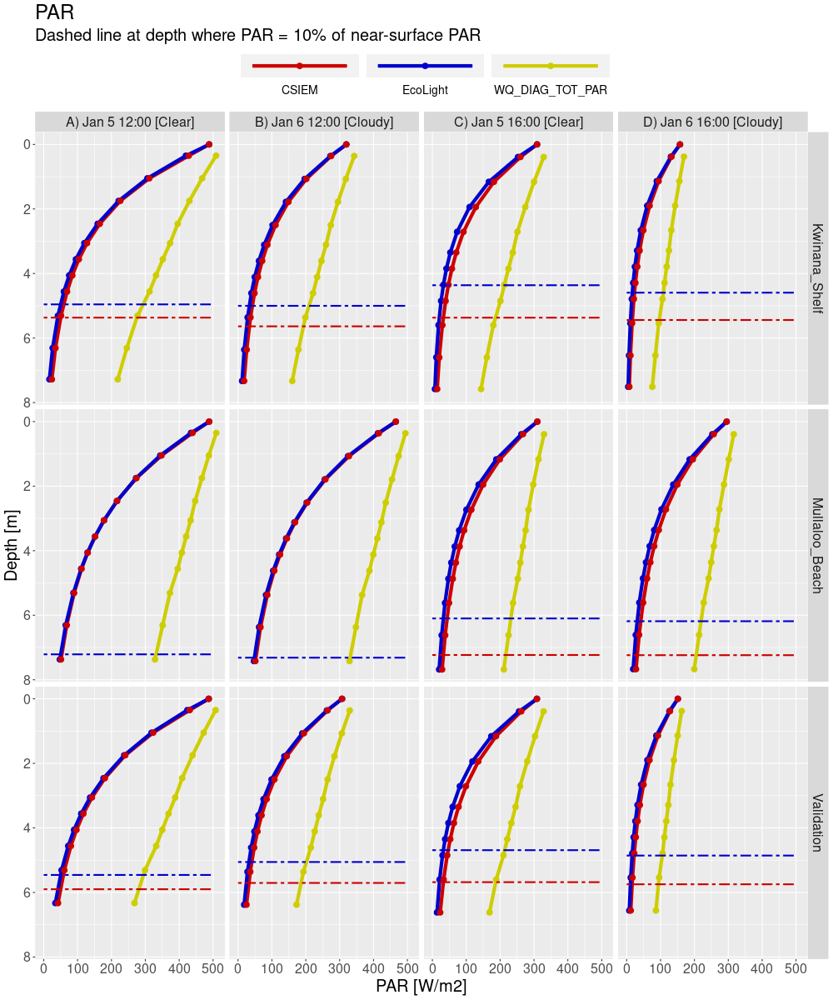{width="6.268055555555556in" height="7.521527777777778in"}

**Figure 7.6**. PAR at depth comparisons for sites Kwinana_Shelf, Mullaloo_Beach and Validation.

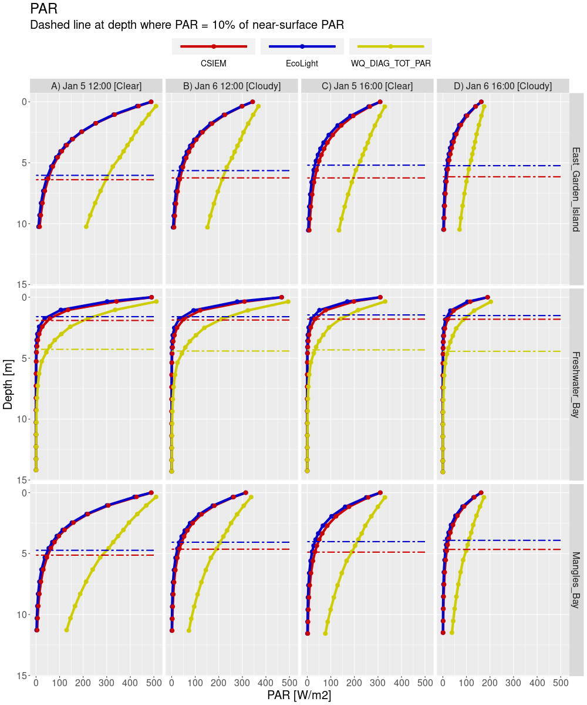{width="6.268055555555556in" height="7.521527777777778in"}**Figure 7.7**. PAR at depth comparisons for sites East_Garden Island, Freshwater_Bay and Mangles_Bay.

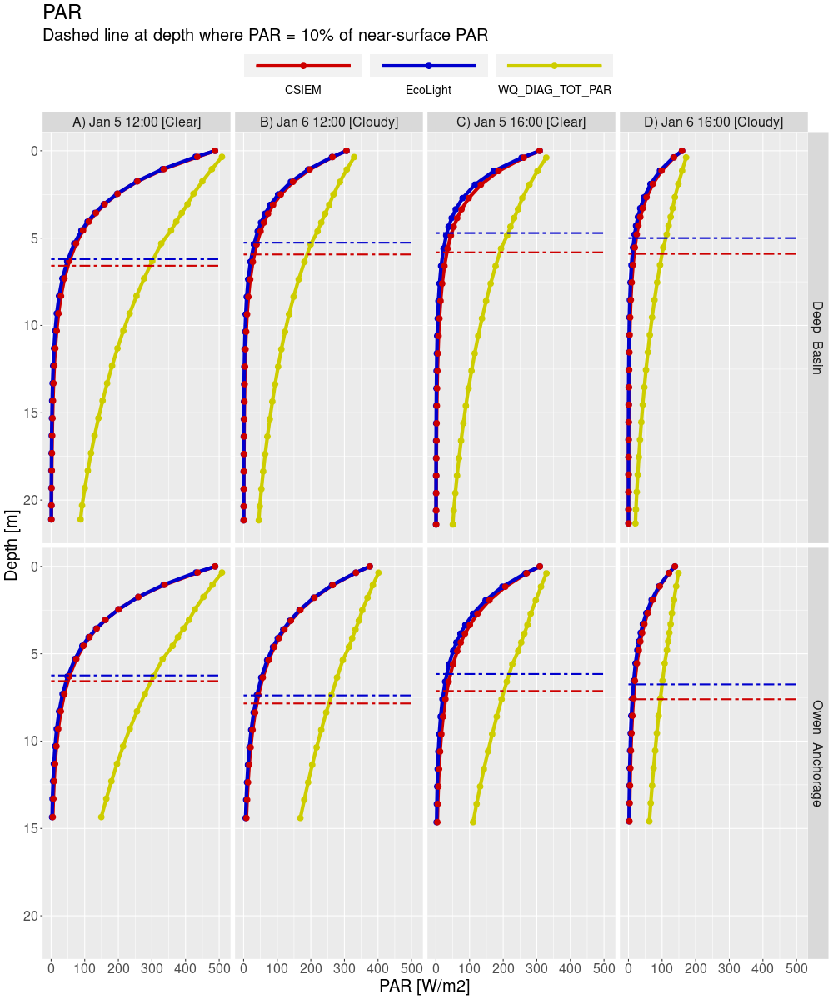{width="6.268055555555556in" height="7.521527777777778in"}**Figure 7.8**. PAR at depth comparisons for sites Deep_Basin and Owen_Anchorage.

{width="6.268055555555556in" height="7.521527777777778in"}**Figure 7.9**. PAR at depth comparisons for site West_Rottnest.

We additionally performed an integration of PAR over a single day to obtain the daily energy flux, sometimes termed the Daily Light Integral (DLI), available in the PAR band at several ocean depths. There is a high bias to the estimate of this quantity from CSIEM compared to EcoLight which is at its least for site West_Rottnest and at its most for site Freshwater_Bay. The fundamental difference between the two models is the modelling of the diffuse light field. For clearer water, or more correctly waters with a lower proportion of scattering, the diffuse nature of the light field in each model is very similar and attenuation is dominated by absorption. However, as the impact of scattering increases, the downwelling light field in Ecolight becomes more diffuse than in CSIEM. The slight difference in the modelled diffuse light field was shown to affect the 10% depth in Figures B7-B10.

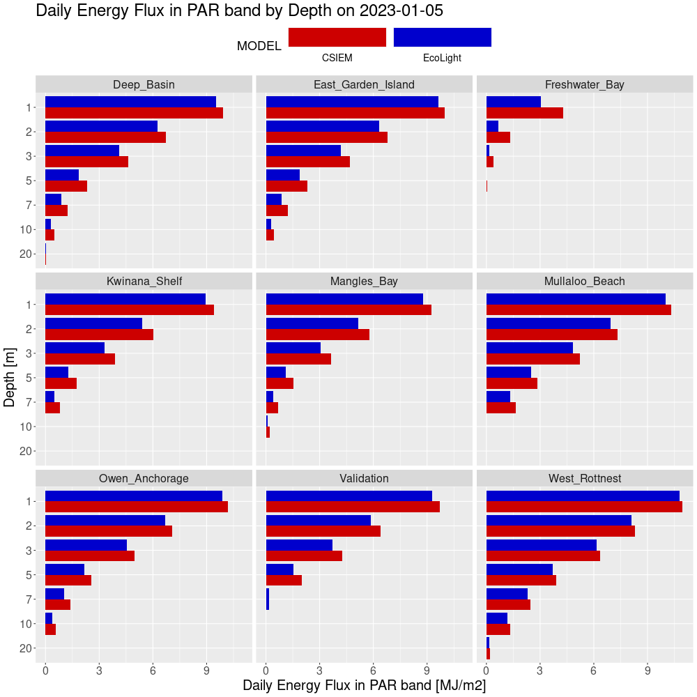{width="6.268055555555556in" height="6.268055555555556in"}**Figure 7.10**. Daily energy flux in PAR band derived from EcoLight and CSIEM results for all nine sites at several depths.

### Spectral Irradiance Comparisons

The following analyses present plots of multi-spectral irradiance from CSIEM and EcoLight at depths of 1 and 5 metres for each location. Each page is for one of the four times identified in Figure B4 to cover clear and cloudy conditions at two solar zenith angles.

If we ignore the very turbid Freshwater Bay site, then the agreement of CSIEM with EcoLight is excellent for Figure B12, clear sky at 12:00 pm and for 1 m depth. For the other days and times, spectra are in very good agreement.

For the Freshwater Bay site, the downwelling irradiance spectra for CSIEM and Ecolight display distinct differences in overall intensity. For all times, the Ecolight modelled spectral irradiance is less than the CSIEM modelled irradiance. These results are the same as portrayed earlier in PAR depth profiles and for the daily integrated energy FLUX.

{width="6.268055555555556in" height="7.521527777777778in"}**Figure 7.11**. January 5, 2023 at noon (clear sky), spectral irradiances from EcoLight and CSIEM interpolated to 1m and 5m depths for the nine comparison sites.

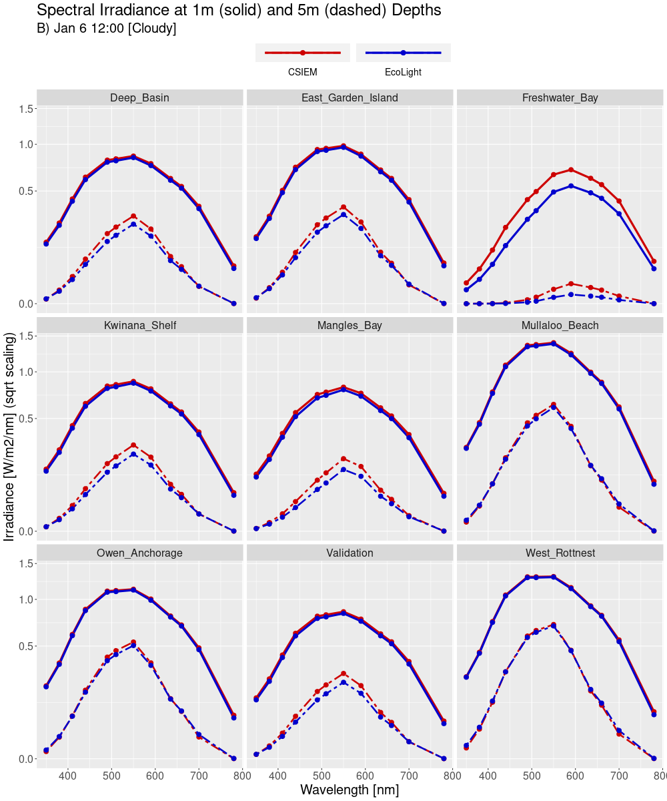{width="6.268055555555556in" height="7.521527777777778in"}**Figure 7.12**. January 6, 2023 at noon (cloudy conditions), spectral irradiances from EcoLight and CSIEM interpolated to 1m and 5m depths for the nine comparison sites.

{width="6.268055555555556in" height="7.521527777777778in"}**Figure 7.13**. January 5, 2023 at 4pm (clear sky), spectral irradiances from EcoLight and CSIEM interpolated to 1m and 5m depths for the nine comparison sites.

{width="6.268055555555556in" height="7.521527777777778in"}**Figure 7.14**. January 6, 2023 at 4pm (cloudy conditions), spectral irradiances from EcoLight and CSIEM interpolated to 1m and 5m depths for the nine comparison sites.

### Assessment of light dynamics

The field spectra from Cockburn Sound are made by MS9 instrument with 10nm FWHM spectral filters centered on wavelengths 448, 470, 524, 554, 590, 628, 656, 699 nm. Across the PAR band, CSIEM channels are 25 nm wide and the Curtin light model provides illumination representative of these wider channels. In its output data product, CSIEM provides results interpolated to another set of discrete wavelengths. Across the PAR band these are 410, 440, 490, 510, 550, 590, 635, 660, 700 nm. Whilst these differences are not outcome determinant to the modelling objectives, they can lead to small apparent anomalies when comparing model data to field spectra.

{width="3.0in" height="3.0in"}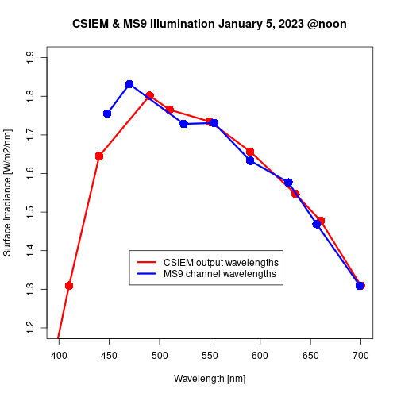{width="3.0in" height="3.0in"}**Figure 7.15**. Surface illumination on January 5, 2023 (left panel) and how these data yield synthetic CSIEM and MS9 outputs (right panel). The source data are from EcoLight at 1nm resolution and the differences in the right panel are artefacts due only to the different processing paths.

### Single profile assessment

In this section we compare Hydrolight-modelled light profiles to in-situ spectral profile measurements, in order to understand spectra attenuation coefficients.

We aimed to run Hydrolight with known concentrations of optical constituents which would then enable us to predict the spectral light profiles. These modelled profiles could then be compared to in-situ spectral profiles. Note, we don't know what IOPs to use so we used "standard" Hydrolight IOP models.

We searched the in-situ data base to identify dates and locations where coincident spectral light profiles and in-water constituent concentration data existed. Specifically, we searched for chlorophyll, TSS and CDOM concentrations. We failed to identify any dates and locations with all four sets of coincident data. We then limited the search to spectral profiles, chlorophyll and TSS. Only four dates were identified, all at site 6147034. Table 1 lists the dates, chlorophyll and TSS concentrations for the four sets of in-situ data.

Table 7.2. Dates, chlorophyll and TSS concentrations for the four in-situ comparison data sets.

  -----------------------------------------------------------------------
  Site code         date              Chl mg/m3         TSS mg/L
  ----------------- ----------------- ----------------- -----------------
  6147034           2/2/2022          0.7               1.9

  6147034           3/6/2021          0.7               1.1

  6147034           7/5/2021          0.7               0.8

  6147034           20/7/2021         1.3               1.1
  -----------------------------------------------------------------------

We ran Hydrolight for the four scenarios outlined in Table 7.3. In the absence of a complete description of the optical conditions, we undertook model runs across a range of conditions to help identify the impact of this uncertainty.

**Table 7.3**. Various input values for Hydrolight modelling

  ------------------- ---------------------------------------------------------------
  CDOM a440 (m^-1^)   0.02, 0.12, 0.30, 1.50, 3.00

  Sky conditions      Clear, cloudy (100%)

  Substrate albedo    Sandy, black

  Wavelengths (nm)    412.5, 442.5, 492.5, 512.5, 552.5, 592.5, 637.5, 662.5, 702.5
  ------------------- ---------------------------------------------------------------

Figure 7.16(a-d) show the in-situ and modelled spectral profiles as well as derived spectral diffuse attenuation coefficients, K. Each figure contains nine separate plots, one for each spectral profiling band \[410 nm, 440 nm, 490 nm, 510 nm, 550 nm, 590 nm, 635 nm, 660 nm, 700 nm\]. The vertical axis is depth in metres. The lower axis of each plot is the spectral irradiance in uW/cm^2^/nm. The axes are only labelled on the lower row of plots. The top axis is the spectral diffuse attenuation coefficient in m^-1^, only labelled for the top row of plots.

Red stars and green dots indicate the spectral profiling irradiance data. Exponential curves were fitted to the profile data, however near-surface measurements were discarded. For the example plots shown here, any data shallower than 4 m was not employed in the curve fitting (noted on the plots by "depth limit = 4.0 m"). It is not uncommon for near-surface light data to be impacted by wavy surface conditions and/or instrument shading issues. In fact, for some of the Cockburn Sound in-situ data there were quality control notes included that sometimes mentioned potential shading of the instrument by surface floats. The thick dark-blue curve indicates the exponential function fitted to the measurements indicated by the red stars. The spectral diffuse attenuation coefficient, K, derived from each of these curves is indicted on each plot as text in the upper left corner. The coefficient of determination, R^2^, is also indicated on each plot.

A simple approach to determining depth profile K values is to consider the change in light intensity between each successive light measurement. The cyan "jagged curves" indicate K values derived by this method. It is interesting to consider the range of K values (top axis) compared to the K values derived by fitting a curve to the light profiles.

The orange curve on each plot is the spectral irradiance profile derived from Hydrolight for the Chl and TSS concentration values listed in Table 7.2, and for a CDOM value a440 = 0.02 m^-1^, clear sky and a sandy substrate.

The various thin blue curves show the spectral irradiance profiles derived from Hydrolight for the increasing CDOM values listed in Table 7.3 at either sandy or black substrate and clear or cloudy sky conditions.

{width="6.263888888888889in" height="8.706421697287839in"} **Figure 7.16a.** Wavelength specific light profiles, showing best fit curves for light attenuation.

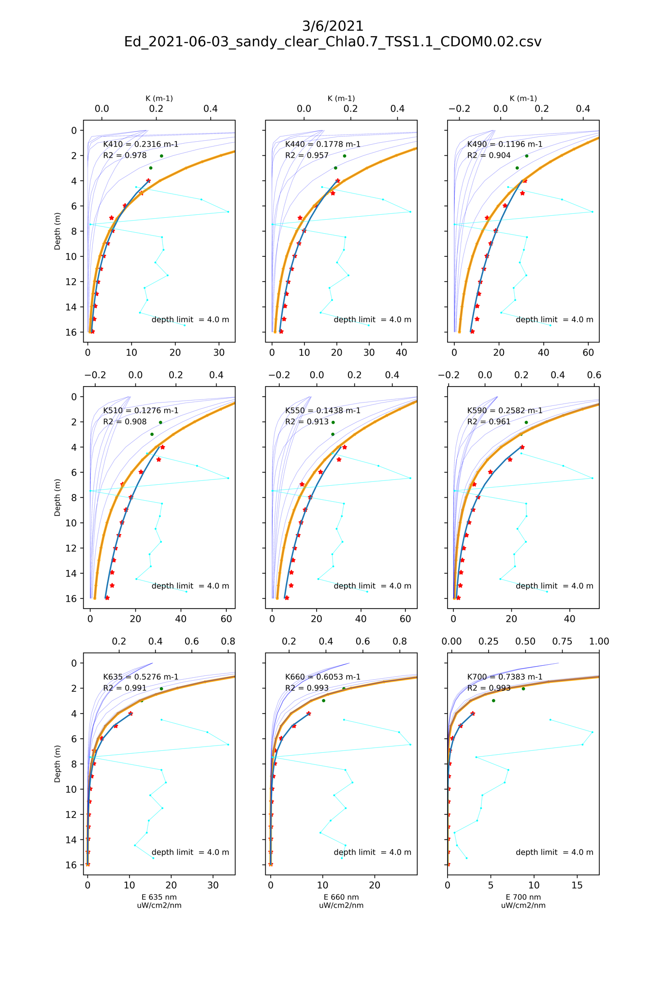{width="6.263888888888889in" height="8.706421697287839in"}

**Figure 7.16b.** Wavelength specific light profiles, showing best fit curves for light attenuation.

{width="6.263888888888889in" height="8.77981627296588in"}

**Figure 7.16c.** Wavelength specific light profiles, showing best fit curves for light attenuation.

{width="6.263888888888889in" height="8.651375765529309in"}

**Figure 7.16d.** Wavelength specific light profiles, showing best fit curves for light attenuation.

## Spectral validation

Figure 7.17 shows a comparison of the CSIEM spectral measurement vs the value observed via the is situ measurement sensor at the Kwinana Shelf site. The field data from this sensor had some questionable signatures, including peak irradiance at 470nm, so this was not further explored.

{width="6.268055555555556in" height="6.268055555555556in"}

**Figure 7.17**. CSIEM modelled spectral irradiance at depth compared to MS9 field spectra.

### Seasonal spectral validation

Both the measured and modelled light climates showed a similar seasonal trend with peak light intensity in December 2022 then gradually decreased to July 2023, and higher light intensity in wave lengths of 448 nm -- 590 nm (Figure 7.18). A regression of measured vs. modelled light in all spectrum (Figure 7.19 indicated the model captured the range and trend of light, though the model tended to overpredict the short wavelength (398 nm) and underpredict the long wavelength (699 nm). This is probably due to that the model slightly overpredicted the concentration of suspended solids (SS), that has major impacts on reducing the short wavelength light. Other factors such as POC and DOC also have major impacts on the relatively short wave length spectrum. However, there is no field observations for validating the POC and DOC concentrations in Cockburn Sound.

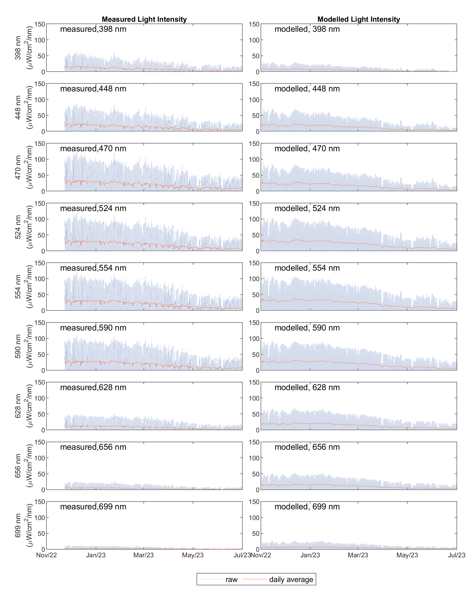{width="6.301388888888889in" height="8.07013888888889in"}

**Figure 7.18**. Seasonal variation in spectral irradiance compared to MS9 field spectra at the Kwinana Shelf site.

To further examine the effects of inherent optical properties (IOPs) on the light decaying along the water column, the modelled SS, total chlorophyll-a (TCHLA), POC and DOC concentrations and their effects on the light absorbance are shown in Figure 7.19. The mean SS concentration during the model period is \*, which led to a reduction rate of \*\* /m for wavelength of 350. In comparison, the mean TCHLA, POC, and DOC concentrations are \*\*\*, respectively, which led to a reduction rate of \*\*/m for wave length of 350. The SS concentration showed to be the relatively dominant factor affecting light climate with short wave lengths. However, the absorbance of light of SS, POC, and DOC decreased quickly with the increase in wave lengths, while TCHLA has higher absorbance in wave lengths \> \*\*\* nm.

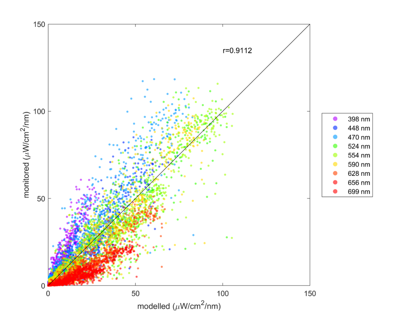{width="3.788990594925634in" height="2.9772430008748905in"}

**Figure 7.19.** Wavelength specific light profiles, showing best fit curves for light attenuation.

{width="6.301388888888889in" height="3.3743055555555554in"}

**Figure 7.20.** Wavelength specific light profiles, showing best fit curves for light attenuation.

## Summary

The CSIEM model is well suited to resolving the variability in the underwater light climate. The underwater climate is closely related the inherent optical properties of water, such as suspended solids, detrital material, and total chlorophyll-a, and the performance of CSIEM in capturign these is reported in Chapter 11.  

The bulk-PAR simulation approach 

The spectral-light model has been able to accurately capture the underwater light intensities, and reasonably resolve of the light spectra, particularly for the wavelengths between of 448-656 nm, which are the major energy provider to primary producers such as seagrass. Some, misalignments were noted in wavelengths \<448 nm and \> 656 nm, and further refinement of the IOP concentrations over time will improve these. It is worth noting that these wavelengths produce a small portion to support the photosynthetic activities of seagrass. 

