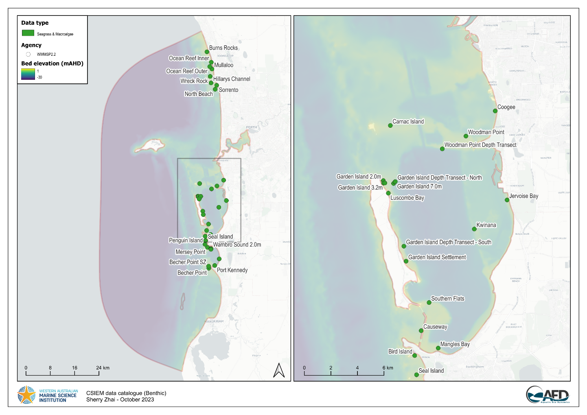
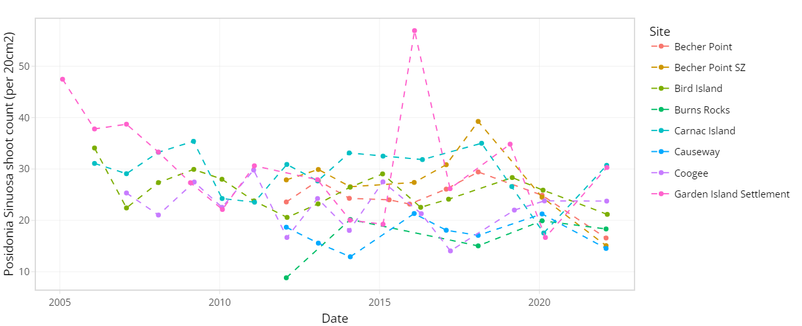
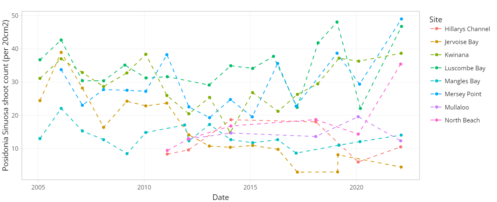
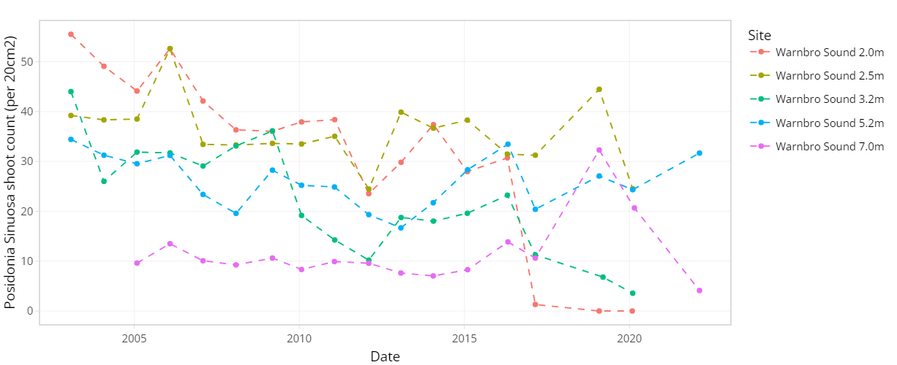
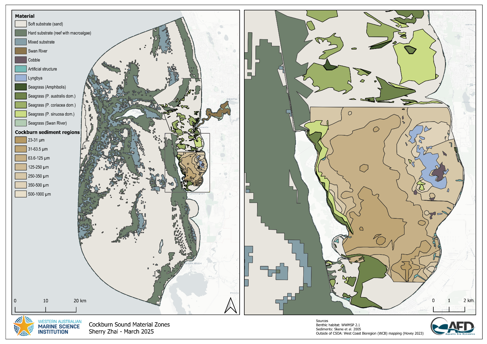
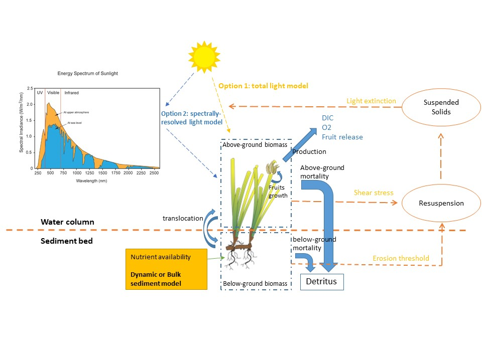
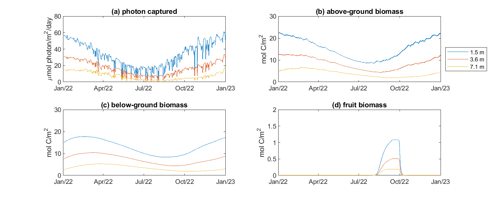

# Benthic Communities {#biomass}

## Overview

The benthic ecosystems of Cockburn Sound and the surrounding Perth coastal waters play a central role in maintaining the health, productivity, and resilience of the marine environment. These seabed communities—comprising seagrasses, macroalgae, filter-feeders, infaunal organisms, and microbial assemblages—drive many of the fundamental processes that support water quality, habitat structure, nutrient cycling, and food-web functioning.

Seagrass meadows in particular form one of the most extensive and ecologically valuable benthic habitats in Cockburn Sound. Their growth and survival depend strongly on the availability of light at the seabed, which is directly influenced by water quality conditions. Suspended sediments, coloured dissolved organic matter, phytoplankton biomass, and filamentous algal overgrowth all modify the inherent optical properties of the water column, reducing light penetration and constraining seagrass photosynthesis (Baird et al., 2016). Even small changes in light availability can shift seagrass growth, biomass, or seasonal dynamics, with cascading impacts for habitat quality, nutrient cycling, and local fauna.

Beyond seagrass, other benthic communities—including macroalgae, sponges, bivalves, and microbial biofilms—also exert strong controls on the ecological state of Cockburn Sound. These organisms consume or transform nutrients, regulate oxygen dynamics at the sediment–water interface, stabilise sediments, and provide habitat and food for invertebrates and fish. Collectively, their metabolic activity constitutes the “benthic engine” of the system, influencing water clarity, productivity patterns, sediment chemistry, and the availability of energy to higher trophic levels. In shallow coastal embayments such as Cockburn Sound, benthic metabolism often rivals or exceeds water-column processes as a driver of ecosystem function.

Ultimately, the productivity and stability of benthic ecosystems underpin the broader ecological health of Cockburn Sound. They support fisheries, provide food and habitat for a wide range of marine life—including apex predators and culturally significant species—and help sustain the ecological character of the region. Understanding and modelling these benthic processes is therefore essential for assessing ecosystem condition and guiding effective environmental management.

In this chapter, we describe the CSIEM benthic modules that simulate these key components of the seabed environment. This includes a custom seagrass module that links biomass dynamics to water quality and spectral light conditions, as well as modules representing macroalgae and filter-feeder communities. Together, these components capture the spatially variable nature of benthic metabolism across Cockburn Sound and adjacent coastal waters, providing critical information needed to resolve oxygen, carbon, and nutrient budgets.

## Data availability and synthesis

### Long-term seagrass monitoring

The condition of seagrass communities in Cockburn Sound, Warnbro Sound and Marmion at various sites were monitored annually between 2003 -- 2022 by Cockburn Sound Management Council (Figure 7.1). Sampling has mostly conducted during summer months but has varied from year to year. Survey records generally include shoot count, lower depth limit, seagrass height, dominant epiphyte type and cover (Table 7.1), but also varied over time. Monitoring primarily focused on the historically dominant species *Posidonia sinuosa*, though in some years, presence/absence or shoot count data are also available for other species such as *Posidonia australis*, *Posidonia coriacea*, *Amphibolis griffithii*, and *Amphibolis antarctica*. Average shoot count of *P. sinuosa* between 2003 - 2022 at all monitoring sites within the model domain are summarized in Figure 7.2 and 7.3. Additionally, several case studies that recorded *P. sinuosa* biomass in CS are particularly relevant to the dynamic seagrass model and are listed in Table 7.1.

{width="6.549133858267717in" height="4.631452318460193in"}**Figure 7.1**. Location of CSMC long-term seagrass monitoring sites within the model domain (left) and within Cockburn Sound (right).

**Table 7.1.** Summary of historical seagrass monitoring datasets in Cockburn Sound relevant to model development.

  ---------------------------------------------------------------------------------------------------------------------------------------------------------------------------------------------------------------------------------------------------------------------------------------------------------------------------------------------------------------------------------------------------------------------------
  **Program/Author**       **Period**                                    **Variables**                                                                                                                                                                                                                                                          **Number of sites**           **Note**
  ------------------------ --------------------------------------------- ---------------------------------------------------------------------------------------------------------------------------------------------------------------------------------------------------------------------------------------------------------------------- ----------------------------- -----------------------------------------------
  *Long-term monitoring*                                                                                                                                                                                                                                                                                                                                                       

  CSMC\*                   2003 - 2022 (majority sampled in Jan - Mar)   Seagrass shoot count (multiple species), epiphyte type/cover, seagrass height, lower depth limit, depth; dominant/non-dominant epiphyte type, cover (% or categorical), epiphyte biomass; Depth transect sites: Leading edge/depth, lower depth limit distance/depth   58 (41 within model domain)   

  WWMSP 2.2\^              2003 - 2022 (no dates)                        *P. sinuosa* count, depth, habitat type, year (no dates); dominant algae type, density (categorical)                                                                                                                                                                   61 (34 within model domain)   This is a QAQC\'d version of the CSMC dataset

  *Case studies*                                                                                                                                                                                                                                                                                                                                                               

  Fraser & Kendrick 2017   Mar - May 2015                                *P. sinuosa* shoot count, depth, biomass (above/below ground), productivity, epiphytes biomass, leaf/root sulfur %, rhizome heavy metals                                                                                                                               12                            

  Collier et al. 2007      Jun 2002; Jan-Feb 2003                        *P. sinuosa* shoot count, biomass (above/below), epiphyte biomass, depth, leaf morphology, leaf growth, light                                                                                                                                                          2 transects \* 6 depths       

  Keulen 1998              Dec 1991 - Feb 1993                           *P. sinuosa* shoot count, biomass (above ground)                                                                                                                                                                                                                       2                              
  ---------------------------------------------------------------------------------------------------------------------------------------------------------------------------------------------------------------------------------------------------------------------------------------------------------------------------------------------------------------------------------------------------------------------------

\*Cockburn Sound Management Council

\^Westport Marine Science Program - Theme 2.2

{width="6.378640638670166in" height="2.4855489938757653in"}{width="5.977896981627296in" height="2.3236996937882766in"} {width="6.052023184601925in" height="2.3630304024496938in"}

**Figure 7.2**. Average *Posidonia sinuosa* shoot count per 20 cm^2^ between 2003 -- 2022 at CSMC monitoring sites (showing sites within model domain only).

### Benthic habitat mapping

Map of the dominant benthic habitat features on the seafloor, with seagrass distribution shown to a genus level for *Amphibolis* and *Halophila* and species level for *Posidonia* for the Cockburn Sound, Owen Anchorage and Gage Roads regions were supplied by WAMSI Westport Marine Science Program Theme 2 Project 2.1 (WWMSP2.1). Benthic features for areas within the model domain not covered by this recent mapping were based on West Coast Bioregion (WCB) mapping (Hovey 2023).

Due to the high resolution of the WWMSP2.1 map and technical constraints of TUFLOW-FV, polygon boundaries underwent a resolution reduction process prior to being used in model simulation (Figure 7.4). Additionally, the original 11 seagrass community groups provided by WWMSP2.1 were classified into four groups by their dominant species (Table 7.2) to assist with alignment of group parameterisation within CSIEM.

{width="6.124185258092738in" height="2.3622047244094486in"}

{width="6.208092738407699in" height="2.4190923009623795in"}

**Figure 7.3**. Average *Posidonia sinuosa* shoot count per 20 cm^2^ between 2003 -- 2022 at CSMC monitoring sites Garden Island and Warnbro Sound at multiple depths.

**Table 7.2**. Seagrass groups in WWMSP2.1 benthic map and CSIEM set up.

  ----------------------------------------------------------------------------------------------------------------------------------------
  WWMSP2.1 seagrass group                                                                                        CSIEM seagrass group
  -------------------------------------------------------------------------------------------------------------- -------------------------
  *Amphibolis*                                                                                                   *Amphibolis*

  *P. australis; P. australis & Amphibolis; P. australis & P. sinuosa; P. australis & P. sinuosa & Amphibolis*   *P. australis* dominant

  *P. coriacea; P. coriacea & Amphibolis; P. coriacea & Amphibolis with Halophila*                               *P. coriacea* dominant

  *P. sinuosa; P. sinuosa & Amphibolis; P. sinuosa & P. coriacea & Amphibolis*                                   *P. sinuosa* dominant
  ----------------------------------------------------------------------------------------------------------------------------------------

{width="6.597234251968504in" height="4.664740813648294in"}**Figure 7.4**. Substrate type and benthic habitat within the model domain, including distribution of seagrass communities within the Cockburn Sound and Owen Anchorage (CSOA).

### Seagrass experimental research

*Light threshold* : There have been several studies on the environmental thresholds of seagrass species that occur in CS over the last few decades, including field observations, field experiments and laboratory experiments. Among known environmental controls, light requirements received the most attention, with a number of metrics commonly seen in the literature such as minimum light requirement in the unit of percentage of surface irradiance (%SI) and daily light integral (DLI, mol m^-2^ d^-1^) over a set duration (see Said et al. 2024a for a comprehensive review). However, direct comparison between these metrics may be challenging (Said et al. 2024a). Some species have also been studied in a different geographical context (e.g. South Australia, Erftemeijer et al. 2024), which suggest that thresholds may differ between locations and locally derived thresholds are preferred.

During WWMSP2, to simulate a dredging scenario during a marine heatwave event, a shading experiment was conducted in combination of a heatwave treatment in an outdoor mesocosm facility to investigate their interactive effect on *P. sinuosa* collected from CS (Webster et al. 2024). Based on the three-week experiment, the main conclusions relevant to threshold parameterisation in the model were 1) the light requirement derived from this experiment was consistent with existing literature: 2 mol photons m-2 d-1 (ambient light 8 mol m^-2^ d^-1^), although for longer durations (≥ 2 months), a more conservative threshold may be needed; 2) the effects of high temperature were positive (tested up to 28°C) and independent of light treatment; 3) the effect of light and temperature did not show significant interaction; 4) these results suggest *P. sinuosa* can tolerate light reduction during a short-term (≤ 21 days) heatwave.

*Temperature threshold* : In comparison, seagrass temperature thresholds in CS are less studied in the past (Said et al. 2024a). In addition to the findings stated above during the light reduction x heatwave experiment, WWMSP2 has conducted thermal tolerance lab experiments on several species from populations across multiple geographical locations in WA (Said et al. 2024b). Based on the photosynthesis-temperature (P-T) relationship derived from this short-term experiment, main findings were that thermal tolerance/optima varied between species (by almost 10°C across six species) and within species across locations. *P. sinuosa* in the Perth region had a thermal optimum of 26°C, lowest among all populations tested including the most southern population in Geographe bay. Thermal maximum for *P. sinuosa* in Perth was 38°C.

### Non-seagrass survey data

Invertebrate biomass estimates from Lemmens et al. (1996) and those reported in WWMSP2.4 were considerably different, with the WWMSP2.4 report indicating much smaller values. Lemmens et al. (1996) estimated the biomass for filter-feeders were approximately 3 g AFDW m⁻² in bare sand, whereas  WWMSP2.4 report indicates only ~0.7 g WW m⁻² (average of CS and OA) for all invertebrates. This difference may be primarily attributable to the use of different sampling methods and equipment, as well as the likely targeting of different size classes and taxonomic groups. Lemmens et al. (1996) sampled filter-feeding invertebrates using quadrats with hand collection, followed by passing all samples through a 2mm sieve, while the WWMSP2.4 sampled all invertebrates using trawls. The trawl mesh size (25–50 mm) used would have excluded many of the smaller filter feeders captured by Lemmens et al. (1996) (some only a few millimetres in length).
The WWMSP2.4 study included samples from soft and hard-substrate habitats, but not from seagrass habitat. Consequently, no direct comparison with Lemmens et al. (1996) is possible for invertebrate biomass in seagrass habitats. For hard substrates, only abundance data were reported in the WWMSP2.4 report, with no biomass estimates available.
 

## Dynamic seagrass model

To understand seagrass dynamics and their response to various scenarios it is also necessary to consider the variability in seagrass biomass dynamics and the ecophysiological controls on seagrass productivity. Further, seagrass presence can also generate physical and biogeochemical feedbacks on the broader system, that can be taken into account.

The AED seagrass model simulates the seagrass biomass through growth, respiration, mortality, and above-below ground translocation processes. The model has been constructed based on an integration of prior research work in Australian systems (Hipsey et al., 2016; Baird et al., 2016), and tailored to fit the Cockburn Sound environment by utilising the latest data from field survey and laboratory work on seagrass biophysical and ecophysiological properties.

In the model, the total seagrass biomass is composed by three components, the above-ground leave biomass ${MAC}_{A}$, below-ground biomass ${MAC}_{B}$, and fruits (or seeds) ${MAC}_{F}$. Their dynamics are generally described as:

$\frac{d}{dt}{MAC}_{A} = f_{npp}^{{MAC}_{A}}\text{ } - f_{mor}^{{MAC}_{A}}\text{ } \pm \text{ }f_{tran}^{MAC} - f_{growth}^{{MAC}_{F}}$

$\frac{d}{dt}{MAC}_{B} = - f_{mor}^{{MAC}_{B}}\text{ } \mp \text{ }f_{tran}^{MAC}$

$\frac{d}{dt}{MAC}_{F} = f_{growth}^{{MAC}_{F}}\text{ } - \text{ }f_{release}^{{MAC}_{F}}$

The above equations are described in detail in Appendix C.

{width="6.181102362204724in" height="3.4825054680664915in"}

**Figure 7.13**. Overview of the aed_macrophyte model applied for Cockburn Sound seagrass biomass predictions.

### Seagrass canopy parameterisation and biomass initialisation

In order to appropriately parameterise the model and also align the model to observed seagrass survey and experimental data, the relationship between biomass and canopy properties is necessary. For example, canopy characteristics such as shoot density, stem diameter, and leaf height are important factors affecting the physical environment within and around a meadow, and the nature of light capture. Therefore, resolving the relations between the seagrass biomass and its canopy characteristics is required and this is described in this section specific to our application in Cockburn Sound and nearby waters.

In general terms, we know that biomass and shoot (or leaf) density are related, though this is complicated when comparing between species, and also dependent on the specific "health" of any given meadow. For example, the same shoot density could be associated with a high or low biomass. Within this in mind we leverage the concept of the Interspecific Boundary Line (IBL) which sets a maximum efficiency of space occupation (Figure 10), and with the perpendicular distance to the IBL indicating the overall efficiency of space occupation of any particular data point (Vieira et al., 2018).

{width="6.268055555555556in" height="4.418055555555555in"}

**Figure 7.14**. Seagrass aboveground biomass-shoot density relations worldwide. Biomass (B) and shoot density (D) of seagrasses, their interspecific boundary line (IBL) given by log10B = 4.569 − 0.438∙log10D, and stands' distances to the IBL (dgrass). Figure reprinted from Vieira et al. (2018).

As observed in Figure 10, data from a broad range of species and across many locations show the trend following the perpendicular line, and the relative distance ($d_{grass}$) from the seagrass IBL. The perpendicular line represents the species specific biomass-shoot density relationship, and can be presented mathematically using a log function such as:

$\log 10(DW) = a \times \log 10\left( n_{v} \right) + b$

where $DW$ is the aboveground biomass in dry weight (g/m2), $n_{v}$ is the shoot density (count/m2), and $a$ and $b$ are best-fit coefficients for any given species or meadow community.

In Cockburn Sound, biomass-shoot density relation for the dominant species *P. sinuosa* has been approximated using survey data from 1993, 2003 and 2015 where both shoot density and biomass records were available (Figure 7.15).

{width="6.034027777777778in" height="3.1868055555555554in"}

**Figure 7.15**. Log10 seagrass aboveground biomass-shoot density relation in Cockburn Sound. The arrow indicates the interspecific boundary value for data in Cockburn Sound. Series legend shows the year data were collected from the field. Data is sourced from: 2015 -- Fraser and Kendrick 2017; 2003 -- Collier et al. 2007; 1993 -- Keulen 1998.

Summarising the above information leads to a relationship of biomass and shoot density specified for *Posidonia sinuosa* In Cockburn Sound as:

$\log 10(DW) = 0.885 \times \log 10(n_{v})$

By converting the Eq. (29), the shoot density of the seagrass $n_{v}$ (in shoots/m^2^) can be calculated as $n_{v} = 3.39DW$. This is similar to the empirical formulation based on relationships in Krause-Jensen et al. (2000) as $n_{v} = 4.45DW$. A conversion factor $\chi_{v}$ (=0.5/12×1000, mmol C/g DW) can also be used to link the shoot density to the above ground biomass (${MAC}_{A}$) in carbon units of mmol C/m^2^, such that:

$DW = {MAC}_{A}/\chi_{v}$

Therefore, for the CS application we can summarise the relationship between biomass and shoot density as: $n_{v} = 3.39DW = 3.39{MAC}_{A}/\chi_{v}$

Though Collier et al. (2007) showed there is no clear relationship between the seagrass biomass and leaf length, the shoot height (lv, m) is generally considered to be related to seagrass biomass as (Moore, 2004; Ganju et al., 2018):

$l_{v} = 0.45 \times (\frac{DW}{DW + 120})$

The relationship between canopy density and height, and above ground-biomass is able to be utilised for computing the light capture and flow resistance (drag) amounts, as outlined in Appendix C.

When configuring the seagrass biomass model, we must spatially initialise the simulated seagrass group(s) not only based on seagrass presence/absence, but also based on depth, due to the tendency for lower equilibrium biomass levels at lower light intensities. For this application, we first assign cells into "active zones" for seagrass biomass, based on the latest benthic mapping shape files (see Section 2.4), and then to initialise biomass in any cell we apply a biomass-depth relationship. For this we refer to data from Fraser and Kendrick (2017), whereby depth transects of shoot density have been provided.

$${MAC}_{A}\lbrack z\rbrack = {MAC}_{\min} + \frac{\exp(a\lbrack z\rbrack)}{1 + \exp(a\lbrack z\rbrack)} \times ({MAC}_{\max} - {MAC}_{\min})$$

where ${MAC}_{\max}$ is the above-ground biomass under non-light limiting conditions and may be approximated from the IBL relationship outlined above, ${MAC}_{\min}$is the minimum biomass at a defined minimum depth, and $a\lbrack z\rbrack$ is a function based on the mean depth ($z$) at the location of interest. This function is optimised by fitting to data for *P. sinuosa* from Fraser and Kendrick ... (200X) as shown in Figure 10, giving, ${MAC}_{\min} =$ 10, ${MAC}_{\max} = 650$, and:

$$a\lbrack z\rbrack = 0.95 \times (z - 7.5)$$

Figure 7.16: Biomass depth relationship based on two-years of data digitised from Collier et al. (2007) and Fraser and Kendrick (2017). The model is based on optimal fit to Eq XX.

The above:below ground biomass ratio is also able to be computed by assuming:

${MAC}_{b} = f_{below} \times ({MAC}_{A} + {MAC}_{B}$)

where $f_{below}$ was computed from available data for *P. sinuosa* (Figure 7.17). Note that, whilst Eq above will set a fixed fraction of total biomass to be below-ground, this fraction will vary over time based on the dynamic rate of translocation used in the model.

**Figure 7.17**. Above:below ground biomass relationship based on two-years of data digitised from Collier et al. (2007) and Fraser and Kendrick (2017).

### Seagrass ecophysiological parameterisation

Seagrass productivity is modelled either using a bulk-light model or a spectrally-resolved model. In both models net productivity is computed as the balance of photosynthesis, mortality and respiration. In addition, optional functions were included in the model to account for above:below ground translocation and seasonal fruiting and seed release. Refer to Appendix C for details of the parametrisations used in the model. Initial parameter selection for the model is outlined in Table 7.4.

**Table 7.4**. Parameters used in the seagrass model ...

+-----------+------------------------------+----------------------------------------------------------------+--------------------+------------------------------------------------------------------------------------------------------+
| Variable  | Symbol                       | Long name                                                      | Units              | Comments                                                                                             |
+===========+==============================+================================================================+====================+======================================================================================================+
| R_growth  | $$R_{growth}^{{MAC}_{A}}$$   | Maximum growth rate                                            | /day               | Over annual cycle: 1-1.5% for P. sinuosa; 1.5 -- 1.9% for P. australis (Cambridge and Hocking, 1997) |
|           |                              |                                                                |                    |                                                                                                      |
|           |                              |                                                                |                    | 0.3 -- 0.5 (photosynthetic efficiency, Collier et al., 2009)                                         |
|           |                              |                                                                |                    |                                                                                                      |
|           |                              |                                                                |                    | 0.4 (Baird et al., 2016)                                                                             |
+-----------+------------------------------+----------------------------------------------------------------+--------------------+------------------------------------------------------------------------------------------------------+
| Omega_mac | $$\Omega_{MAC}$$             | Carbon-specific area of macrophyte                             | (mmol C m^-2^)^-1^ | 0.0099 (converted assuming highest biomass of 650 DW/m2)                                             |
|           |                              |                                                                |                    |                                                                                                      |
|           |                              |                                                                |                    | 0.0011-0.0019 (Converted from Baird et al., 2016)                                                    |
|           |                              |                                                                |                    |                                                                                                      |
|           |                              |                                                                |                    |                                                                                                      |
+-----------+------------------------------+----------------------------------------------------------------+--------------------+------------------------------------------------------------------------------------------------------+
| AL        | $$A_{L,\lambda}$$            | Leaf absorbance                                                | \-                 | 0.28 -- 0.83 (estimated from Collier et al., 2009)                                                   |
|           |                              |                                                                |                    |                                                                                                      |
|           |                              |                                                                |                    | 0.7 (Baird et al., 2016)                                                                             |
|           |                              |                                                                |                    |                                                                                                      |
|           |                              |                                                                |                    | 0.57-0.59 (Ralph et al., 2007)                                                                       |
+-----------+------------------------------+----------------------------------------------------------------+--------------------+------------------------------------------------------------------------------------------------------+
| f_below   | $$f_{below}$$                | Fraction biomass below ground                                  | \-                 | 0.55-0.83 (Collier et al., 2009, shallow sites)                                                      |
|           |                              |                                                                |                    |                                                                                                      |
|           |                              |                                                                |                    | 0.07-0.69 (Collier et al., 2009, deep sites)                                                         |
|           |                              |                                                                |                    |                                                                                                      |
|           |                              |                                                                |                    | 0.5-0.75 (Baird et al., 2016)                                                                        |
+-----------+------------------------------+----------------------------------------------------------------+--------------------+------------------------------------------------------------------------------------------------------+
| tau_tran  | $$\tau_{tran}$$              | Translocation rate                                             | /day               | 0.033 (Baird et al., 2016)                                                                           |
+-----------+------------------------------+----------------------------------------------------------------+--------------------+------------------------------------------------------------------------------------------------------+
| sin_blade | $$sin\beta_{\text{blade~}}$$ | Sine of nadir blade angle                                      | \-                 | 0.5 -- 1.0 (Baird et al., 2016)                                                                      |
+-----------+------------------------------+----------------------------------------------------------------+--------------------+------------------------------------------------------------------------------------------------------+
| E_comp    | $$E_{comp}$$                 | Compensation scalar PAR irradiance (minimum light requirement) | mol photon m-2 d-1 | 8-12% of surface PAR (Collier et al., 2007)                                                          |
|           |                              |                                                                |                    |                                                                                                      |
|           |                              |                                                                |                    | 4-36% (global, Ralph et al., 2007)                                                                   |
|           |                              |                                                                |                    |                                                                                                      |
|           |                              |                                                                |                    | 2.8 -- 4.5 (Baird et al., 2016)                                                                      |
|           |                              |                                                                |                    |                                                                                                      |
|           |                              |                                                                |                    | 2 (theme 2.2 experiments result)                                                                     |
+-----------+------------------------------+----------------------------------------------------------------+--------------------+------------------------------------------------------------------------------------------------------+
| k_mort_A  | $$\varsigma_{{MAC}_{A}}$$    | Leaf loss rate                                                 | /day               | 0.06 (Baird et al., 2016)                                                                            |
+-----------+------------------------------+----------------------------------------------------------------+--------------------+------------------------------------------------------------------------------------------------------+
| k_mort_B  | $$\varsigma_{{MAC}_{B}}$$    | Root loss rate                                                 | /day               | 0.004 (Baird et al., 2016)                                                                           |
+-----------+------------------------------+----------------------------------------------------------------+--------------------+------------------------------------------------------------------------------------------------------+
| f_seed    | $$f_{seed}$$                 | Seed biomass as a fraction of 63% cover                        | \-                 | 0.01 (Baird et al., 2016)                                                                            |
+-----------+------------------------------+----------------------------------------------------------------+--------------------+------------------------------------------------------------------------------------------------------+

+-----------+------------------------------+----------------------------------------------------------------+--------------------+------------------------------------------------------------------------------------------------------+
| Variable  | Symbol                       | Long name                                                      | Units              | Comments                                                                                             |
+===========+==============================+================================================================+====================+======================================================================================================+
| R_growth  | $$R_{growth}^{{MAC}_{A}}$$   | Maximum growth rate                                            | /day               | Over annual cycle: 1-1.5% for P. sinuosa; 1.5 -- 1.9% for P. australis (Cambridge and Hocking, 1997) |
|           |                              |                                                                |                    |                                                                                                      |
|           |                              |                                                                |                    | 0.3 -- 0.5 (photosynthetic efficiency, Collier et al., 2009)                                         |
|           |                              |                                                                |                    |                                                                                                      |
|           |                              |                                                                |                    | 0.4 (Baird et al., 2016)                                                                             |
+-----------+------------------------------+----------------------------------------------------------------+--------------------+------------------------------------------------------------------------------------------------------+
| Omega_mac | $$\Omega_{MAC}$$             | Carbon-specific area of macrophyte                             | (mmol C m^-2^)^-1^ | 0.0099 (converted assuming highest biomass of 650 DW/m2)                                             |
|           |                              |                                                                |                    |                                                                                                      |
|           |                              |                                                                |                    | 0.0011-0.0019 (Converted from Baird et al., 2016)                                                    |
|           |                              |                                                                |                    |                                                                                                      |
|           |                              |                                                                |                    |                                                                                                      |
+-----------+------------------------------+----------------------------------------------------------------+--------------------+------------------------------------------------------------------------------------------------------+
| AL        | $$A_{L,\lambda}$$            | Leaf absorbance                                                | \-                 | 0.28 -- 0.83 (estimated from Collier et al., 2009)                                                   |
|           |                              |                                                                |                    |                                                                                                      |
|           |                              |                                                                |                    | 0.7 (Baird et al., 2016)                                                                             |
|           |                              |                                                                |                    |                                                                                                      |
|           |                              |                                                                |                    | 0.57-0.59 (Ralph et al., 2007)                                                                       |
+-----------+------------------------------+----------------------------------------------------------------+--------------------+------------------------------------------------------------------------------------------------------+
| f_below   | $$f_{below}$$                | Fraction biomass below ground                                  | \-                 | 0.55-0.83 (Collier et al., 2009, shallow sites)                                                      |
|           |                              |                                                                |                    |                                                                                                      |
|           |                              |                                                                |                    | 0.07-0.69 (Collier et al., 2009, deep sites)                                                         |
|           |                              |                                                                |                    |                                                                                                      |
|           |                              |                                                                |                    | 0.5-0.75 (Baird et al., 2016)                                                                        |
+-----------+------------------------------+----------------------------------------------------------------+--------------------+------------------------------------------------------------------------------------------------------+
| tau_tran  | $$\tau_{tran}$$              | Translocation rate                                             | /day               | 0.033 (Baird et al., 2016)                                                                           |
+-----------+------------------------------+----------------------------------------------------------------+--------------------+------------------------------------------------------------------------------------------------------+
| sin_blade | $$sin\beta_{\text{blade~}}$$ | Sine of nadir blade angle                                      | \-                 | 0.5 -- 1.0 (Baird et al., 2016)                                                                      |
+-----------+------------------------------+----------------------------------------------------------------+--------------------+------------------------------------------------------------------------------------------------------+
| E_comp    | $$E_{comp}$$                 | Compensation scalar PAR irradiance (minimum light requirement) | mol photon m-2 d-1 | 8-12% of surface PAR (Collier et al., 2007)                                                          |
|           |                              |                                                                |                    |                                                                                                      |
|           |                              |                                                                |                    | 4-36% (global, Ralph et al., 2007)                                                                   |
|           |                              |                                                                |                    |                                                                                                      |
|           |                              |                                                                |                    | 2.8 -- 4.5 (Baird et al., 2016)                                                                      |
|           |                              |                                                                |                    |                                                                                                      |
|           |                              |                                                                |                    | 2 (theme 2.2 experiments result)                                                                     |
+-----------+------------------------------+----------------------------------------------------------------+--------------------+------------------------------------------------------------------------------------------------------+
| k_mort_A  | $$\varsigma_{{MAC}_{A}}$$    | Leaf loss rate                                                 | /day               | 0.06 (Baird et al., 2016)                                                                            |
+-----------+------------------------------+----------------------------------------------------------------+--------------------+------------------------------------------------------------------------------------------------------+
| k_mort_B  | $$\varsigma_{{MAC}_{B}}$$    | Root loss rate                                                 | /day               | 0.004 (Baird et al., 2016)                                                                           |
+-----------+------------------------------+----------------------------------------------------------------+--------------------+------------------------------------------------------------------------------------------------------+
| f_seed    | $$f_{seed}$$                 | Seed biomass as a fraction of 63% cover                        | \-                 | 0.01                                                                                                 |
+-----------+------------------------------+----------------------------------------------------------------+--------------------+------------------------------------------------------------------------------------------------------+

### Seagrass biomass model validation

A simulation using CSIEM with the initial parameterisation of the model as described above has yielded relatively accurate patterns in seagrass biomass seasonality and biomass distribution over depth. Figure 7.18 shows the biomass pattern in the model once initialised with the benthic map and the above biomass-depth relationship. Figure 7.19 compares the seasonal changes across multiple depths and the nature of the above-below ground partitioning and the timing of fruit development and release.

{width="6.410256999125109in" height="3.0560695538057745in"}

**Figure 7.18.** Modelled *Posidonia* group biomass.

{width="5.81in" height="2.5612357830271217in"}

**Figure 7.19.** Modelled *Posidonia* group biomass seasonally varying, at multiple depths.

Overall, when compare the base model simulation with observed data aggregated over depth intervals, then the model reasonably captures the gradient. There is an underprediction in the depth range from 2-6m, and slight overprediction at 8-10m.

{width="4.731687445319335in" height="1.92in"}

**Figure 7.20.** Modelled *Posidonia* group biomass compared with the average observed biomass from sampling for the year 2022.

## Non-seagrass model approach

## Summary

This assessment focused on the potential impacts of water quality changes to the seagrass, which have ignored the other impacts from:

- Climate change such as heatwave events can cause the seagrass decline (Strydom et al., 2020);

- Other factors such as epiphyte (Cambridge et al., 1986) and sulfide intrusion from sediment (Fraser and Kendrick, 2017; Fraser et al., 2023) may also cause decline

Nonetheless, the model is suitable to predict the impacts of changes in water quality and to estimate seagrass productivity response to factors such as dredging and nutrient enrichment on the overall seagrass dynamics.

