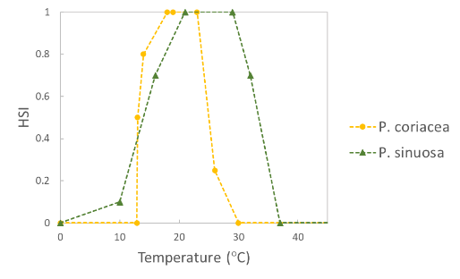
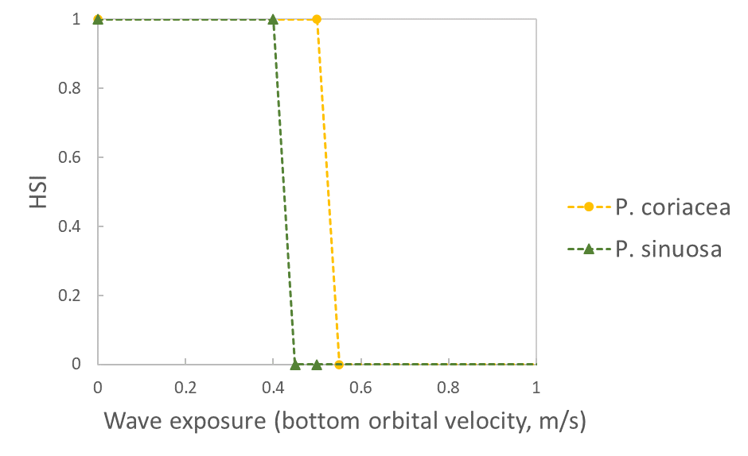
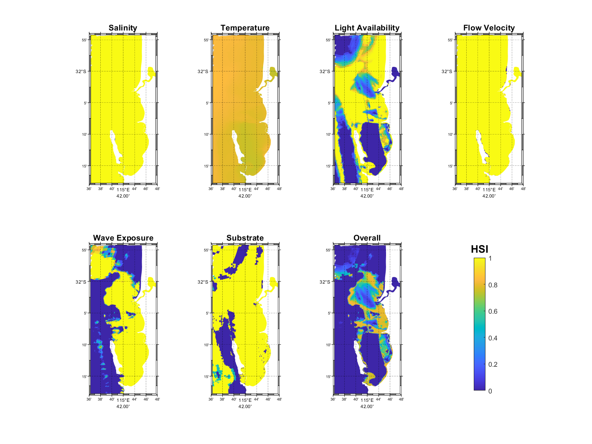
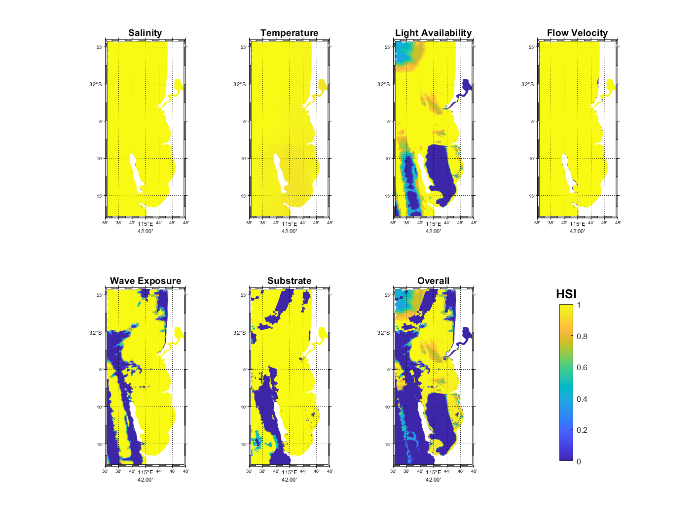
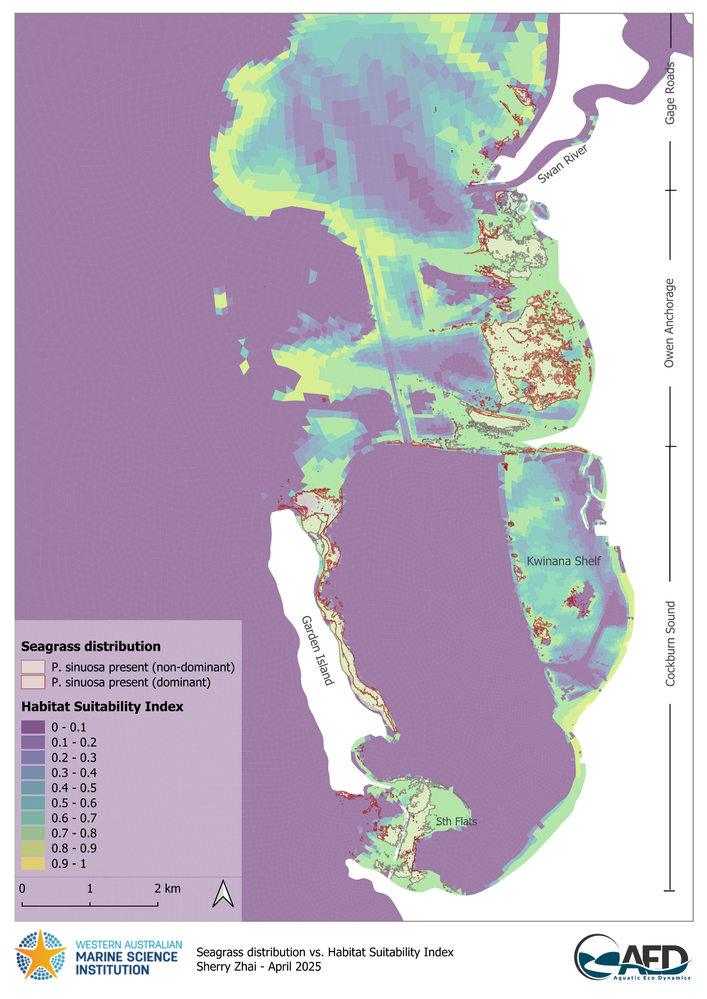
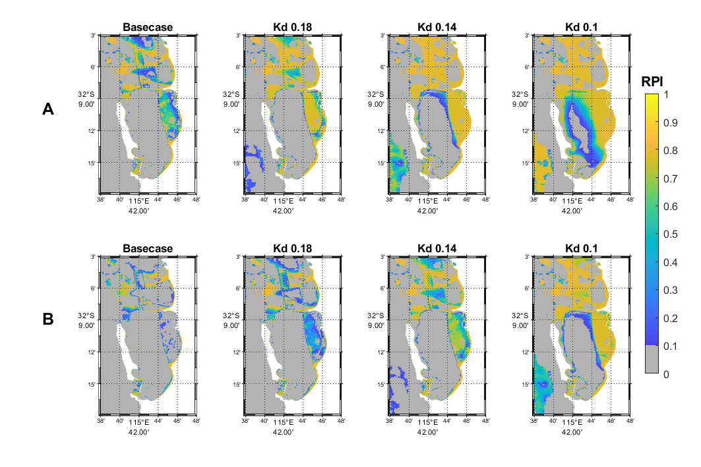
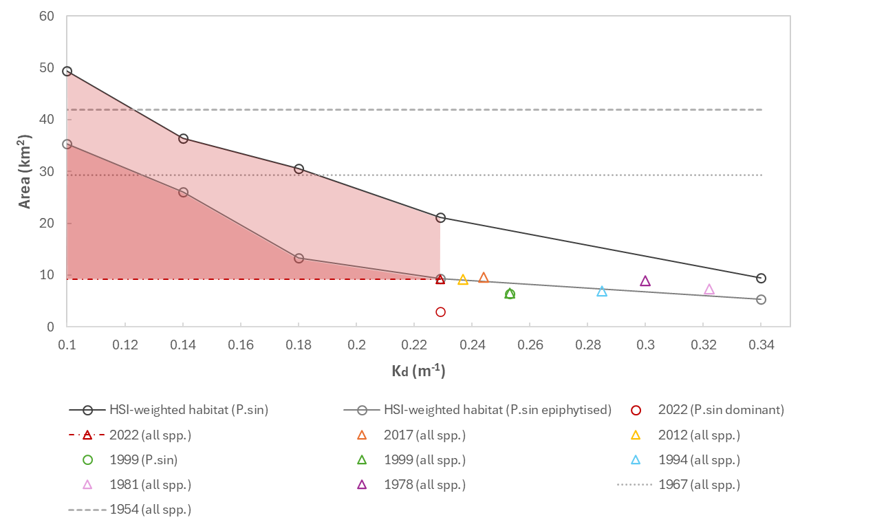

# Seagrass Habitatable Area {#habitat}

## Overview

Seagrass is an important ecological component of Cockburn Sound, where seagrass meadows have historically flourished, covering most of the seabed at depth of 10 m or less within the Sound before industrial development (Cambridge & McComb, 1984). The seagrass coverage declined severely after industrial development and was estimated that only 22% seagrass remained in year 1978 (Cambridge & McComb, 1984; Kendrick et al., 2002). The extensive seagrass decline coincided with the discharge of effluents which were rich in nutrients (Cambridge et al., 1986; Cockburn Sound Management Council, 2009), indicating the water quality such as elevated nutrient levels, decreased water clarity and light availability are vital for seagrass survival.

Despite reductions in nutrient loads achieved through water quality improvement initiatives, including relocating wastewater to the Sepia Depression Ocean Outlet, seagrass coverage has not shown significant recovery in the Sound (Kirckman et al., 2000; Kendrick et al., 2002). This persistent loss underscores the urgent need to understand the ecological dynamics of seagrass in Cockburn Sound and apply this knowledge to restoration efforts.

Research into the drivers of seagrass decline has primarily focused on changes to physical conditions in the water column, with the high light requirements of seagrasses leading them to be vulnerable to stressors which reduce light availability such as eutrophication, macroalgal smothering, or increased turbidity.

Seagrass dynamics are highly sensitive to light availability, which are directly influenced by water quality parameters, including suspended particles, dissolved organic material, filamentous algae, and phytoplankton. These elements alter the inherent optical properties of the water, which in turn affects light penetration and seagrass photosynthesis (Chapter 12).

In this chapter, the CSIEM habitat suitability index (HSI) model for seagrass is described,  and applied to demonstrate the sensitivity of water quality (turbidity) changes on seagrass habitat extent. This seeks to provide insights that can support effective management and guide restoration priorities within Cockburn Sound.

## Data availability

Seagrass data used for development of the habitat assessment is outlined in Chapter 13.

Additional seagrass habitat mapping done by Project 2.1

## Seagrass habitat suitability screening

## Approach

The first approach adopted in this study was to simulate "habitat suitability" based on an assessment of modelled environmental conditions relative to the known requirements of *P. sinuosa*, which include light, wave exposure, temperature, salinity, flow velocity and substrate type. This approach was then used to define a relative index for each computational cell by overlaying the various environmental controls/limitations that have been informed based on WWMSP Theme 2 experiments and available literature. The Habitat Suitability Index (HSI) approach empirically defines conditions that lead to successful growth, without the need for mechanistic simulation of processes such as photosynthesis and respiration.

The simulated conditions from CSIEM (mesh B - optimised) were used to calculate the HSI. In each model grid cell (*c*), the HSI for each environmental control (*i*) was computed based on suitability of average conditions between 1/7/2023 -- 30/9/2023, by defining a fractional index, ${HSI}_{c}^{i}$. ${HSI}_{c}^{i}$ for each environmental control were then integrated into an overall HSI (${HSI}_{c}^{overall}$) which indicates the overall suitability for plant growth. Specifically, this was computed as follows:

## ${HSI}_{c}^{overall}\ \  = \ {HSI}_{c}^{light}*{HSI}_{c}^{wave}*{HSI}_{c}^{temp}*{HSI}_{c}^{sal}*{HSI}_{c}^{vel}*{HSI}_{c}^{sub}$ (8.1)

Suitability ranged from 0 to 1, representing unsuitable to optimal conditions, respectively. The individual functions are summarised in Table 7.1. As a quick screening assessment, we adopted the function forms used in Erftemeijer et al. (2023) with updated thresholds based on WWMSP 2 findings, using data from Perth seagrass populations where available. After initial review and assessments, a three-month period in late winter-early spring was chosen for suitability analysis due to a) light availability was around its lowest due to both shorter day light hours and higher turbidity, and b) higher wave exposure, both of which are primary environmental controls on *P. sinuosa* distribution in CS.

Upon review of current extent of seagrass communities in the Cockburn Sound and Owen Anchorage (CSOA) region, an additional species *P. coriacea* was included in the HSI assessment as a reference considering its large extent in the CSOA and Gage Roads region. While environmental requirements for *P. sinuosa* were based on WWMSP 2 experiments and available literature, those for *P. coriacea* were based on literature only (Table 7.3).

Prior to the calculation of HSI, some output from the hydrodynamic-biogeochemical model were adjusted based on model performance assessments. Specifically, for assessing habitat suitability on wave exposure, a factor of 0.35 was applied to simulated wave bottom orbital velocity from the WWM due to over-prediction of significant wave height in the Owen Anchorage region (see Figure 8.8a and 8.9a). For light availability, a factor of 1.4 was applied to extinction coefficient across the model domain except in Cockburn Sound, as turbidity outside CS was likely underpredicted. However, field data were extremely limited outside CS to make comprehensive assessment of model performance on light predictions.

**Table 7.3.** Habitat suitability functions (HSI) for light availability, temperature, wave exposure, salinity, flow velocity and substrate type for *Posidonia sinuosa* and *Posidonia coriacea*. An HSI of 0 represents unsuitable conditions, while an HSI of 1 indicates optimal conditions.

+-----------------------------------+---------------------------------------------------------------------------------------+---------------------------------------------------------------------------------------------------------------------------------------------------------------------+
| **Environmental condition (*i*)** | **HSI function**                                                                      | **Sources**                                                                                                                                                         |
+:=================================:+:=====================================================================================:+:===================================================================================================================================================================:+
| Light availability                | {width="2.3393536745406824in" height="1.4173228346456692in"} | ***P. sinuosa*:** Erftemeijer et al. 2023, with minimum threshold adjusted based on data from Perth populations assuming light epiphyte cover (Collier et al. 2007) |
|                                   |                                                                                       |                                                                                                                                                                     |
| (% surface irradiance)            |                                                                                       | ***P. coriacea*:** Erftemeijer et al. 2023                                                                                                                          |
+-----------------------------------+---------------------------------------------------------------------------------------+---------------------------------------------------------------------------------------------------------------------------------------------------------------------+
| Temperature (°C)                  | {width="2.335064523184602in" height="1.4173228346456692in"}  | ***P. sinuosa*:** Said et al. 2024b (adapted)                                                                                                                       |
|                                   |                                                                                       |                                                                                                                                                                     |
|                                   |                                                                                       | ***P. coriacea*:** Erftemeijer et al. 2023                                                                                                                          |
+-----------------------------------+---------------------------------------------------------------------------------------+---------------------------------------------------------------------------------------------------------------------------------------------------------------------+
| Wave exposure                     | {width="2.321055336832896in" height="1.4173228346456692in"}  | Erftemeijer et al. 2023 (adjusted)                                                                                                                                  |
|                                   |                                                                                       |                                                                                                                                                                     |
| (bottom orbital velocity, m/s)    |                                                                                       |                                                                                                                                                                     |
+-----------------------------------+---------------------------------------------------------------------------------------+---------------------------------------------------------------------------------------------------------------------------------------------------------------------+
| Salinity (ppt)                    | {width="2.327027559055118in" height="1.4173228346456692in"}  | Erftemeijer et al. 2023                                                                                                                                             |
+-----------------------------------+---------------------------------------------------------------------------------------+---------------------------------------------------------------------------------------------------------------------------------------------------------------------+
| Flow velocity (m/s)               | {width="2.319582239720035in" height="1.4173228346456692in"}  | Erftemeijer et al. 2023                                                                                                                                             |
+-----------------------------------+---------------------------------------------------------------------------------------+---------------------------------------------------------------------------------------------------------------------------------------------------------------------+
| Substrate                         | $HSI$ = $\left\{ \begin{array}{r}                                                     | Erftemeijer et al. 2023 (adapted)                                                                                                                                   |
|                                   | 1,\ soft\ substrate\ (sand)\  \\                                                      |                                                                                                                                                                     |
|                                   | 0.5,\ mixed\ substrate \\                                                             |                                                                                                                                                                     |
|                                   | 0,\ \ all\ other\ substrate\ types                                                    |                                                                                                                                                                     |
|                                   | \end{array} \right.\ $                                                                |                                                                                                                                                                     |
+-----------------------------------+---------------------------------------------------------------------------------------+---------------------------------------------------------------------------------------------------------------------------------------------------------------------+

Following the calculation of overall HSI, a Restoration Priority Index (RPI) was computed in each cell to indicate areas with high restoration potential, or priority, considering the overall HSI and current distribution of seagrasses. Specifically, this was calculated by subtracting the presence of any seagrass species (present -- 1, absent -- 0) from the ${HSI}_{}^{overall}$ in each cell. As a result, RPI ranges from 0 to 1, representing low to high restoration priority. Essentially, an area with RPI = 1 indicates high quality habitat where seagrasses have yet to establish and could be prioritised for restoration (e.g. transplanting).

To quantify total suitable habitat, the HSI was used as a multiplier with the cell area when HSI ≥ 0.5, $A_{c}$, to calculate HSI-weighted habitat area, according to:

$A_{}^{HSI} = \sum_{c}^{}{{HSI}_{c}^{overall}*A_{c}}$ (8.2)

Since previous studies have identified light availability as the primary environmental control of *P. sinuosa* distribution in CS (Collier et al. 2007), sensitivity analysis of suitable habitat area to light attenuation (*K~d~*) through the water column was conducted. Additionally, to explore the possible light-attenuation effect of moderate to heavy epiphyte loading on seagrass leaves, habitat suitability index with epiphyte, ${HSI}_{c}^{overall\_ epi}$, and the corresponding habitat area at various *K~d\ ~*values were calculated by reducing modelled light availability by 45% (Masini et al. 1995) to illustrate an extreme case. Modelled habitat area was compared against historical record of seagrass area and light attenuation measurements in CS where available.

## Habitat suitability results and discussion

Figure 7.6 and Figure 7.7 show the pattern of habitat suitability for *P. sinuosa* and *P. coriacea*, respectively, during July -- September 2023 based on salinity, temperature, light availability, flow velocity, wave exposure, substrate, which were integrated into an overall suitability. The most significant environmental controls for *P. sinuosa* and *P. coriacea* habitat in the CSOA are light availability and wave exposure (Figure 7.6 and 7.7), however, for *P. sinuosa* habitat to be considered optimal, higher light and less wave exposure are required compared to *P. coriacea*. Inside CS, habitat quality for *P. sinuosa* is primarily influenced by light availability, and optimal habitats are located along the eastern shore of Garden Island and around Southern Flats, as well as small patches along the western edge of Kwinana Shelf (Figure 7.6). In contrast, extensive areas in the CSOA are potentially suitable for *P. coriacea*, except in the CS basin (Figure 7.7).

Comparisons between the modelled HSI and WWMSP Theme 2 seagrass distribution map suggest the current extent of *P. sinuosa* communities generally agreed with model predictions, in that the presence of *P. sinuosa* community aligned with areas with higher suitability (HSI \> 0.5, Figure 7.8). Larger continuous meadows tended to occur in high quality habitat (HSI ≥ 0.7), whereas patchy population distribution was generally associated with habitat of lower or mixed quality. Within CS, *P. sinuosa* meadows appeared to only occur in high quality habitat (HSI ≥ 0.7). Slight misalignment was evident around the northern and southern tips of Garden Island where isolated patches of *P. sinuosa* exist, but modelled HSI indicated unsuitable habitat due to wave exposure (Figure 7.8 and 7.6). This suggests either a) overprediction of wave bottom velocity in these areas which could be relatively sheltered by the large extent of reef and macroalgae on the west (Figure 7.4); or b) uncertainty around wave tolerance threshold for this species, as very limited studies, if any, exist on their wave tolerance other than a general consensus that *P. sinuosa* prefers a relatively sheltered position (Erftemeijer 2013).

*P. coriacea* showed a similar trend, however, mismatch between HSI and *P. coriacea* presence occurred around Parmelia, Mewstone, and south of Garden Island where *P. coriacea* population exist but modelled HSI indicated unsuitable habitat due to wave exposure (Figure 7.9 and 7.7). This again suggests uncertainties on wave predictions and/or wave tolerances. It is important to note that habitat suitability functions for *P. coriacea* were based on literature focusing on populations in South Australia, which may differ slightly to Western Australian populations.

Current P. sinuosa extent was also compared against modelled HSI assuming heavy epiphyte loading (45% light reduction) as a reference (Figure 7.10). Within CS, the effects of epiphyte shading on habitat suitability appeared to be the greatest on Kwinana Shelf - only isolated patches of habitat remain on the western edge -- which coincidently aligned with the current *P. sinuosa* extent. In comparison, areas near Garden Island and Southern Flats were much less affected by epiphytes with HSI generally still greater than 0.6.

Within CS, areas with high restoration priority are located on the western side of Kwinana Shelf due to higher light availabilities, as well as along the coast in the south-east region (Figure 7.11A Basecase).

{width="6.231879921259843in" height="5.623999343832021in"}

**Figure 7.6.** Model output of Habitat Suitability Index (HSI) for *Posidonia sinuosa* in the Cockburn Sound, Owen Anchorage and Gage Roads region, as a function of salinity, temperature, light availability, flow velocity, wave exposure, substrate type, and an integrated overall suitability. An HSI of 0 represents unsuitable habitat conditions (dark blue), while an HSI of 1 represents optimal conditions (yellow).

{width="6.247999781277341in" height="5.625278871391076in"}

**Figure 7.7.** Model output of Habitat Suitability Index (HSI) for *Posidonia coriacea* in the Cockburn Sound, Owen Anchorage and Gage Roads region, as a function of salinity, temperature, light availability, flow velocity, wave exposure, substrate type, and an integrated overall suitability. An HSI of 0 represents unsuitable habitat conditions (dark blue), while an HSI of 1 represents optimal conditions (yellow).

If water clarity improves, i.e. average *K~d\ ~*is reduced by 20% from 0.23 m^-1^ to 0.18 m^-1^, much of the Kwinana Shelf would become high quality habitat with high restoration potential (RPI ≥ 0.7, Figure 7.11A). If *K~d~* is further reduced to 0.14 m^-1^, most of CS and OA that do not currently have seagrass establishment would become highly suitable except in the deep basin (Figure 7.11A). In contrast, if seagrass leaves are heavily epiphytised, water clarity will need to be much higher with *K~d~* = 0.1 m^-1^ to provide similar restoration potential (Figure 7.11B).

Modelling suggests current total weighted suitable habitat area (HSI ≥ 0.5) for *P. sinuosa* within CS is approximately 21 km^2^, among which 14 km^2^ is predicted to have good restoration potential (RPI ≥ 0.5) after excluding areas already occupied by seagrasses (Figure 7.12). Based on the most recent WWMSP2.1 benthic mapping in 2022, the estimated total area for all seagrass species was 9 km^2^, however only 3 km^2^ was dominated by *P. sinuosa,* making up considerably smaller proportions of the total seagrass extent compared to 1999 mapping where seagrasses in CS were predominantly *P. sinuosa* (Kendrick et al. 2002). It was as expected that modelled habitat area was much higher than the actual *P. sinuosa* extent, since only a few major environmental factors were considered which indicate

{width="6.301388888888889in" height="8.911111111111111in"}

**Figure 7.8.** Comparison between modelled Habitat Suitability Index (HSI) and *Posidonia sinuosa* presence in the Cockburn Sound and Owen Anchorage region. An HSI of 0 represents unsuitable habitat conditions (dark purple), while an HSI of 1 represents optimal conditions (yellow).

{width="6.301388888888889in" height="8.911111111111111in"}

**Figure 7.9.** Comparison between modelled Habitat Suitability Index (HSI) and *Posidonia coriacea* presence in the Cockburn Sound and Owen Anchorage region. An HSI of 0 represents unsuitable habitat conditions (dark purple), while an HSI of 1 represents optimal conditions (yellow).

{width="6.301388888888889in" height="8.911111111111111in"}

**Figure 7.10.** Comparison between modelled Habitat Suitability Index (HSI) if light availability was reduced by heavy epiphyte loading and *Posidonia sinuosa* presence in the Cockburn Sound and Owen Anchorage region. An HSI of 0 represents unsuitable habitat conditions (dark purple), while an HSI of 1 represents optimal conditions (yellow).

the fundamental niche, or an 'environmental envelope' that the species may exist in. Variables not included in the model, including biological factors such as resource competition and animal grazing will impact on actual seagrass occurrence. Assuming epiphyte loading was light, the predicted habitat area in response to changing water clarity, i.e. light attenuation coefficient (*K~d~*), between 0.14 m^-1^ and 0.34 m^-1^ appears to be relatively linear (Figure 7.12). Comparing with estimated past seagrass extent in CS between 1978 and 2017 when water clarity gradually improved, total seagrass extent did not follow the same trajectory as modelled habitat and remained relatively unchanged. Although the habitat model is based on environmental requirements of *P. sinuosa* while all past seagrass mapping in CS did not distinguish species except in 1999, it is not unreasonable to expect the total seagrass extent in the last four decades would follow a similar trend along the light attenuation gradient given that a) both existing literature (e.g., Cambridge & McComb 1984) and 1999 mapping suggested historically almost all seagrass in CS were *P. sinuosa* (Figure 7.12, Kendrick et al. 2002); b) there is a great deal of overlap in light requirements among seagrass species in CS (see Eftermeijer et al. 2023 for a summary of light requirements for several seagrass species that are also present in CS); and c) light availability was identified as the primary limiting factor for seagrass in general in CS due to water quality issues since industrialisation (Masini *et al.* 1995).

Interestingly, under the modelled scenario where seagrasses are heavily epiphytised with 45% less light reaching leaves, the trajectory of habitat area response to changing water clarity coincidently agreed with mapped seagrass extent over the last four decades, in that the slope of change is predicted to be gentle, i.e., change in suitable area in response to per unit of change in *K~d~*, is insignificant, between *K~d\ ~*of 0.34 m^-1^ and 0.23 m^-1^ (Figure 7.12). Under this trajectory, suitable habitat area will only increase considerably when *K~d\ ~*is reduced to less than 0.18 m^-1^.

It\'s important to note that in the heavy epiphyte loading scenario, light reduction was applied universally across the domain to illustrate an extreme case. It is likely that epiphyte loading in the past varied both spatially and temporally resulting in an overall lighter epiphyte cover, so that the modelled total HSI-weighted habitat area ("epiphytised") would be greater than the actual seagrass extent since the fundamental niche of a species should always be greater than the realised niche (Figure 7.12). Following the trajectory of this scenario, the original seagrass extent of 42 km^2^ in 1954 would not be reached even when *K~d\ ~*approaches 0.1 m^-1^, suggesting a lighter epiphyte cover back then which is highly probable given fewer eutrophication issues. However, this certainly does not exclude the possibility that the seagrass was in better health due to factors not modelled. It is also possible that *K~d~* and epiphyte loading were correlated to some extent, since both can be positively associated with eutrophication. This may mean that in periods shortly after commencement of industrialisation and water quality degradation, the total habitat area versus *K~d~* relationship followed the heavily epiphytised scenario.

Given the significant influence of light availability on seagrass health in CS as demonstrated both by field studies and our modelling, it is worth considering further refinements on habitat model algorithms on light requirements for seagrasses. Water clarity varies considerably in CSOA throughout the year. Based on light attenuation measurements in 2023 alone (data provided by Cockburn Sound Management Council), the highest monthly mean *K~d~* (0.28 m^-1^) which occurred in July, was 47% higher than that in March (0.19 m^-1^). The selection of time window for suitability assessment could therefore change predictions significantly. If this seasonality of *K~d\ ~*also varies from year to year, a more refined approach may be using a rolling average of the most challenging months in any given year, for example. This approach could also be applied to the wave exposure and temperature suitability algorithm. Under current conditions, temperature is not a limiting factor in any season, however if the effects of climate change are to be explored in future studies, time window selection will need refinement. Further, studies have suggested as healthy *Posidonia* has energy reserves that allow them to withstand acute shading and recover when the shading is removed, but are particularly susceptible to chronic light reduction as long-term persistence is dependent on maintaining a positive energy balance (Masini *et al.* 1995), it may be an option to trial a longer period or year-round integrated light requirement/threshold such as photoperiod, or consider using daily light integral (instead of % surface irradiance) which accounts for daylight hours and cloud cover in additional to turbidity. There may also be a need for seasonally varying light thresholds (Said et al. 2024a). This means it is crucial to have light climate resolved throughout the year. While wave exposure isn't a limiting factor inside CS, further improvement on wave prediction, in addition to validation of light climate will offer higher confidence in habitat suitability predictions in the OA and GR region. It is also reasonable to assume that the environmental requirement in different life stages may differ, for example, seedlings may be more susceptible to wave exposure or low light event due to their less established root system and smaller energy reserve, respectively, and thus additional empirical data will assist further parameterise the suitability model with a focus on restoration site selection.

{width="6.414892825896763in" height="4.508021653543307in"}

**Figure 7.11.** Restoration Priority Index (RPI) maps showing areas with high (yellow) to low (dark blue) restoration potential for *Posidonia sinuosa* under current conditions (Base case, average light attenuation coefficient *K~d\ ~*= 0.23 m^-1^ in spring - summer) and scenarios with higher water clarity (lower *K~d~* (m^-1^) values, panel A). Also shown are RPI under the same conditions if epiphyte load is high reducing light availability (panel B). Grey areas are unsuitable habitat (HSI ≤ 0.1) or occupied by existing seagrass community.

{width="6.996699475065617in" height="4.122994313210849in"}

Current condition

**Figure 7.12.** Modelled *Posidonia sinuosa* habitat area (HSI-weighted) in Cockburn Sound along the light attenuation coefficient (*K~d~*) gradient, as well as modelled habitat area if epiphyte load is heavy (lines). Shaded area indicates potential restorable area. Also plotted are past and present estimated seagrass extent (points), including for *P. sinuosa* only (circles) and/or all seagrass species (triangles), with field *K~d\ ~*measurements in corresponding years during spring -- summer. The estimated original seagrass extent in 1954 (before industrialisation) and 1967 are shown with unknown *K~d~* (dashed grey lines). Data source for seagrass extent: 2022 - WWMSP2.1; 2017 and 2012 -- Hovey & Fraser 2018; 1999, 1994, 1981 and 1967 -- Kendrick et al. 2002; 1978 and 1954 -- Cambridge & McComb 1984. Data source for *K~d~*: Cockburn Sound Management Council (converted from log10 m^-1^).

## Summary

This assessment focused on the potential impacts of water quality changes to the seagrass, which have not also considered other impacts from:

- Climate change such as heatwave events can cause the seagrass decline (Strydom et al., 2020);

- Other factors such as epiphyte (Cambridge et al., 1986) and sulfide intrusion from sediment (Fraser and Kendrick, 2017; Fraser et al., 2023) may also cause decline

Nonetheless, the model is suitable to predict the impacts of changes in water quality and to estimate seagrass productivity response to factors such as dredging and nutrient enrichment on the overall seagrass dynamics.

